

# BabyCube Assembly Instructions

These are the assembly instructions for the BabyCube. These instructions are not fully comprehensive, that is they do
not show every small detail of the construction and in particular they do not show the wiring. However there is sufficient
detail that someone with a good understanding of 3D printers can build the BabyCube.

---

## Table of Contents

1. [Parts list](#Parts_list)

1. [X_Carriage assembly](#X_Carriage_assembly)
1. [Print_head assembly](#Print_head_assembly)
1. [X_Carriage_Front assembly](#X_Carriage_Front_assembly)
1. [Top_Face_Stage_1 assembly](#Top_Face_Stage_1_assembly)
1. [Top_Face_Stage_2 assembly](#Top_Face_Stage_2_assembly)
1. [Top_Face assembly](#Top_Face_assembly)
1. [Display_Cover assembly](#Display_Cover_assembly)
1. [Display_Housing assembly](#Display_Housing_assembly)
1. [Z_Carriage assembly](#Z_Carriage_assembly)
1. [Print_bed assembly](#Print_bed_assembly)
1. [Back_Face_Stage_1 assembly](#Back_Face_Stage_1_assembly)
1. [Back_Face assembly](#Back_Face_assembly)
1. [Right_Face_Stage_1 assembly](#Right_Face_Stage_1_assembly)
1. [Right_Face assembly](#Right_Face_assembly)
1. [Base assembly](#Base_assembly)
1. [Switch_Shroud assembly](#Switch_Shroud_assembly)
1. [Left_Face assembly](#Left_Face_assembly)
1. [Stage_1 assembly](#Stage_1_assembly)
1. [Stage_2 assembly](#Stage_2_assembly)
1. [Stage_3 assembly](#Stage_3_assembly)
1. [Stage_4 assembly](#Stage_4_assembly)
1. [Stage_5 assembly](#Stage_5_assembly)
1. [Stage_6 assembly](#Stage_6_assembly)
1. [Main assembly](#main_assembly)

## Tips for printing the parts

The printed parts can be divided into two classes, the "large parts" (ie the left, right, top and back faces), and the
"small parts" (the rest of the parts)

I recommend using a 0.6mm nozzle for printing all the parts, but especially the for the large parts.

### Small parts

For dimensional accuracy the small parts need to be printed with a layer height of 0.25mm and a first layer height of 0.25mm.
To maximise part strength, I use the following:

1. extrusion width of 0.7mm if using a 0.6mm nozzle, 0.65mm if using a 0.4mm nozzle
2. 3 perimeters
3. 3 top and bottom layers
4. Grid (or Honeycomb) infill - not any of the weaker infills (including Rectangular). 30% infill.

### Large parts

For the large parts, I use a 0.6mm nozzle with the following settings:

1. Layer height 0.5mm, same for first layer height
2. Extrusion width of 1.0mm
3. 2 perimeters (only 2 needed because of the 1.0mm extrusion width)
4. 2 top layers (only 2 needed because of the 0.5mm layer height)
5. 2 bottom layers
6. Grid infill at 30%. I find the honeycomb infill is more prone to warping. 30% is used to enable the part cooling fan
to be switched off (see tips below).
7. Brim width 3mm
8. First layer speed 25mm/s
9. If using a standard E3D v6 hotend (ie not a Volcano or other high-volume hotend) set the max volumetric speed to 15mm3/s for PLA, 11mm3/s for ABS,
or 8mm3/s for PETG

The large parts take up almost the full extent of the print bed and as a result can be prone to warping.
If you have problems with warping, I suggest the following:

1. disable the part cooling fan for the first 10cm (20 layers) or more. The part cooling fan is only really required for the
bridges for the motor mounts and switch mounts, since there are no overhangs and the small bolt holes bridge fine without part
cooling.
2. raise the temperature of the heated bed.
3. increase the width of the brim

## Part substitutions

There is some scope for part substitution:

1. Generally caphead bolts can be used instead of button head bolts, except on the print head where caphead bolts may interfere
with homing.
2. I strongly recommend using an aluminium baseplate, but if you have difficulty sourcing this, or cutting it to size, a 3D printed
baseplate can be used instead.

[Top](#TOP)

---

## Parts list

| Print Head | X Carriage Front | Top Face | Display Housing | Print Bed | Back Face | Right Face | Base | Left Face | Main | TOTALS |  |
|-----:|-----:|-----:|-----:|-----:|-----:|-----:|-----:|-----:|-----:|------:|:---|
|      |      |      |      |      |      |      |      |      |      |       | **Vitamins** |
|   .  |   .  |   .  |   .  |   .  |   .  |   .  |   1  |   .  |   .  |    1  |  Aluminium box section 12mm x 8mm x 1mm, length 85mm |
|   .  |   .  |   .  |   .  |   .  |   .  |   .  |   1  |   .  |   .  |    1  |  Aluminium sheet 220mm x 204mm x 3mm |
|   .  |   .  |   .  |   .  |   .  |   .  |   .  |   .  |   .  |   1  |    1  |  Belt GT2 x 6mm x 728mm |
|   .  |   .  |   .  |   .  |   .  |   .  |   .  |   .  |   .  |   1  |    1  |  Belt GT2 x 6mm x 728mm |
|   .  |   .  |   .  |   .  |   .  |   .  |   .  |   1  |   .  |   .  |    1  |  BigTreeTech SKR Mini E3 v2.0 |
|   .  |   .  |   .  |   1  |   .  |   .  |   .  |   .  |   .  |   .  |    1  |  BigTreeTech TFT35 v3.0 |
|   4  |   .  |   .  |   .  |   .  |   .  |   .  |   .  |   .  |   .  |    4  |  Bolt M2 caphead x  6mm |
|   .  |   .  |   .  |   .  |   .  |   .  |   .  |   .  |   .  |   2  |    2  |  Bolt M3 buttonhead x  8mm |
|   4  |   6  |   .  |   .  |   .  |   .  |   .  |   2  |   1  |   6  |   19  |  Bolt M3 buttonhead x 10mm |
|   2  |   .  |   .  |   .  |   .  |   4  |   4  |   .  |   4  |  24  |   38  |  Bolt M3 buttonhead x 12mm |
|   .  |   .  |   .  |   4  |   .  |   .  |   .  |   .  |   .  |   .  |    4  |  Bolt M3 buttonhead x 16mm |
|   2  |   .  |   .  |   .  |   .  |   .  |   .  |   .  |   .  |   .  |    2  |  Bolt M3 buttonhead x 25mm |
|   .  |   .  |   .  |   4  |   .  |   .  |   .  |   5  |   .  |   .  |    9  |  Bolt M3 caphead x  6mm |
|   .  |   .  |  26  |   .  |   4  |   .  |   .  |   5  |   .  |   .  |   35  |  Bolt M3 caphead x  8mm |
|   .  |   .  |   4  |   .  |   .  |   .  |   .  |   .  |   .  |   .  |    4  |  Bolt M3 caphead x 10mm |
|   .  |   .  |   4  |   4  |   .  |   .  |   .  |   .  |   .  |   .  |    8  |  Bolt M3 caphead x 16mm |
|   .  |   2  |   .  |   .  |   .  |   .  |   .  |   .  |   .  |   .  |    2  |  Bolt M3 caphead x 20mm |
|   .  |   .  |   2  |   .  |   .  |   .  |   .  |   .  |   .  |   .  |    2  |  Bolt M3 caphead x 25mm |
|   .  |   .  |   .  |   .  |   .  |   .  |   .  |   .  |   .  |   6  |    6  |  Bolt M3 countersunk x  6mm |
|   .  |   .  |   2  |   .  |   .  |   .  |   .  |   .  |   .  |  12  |   14  |  Bolt M3 countersunk x 10mm |
|   .  |   .  |   .  |   .  |   .  |   .  |   .  |   .  |   2  |   .  |    2  |  Bolt M3 countersunk x 12mm |
|   .  |   .  |   .  |   .  |   4  |   .  |   .  |   .  |   2  |   .  |    6  |  Bolt M3 countersunk x 16mm |
|   .  |   .  |   .  |   .  |   .  |   .  |   1  |   .  |   1  |   .  |    2  |  Bolt M3 countersunk x 30mm |
|   .  |   .  |   .  |   .  |   .  |   8  |   .  |   .  |   .  |   .  |    8  |  Bolt M5 countersunk x 16mm |
|   .  |   .  |   .  |   .  |   .  |   .  |   1  |   .  |   1  |   .  |    2  |  Cork damper NEMA 14 |
|   .  |   .  |   .  |   .  |   .  |   1  |   1  |   .  |   .  |   .  |    2  |  Cork damper NEMA 17 |
|   .  |   .  |   .  |   .  |   1  |   .  |   .  |   .  |   .  |   .  |    1  |  Cork underlay 105mm x 105mm x 3mm |
|   1  |   .  |   .  |   .  |   .  |   .  |   .  |   .  |   .  |   .  |    1  |  E3D V6 Fan Duct |
|   1  |   .  |   .  |   .  |   .  |   .  |   .  |   .  |   .  |   .  |    1  |  Fan 30mm x 10mm |
|   1  |   .  |   .  |   .  |   .  |   .  |   .  |   .  |   .  |   .  |    1  |  Hot end E3D V6 direct 1.75mm |
|   .  |   .  |   .  |   .  |   .  |   1  |   .  |   .  |   .  |   .  |    1  |  Leadscrew 8mm x 150mm |
|   .  |   .  |   .  |   .  |   1  |   .  |   .  |   .  |   .  |   .  |    1  |  Leadscrew nut 8 x 2 |
|   .  |   .  |   .  |   .  |   2  |   .  |   .  |   .  |   .  |   .  |    2  |  Linear bearing LM12LUU |
|   .  |   .  |   1  |   .  |   .  |   .  |   .  |   .  |   .  |   .  |    1  |  Linear rail MGN9 x 150mm |
|   .  |   .  |   2  |   .  |   .  |   .  |   .  |   .  |   .  |   .  |    2  |  Linear rail MGN9 x 200mm |
|   .  |   .  |   3  |   .  |   .  |   .  |   .  |   .  |   .  |   .  |    3  |  Linear rail carriage MGN9C |
|   .  |   .  |   .  |   .  |   .  |   2  |   .  |   .  |   .  |   .  |    2  |  Linear rod 12mm x 200mm |
|   2  |   .  |   .  |   .  |   .  |   .  |   .  |   .  |   .  |   .  |    2  |  M3 self tapping screw x 16mm |
|   .  |   .  |   .  |   .  |   .  |   .  |   1  |   .  |   .  |   .  |    1  |  MK10 Dual Pulley Extruder |
|   .  |   .  |   .  |   .  |   1  |   .  |   .  |   .  |   .  |   .  |    1  |  Magnetic base 100mm x 100mm |
|   .  |   .  |   .  |   .  |   .  |   8  |   .  |   .  |   .  |   .  |    8  |  Nut M5 nyloc |
|   .  |   .  |   .  |   .  |   4  |   .  |   .  |   .  |   .  |   .  |    4  |  O-ring nitrile 3mm x 2mm |
|   .  |   .  |   .  |   .  |   1  |   .  |   .  |   .  |   .  |   .  |    1  |  OpenBuilds mini heated bed 100mm x 100mm |
|   .  |   .  |   .  |   .  |   .  |   .  |   .  |   .  |   .  |   1  |    1  |  PTFE tube 229 mm |
|   .  |   .  |   .  |   .  |   .  |   .  |   .  |   5  |   .  |   .  |    5  |  Pillar hex nylon F/F M3x12 |
|   .  |   .  |   .  |   .  |   1  |   .  |   .  |   .  |   .  |   .  |    1  |  Print surface 100mm x 100mm |
|   .  |   .  |   2  |   .  |   .  |   .  |   2  |   .  |   2  |   .  |    6  |  Pulley GT2 idler 16 teeth |
|   .  |   .  |   2  |   .  |   .  |   .  |   .  |   .  |   .  |   .  |    2  |  Pulley GT2 idler smooth 9.63mm |
|   .  |   .  |   .  |   .  |   .  |   .  |   1  |   .  |   1  |   .  |    2  |  Pulley GT2UM 20 teeth |
|   .  |   .  |   .  |   .  |   .  |   .  |   .  |   .  |   1  |   .  |    1  |  Rocker Switch PRASA1-16F-BB0BW |
|   .  |   .  |   .  |   .  |   .  |   4  |   .  |   .  |   .  |   .  |    4  |  SK12 shaft support bracket |
|   .  |   .  |   .  |   .  |   .  |   .  |   .  |   .  |   .  |   1  |    1  |  Spiral wrap, 500mm |
|   1  |   .  |   .  |   .  |   .  |   .  |   .  |   .  |   .  |   .  |    1  |  Square radial fan 3010 |
|   .  |   .  |   .  |   .  |   .  |   .  |   1  |   .  |   1  |   .  |    2  |  Stepper motor NEMA14 x 36mm |
|   .  |   .  |   .  |   .  |   .  |   1  |   .  |   .  |   .  |   .  |    1  |  Stepper motor NEMA17 x 34mm |
|   .  |   .  |   .  |   .  |   .  |   .  |   1  |   .  |   .  |   .  |    1  |  Stepper motor NEMA17 x 40mm |
|   .  |   .  |   .  |   .  |   .  |   1  |   .  |   .  |   .  |   .  |    1  |  Stepper motor cable, 150mm |
|   .  |   .  |   .  |   .  |   .  |   .  |   2  |   .  |   1  |   .  |    3  |  Stepper motor cable, 400mm |
|   .  |   .  |   6  |   .  |   .  |   .  |   6  |   .  |   6  |   .  |   18  |  Washer  M3 |
|   .  |   .  |   .  |   .  |   .  |   .  |   .  |   .  |   2  |   .  |    2  |  Wire black 12SWG, length 100mm |
|   .  |   .  |   .  |   .  |   .  |   .  |   .  |   .  |   2  |   .  |    2  |  Wire red 12SWG, length 100mm |
|   .  |   .  |   .  |   .  |   .  |   .  |   .  |   .  |   1  |   .  |    1  |  XT60 Connector Female |
|   .  |   .  |   .  |   .  |   .  |   .  |   .  |   .  |   1  |   .  |    1  |  XT60 Connector Female - not shown |
|   .  |   .  |   .  |   .  |   .  |   .  |   .  |   .  |   1  |   .  |    1  |  XT60 Connector Male |
|   .  |   .  |   .  |   .  |   .  |   .  |   .  |   .  |   1  |   .  |    1  |  XT60 Connector Male - not shown |
|   1  |   .  |   .  |   .  |   2  |   .  |   5  |   .  |   5  |   .  |   13  |  Ziptie 2.5mm x 100mm min length |
|   .  |   .  |   .  |   .  |   .  |   .  |   .  |   .  |   .  |   4  |    4  |  Ziptie 2.5mm x 100mm min length |
|  19  |   8  |  54  |  13  |  21  |  30  |  26  |  20  |  36  |  58  |  285  | Total vitamins count |
|      |      |      |      |      |      |      |      |      |      |       | **3D printed parts** |
|   .  |   .  |   .  |   .  |   .  |   1  |   .  |   .  |   .  |   .  |    1  | Back_Face.stl |
|   .  |   .  |   .  |   .  |   .  |   .  |   .  |   1  |   .  |   .  |    1  | Base.stl |
|   .  |   .  |   .  |   .  |   .  |   .  |   .  |   1  |   .  |   .  |    1  | Base_Template.stl |
|   2  |   2  |   .  |   .  |   .  |   .  |   .  |   .  |   .  |   .  |    4  | Belt_Clamp.stl |
|   .  |   2  |   .  |   .  |   .  |   .  |   .  |   .  |   .  |   .  |    2  | Belt_Tensioner.stl |
|   .  |   1  |   .  |   .  |   .  |   .  |   .  |   .  |   .  |   .  |    1  | Belt_Tidy.stl |
|   .  |   .  |   .  |   1  |   .  |   .  |   .  |   .  |   .  |   .  |    1  | Display_Housing.stl |
|   .  |   .  |   .  |   1  |   .  |   .  |   .  |   .  |   .  |   .  |    1  | Display_Housing_Bracket.stl |
|   1  |   .  |   .  |   .  |   .  |   .  |   .  |   .  |   .  |   .  |    1  | Fan_Duct.stl |
|   .  |   .  |   .  |   .  |   .  |   .  |   .  |   .  |   .  |   4  |    4  | Foot_LShaped_8mm.stl |
|   .  |   .  |   .  |   1  |   .  |   .  |   .  |   .  |   .  |   .  |    1  | Front_Lower_Chord.stl |
|   .  |   .  |   .  |   .  |   .  |   .  |   .  |   .  |   .  |   1  |    1  | Front_Upper_Chord.stl |
|   1  |   .  |   .  |   .  |   .  |   .  |   .  |   .  |   .  |   .  |    1  | Hotend_Clamp.stl |
|   1  |   .  |   .  |   .  |   .  |   .  |   .  |   .  |   .  |   .  |    1  | Hotend_Strain_Relief_Clamp.stl |
|   .  |   .  |   .  |   .  |   .  |   .  |   .  |   .  |   1  |   .  |    1  | Left_Face.stl |
|   .  |   .  |   .  |   .  |   .  |   .  |   .  |   1  |   .  |   .  |    1  | PSU_Bracket.stl |
|   .  |   .  |   .  |   .  |   .  |   .  |   .  |   2  |   .  |   .  |    2  | PSU_Support.stl |
|   .  |   .  |   .  |   .  |   .  |   .  |   1  |   .  |   .  |   .  |    1  | Right_Face.stl |
|   .  |   .  |   .  |   .  |   .  |   .  |   .  |   .  |   .  |   1  |    1  | Spool_Holder.stl |
|   .  |   .  |   .  |   .  |   .  |   .  |   .  |   .  |   1  |   .  |    1  | Switch_Shroud.stl |
|   .  |   .  |   .  |   .  |   .  |   .  |   .  |   .  |   1  |   .  |    1  | Switch_Shroud_Clamp.stl |
|   .  |   .  |   1  |   .  |   .  |   .  |   .  |   .  |   .  |   .  |    1  | Top_Face.stl |
|   1  |   .  |   .  |   .  |   .  |   .  |   .  |   .  |   .  |   .  |    1  | X_Carriage.stl |
|   .  |   1  |   .  |   .  |   .  |   .  |   .  |   .  |   .  |   .  |    1  | X_Carriage_Front.stl |
|   .  |   .  |   1  |   .  |   .  |   .  |   .  |   .  |   .  |   .  |    1  | Y_Carriage_Brace_Left.stl |
|   .  |   .  |   1  |   .  |   .  |   .  |   .  |   .  |   .  |   .  |    1  | Y_Carriage_Brace_Right.stl |
|   .  |   .  |   1  |   .  |   .  |   .  |   .  |   .  |   .  |   .  |    1  | Y_Carriage_Left.stl |
|   .  |   .  |   1  |   .  |   .  |   .  |   .  |   .  |   .  |   .  |    1  | Y_Carriage_Right.stl |
|   .  |   .  |   .  |   .  |   1  |   .  |   .  |   .  |   .  |   .  |    1  | Z_Carriage.stl |
|   6  |   6  |   5  |   3  |   1  |   1  |   1  |   5  |   3  |   6  |   37  | Total 3D printed parts count |
|      |      |      |      |      |      |      |      |      |      |       | **CNC routed parts** |
|   .  |   .  |   .  |   .  |   .  |   .  |   .  |   1  |   .  |   .  |    1  | BaseAL.dxf |
|   .  |   .  |   .  |   .  |   .  |   .  |   .  |   1  |   .  |   .  |    1  | Total CNC routed parts count |

[Top](#TOP)

---

## X_Carriage assembly

### Vitamins

|Qty|Description|
|---:|:----------|
|4| Bolt M2 caphead x  6mm|
|4| Bolt M3 buttonhead x 10mm|
|1| Square radial fan 3010|
|1| Ziptie 2.5mm x 100mm min length|

### 3D Printed parts

| 2 x Belt_Clamp.stl | 1 x Fan_Duct.stl | 1 x X_Carriage.stl |
|---|---|---|
|  |  |  

### Assembly instructions

1. Bolt the belt clamps to the sides of the X_Carriage. Leave the clamps loose to allow later insertion of the belts.
2. Bolt the fan onto the side of the X_Carriage, secure the fan wire with a ziptie.
3. Ensure a good fit between the fan and the fan duct and bolt the fan duct to the X_Carriage.

[Top](#TOP)

---

## Print_head assembly

### Vitamins

|Qty|Description|
|---:|:----------|
|2| Bolt M3 buttonhead x 12mm|
|2| Bolt M3 buttonhead x 25mm|
|1| E3D V6 Fan Duct|
|1| Fan 30mm x 10mm|
|1| Hot end E3D V6 direct 1.75mm|
|2| M3 self tapping screw x 16mm|

### 3D Printed parts

| 1 x Hotend_Clamp.stl | 1 x Hotend_Strain_Relief_Clamp.stl |
|---|---|
| 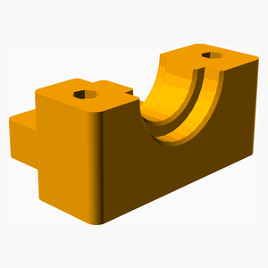 | 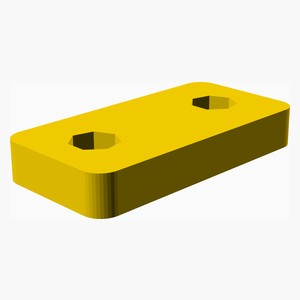 

### Sub-assemblies

| 1 x X_Carriage_assembly |
|---|
|  

### Assembly instructions

1. Assemble the E3D hotend, including fan, thermistor cartridge and heater cartridge.
2. Use the Hotend_Clamp to attach the hotend to the X_Carriage.
3. Collect the wires together and attach to the X_Carriage using the Hotend_Strain_Relief_Clamp.

[Top](#TOP)

---

## X_Carriage_Front assembly

### Vitamins

|Qty|Description|
|---:|:----------|
|6| Bolt M3 buttonhead x 10mm|
|2| Bolt M3 caphead x 20mm|

### 3D Printed parts

| 2 x Belt_Clamp.stl | 2 x Belt_Tensioner.stl | 1 x Belt_Tidy.stl |
|---|---|---|
|  |  |  

| 1 x X_Carriage_Front.stl |
|---|
|  

### Assembly instructions

1. Bolt the Belt_Clamps to the X_Carriage_Front, leaving them loose for later insertion of the belts.
2. Insert the Belt_tensioners into the X_Carriage_Front, and use the 20mm bolts to secure them in place.

[Top](#TOP)

---

## Top_Face_Stage_1 assembly

### Vitamins

|Qty|Description|
|---:|:----------|
|18| Bolt M3 caphead x  8mm|
|2| Bolt M3 countersunk x 10mm|
|2| Linear rail MGN9 x 200mm|
|2| Linear rail carriage MGN9C|

### 3D Printed parts

| 1 x Top_Face.stl |
|---|
| 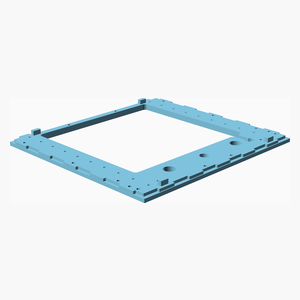 

### Assembly instructions

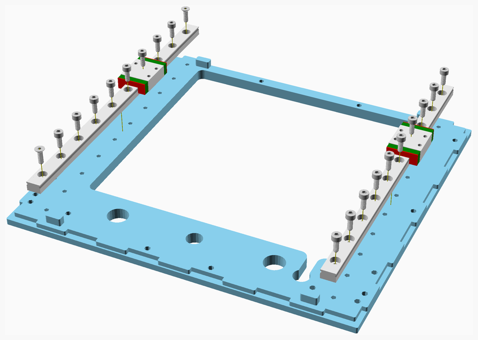

1. Turn the Top_Face upside down and place it on a flat surface.
2. Bolt the rails to the top face. Note that the first and last bolts on the left rail are countersunk bolts and act as pilot bolts to ensure the rails are aligned precisely - they should be tightened before all the other bolts on the left side.
3. The bolts on the right side rail should be only loosely tightened - they will be fully tightened when the right rail is aligned when the X axis rail is added.

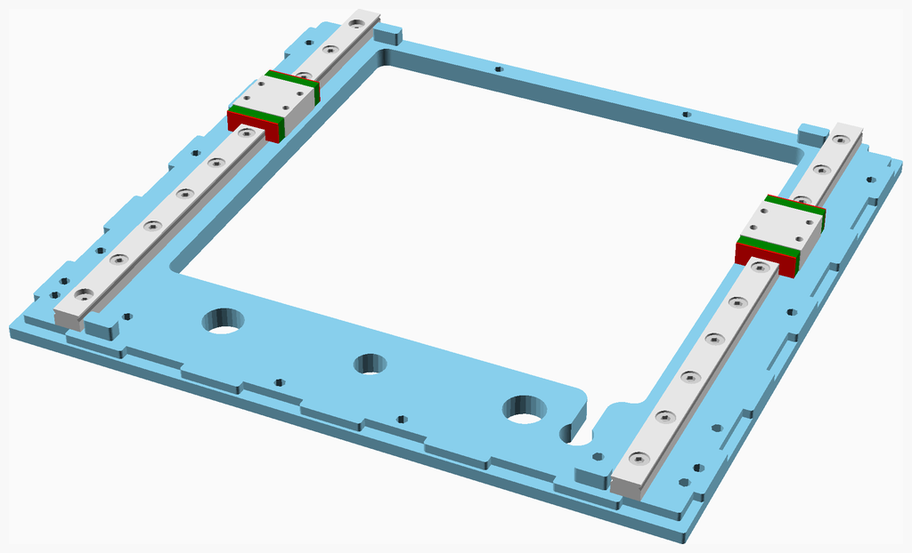

[Top](#TOP)

---

## Top_Face_Stage_2 assembly

### Vitamins

|Qty|Description|
|---:|:----------|
|8| Bolt M3 caphead x  8mm|
|4| Bolt M3 caphead x 16mm|
|2| Bolt M3 caphead x 25mm|
|2| Pulley GT2 idler 16 teeth|
|2| Pulley GT2 idler smooth 9.63mm|
|6| Washer  M3|

### 3D Printed parts

| 1 x Y_Carriage_Brace_Left.stl | 1 x Y_Carriage_Brace_Right.stl | 1 x Y_Carriage_Left.stl |
|---|---|---|
| 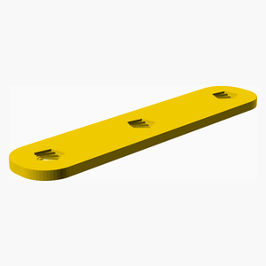 | 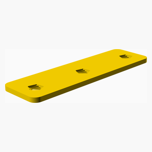 | 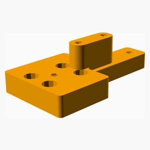 

| 1 x Y_Carriage_Right.stl |
|---|
| 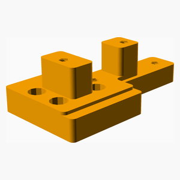 

### Sub-assemblies

| 1 x Top_Face_Stage_1_assembly |
|---|
| 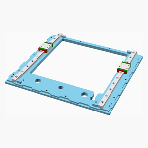 

### Assembly instructions

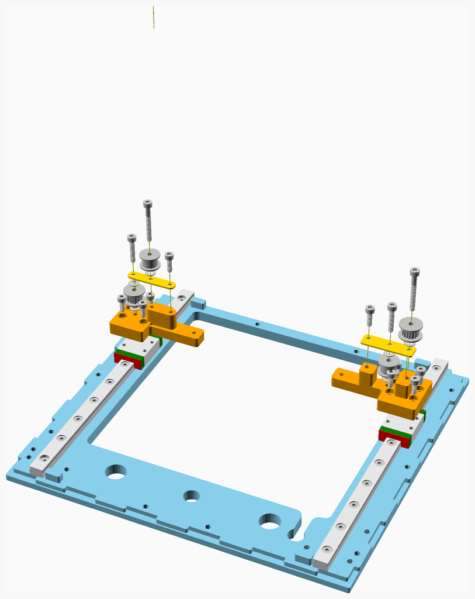

Attach the left and right Y carriages to the top face rails. Note that the two carriages are not interchangeable so be sure
to attach them as shown in the diagram.

The carriages should be attached to the rails before the pulleys are added, since otherwise the bolts are not accessible.  
Attach the pulleys to the carriages. Note that the toothless pulleys are on the inside. Note also that there is a washer under
each of the upper pulleys, but not on top of those pulleys.

Tighten the pulley bolts until the pulleys stop running freely, and then loosen them slightly (approximately 1/16 of a turn)
so they run freely.

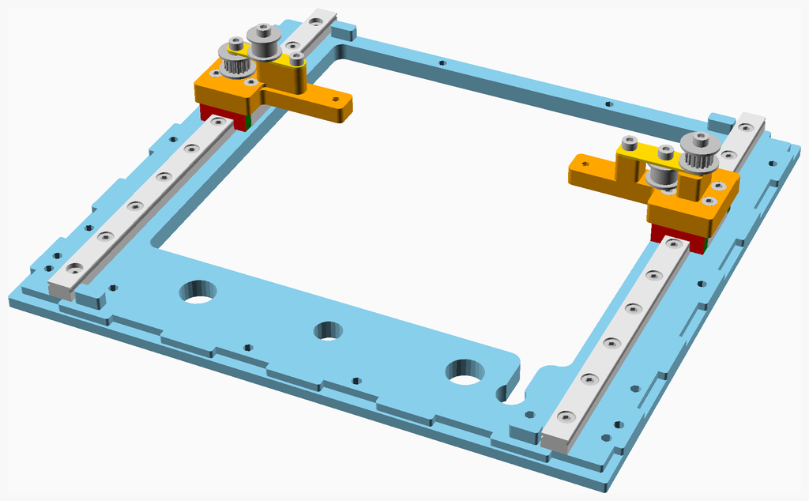

[Top](#TOP)

---

## Top_Face assembly

### Vitamins

|Qty|Description|
|---:|:----------|
|4| Bolt M3 caphead x 10mm|
|1| Linear rail MGN9 x 150mm|
|1| Linear rail carriage MGN9C|

### Sub-assemblies

| 1 x Top_Face_Stage_2_assembly |
|---|
| 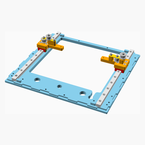 

### Assembly instructions

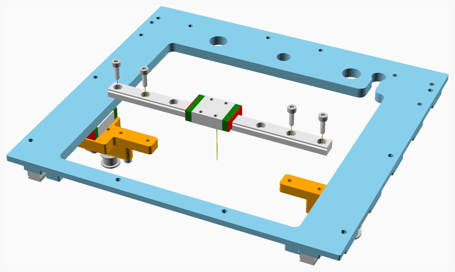

1. Turn the Top_Face into its normal orientation.
2. Bolt the X-axis linear rail onto the Y carriages.
3. Turn the Top_Face upside down again and place it on a flat surface.
4. Align the left and right Y-axis linear rails. Do this by pushing the X-axis rail to the rear of the top face and tighten
the corresponding bolts (left loose in a previous step) and then push the X-axis rails to the front of the top face, again
tightening the corresponding bolts.
5. Check that the carriages run smoothly on the Y-axis linear rails.

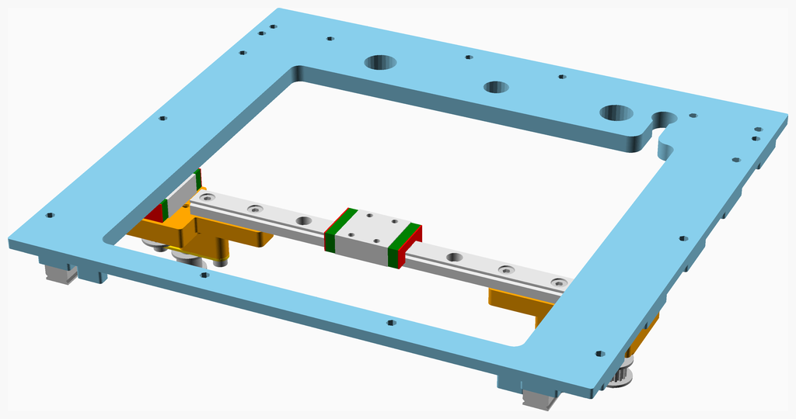

[Top](#TOP)

---

## Display_Cover assembly

### Vitamins

|Qty|Description|
|---:|:----------|
|1| BigTreeTech TFT35 v3.0|
|4| Bolt M3 caphead x  6mm|

### 3D Printed parts

| 1 x Display_Housing.stl |
|---|
| 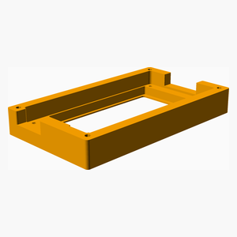 

### Assembly instructions

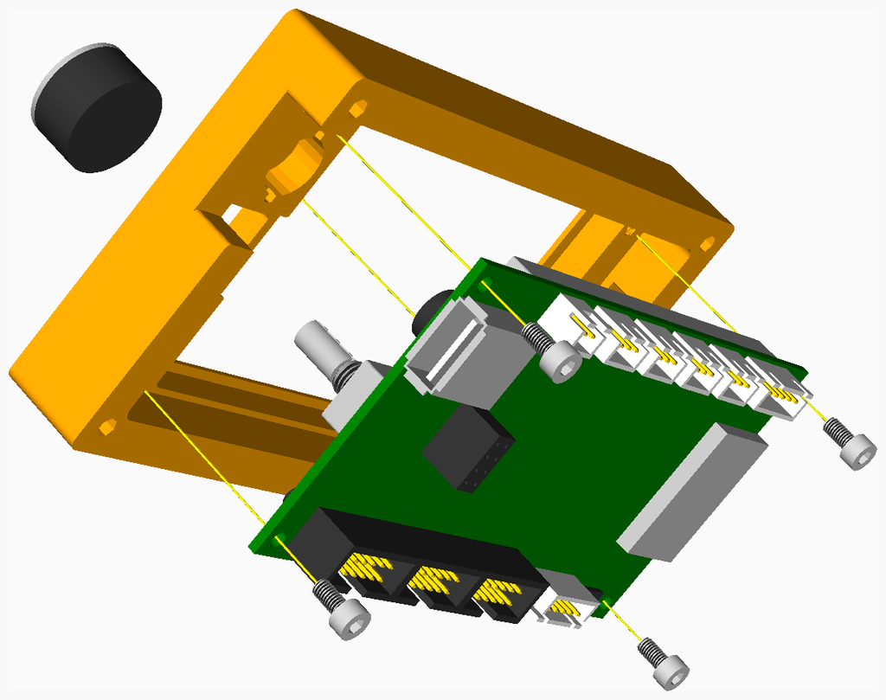

Place the display into the housing and secure it with the bolts - use the bolts to self-tap the holes in the housing.
Attach the knob to the display.

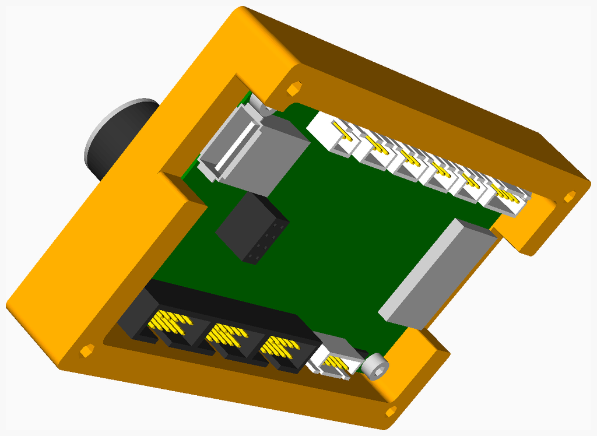

[Top](#TOP)

---

## Display_Housing assembly

### Vitamins

|Qty|Description|
|---:|:----------|
|4| Bolt M3 buttonhead x 16mm|
|4| Bolt M3 caphead x 16mm|

### 3D Printed parts

| 1 x Display_Housing_Bracket.stl | 1 x Front_Lower_Chord.stl |
|---|---|
| 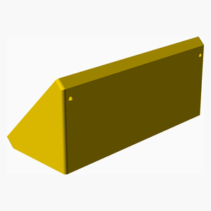 | 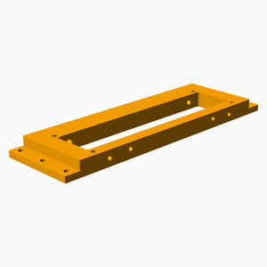 

### Sub-assemblies

| 1 x Display_Cover_assembly |
|---|
| 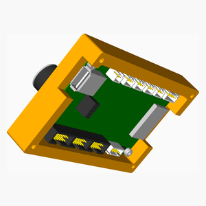 

### Assembly instructions

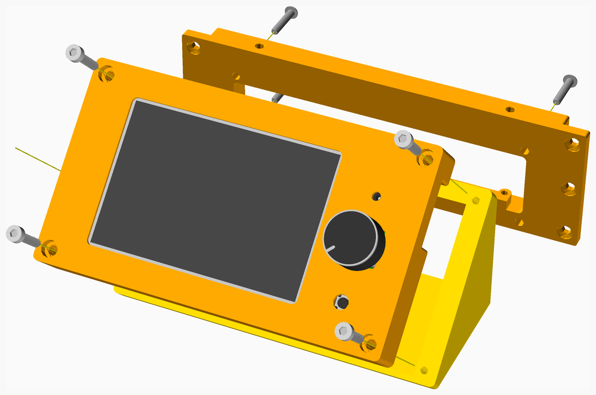

1. Bolt the Display_Cover assembly to the Display_Housing_Bracket.
2. Bolt the Display_Housing_Bracket to the Front_Lower_Chord.

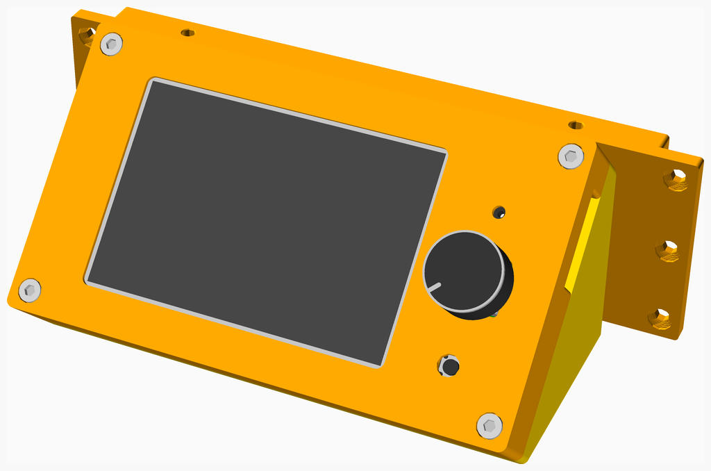

[Top](#TOP)

---

## Z_Carriage assembly

### Vitamins

|Qty|Description|
|---:|:----------|
|4| Bolt M3 caphead x  8mm|
|1| Leadscrew nut 8 x 2|
|2| Linear bearing LM12LUU|

### 3D Printed parts

| 1 x Z_Carriage.stl |
|---|
| 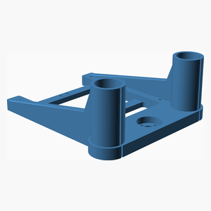 

### Assembly instructions

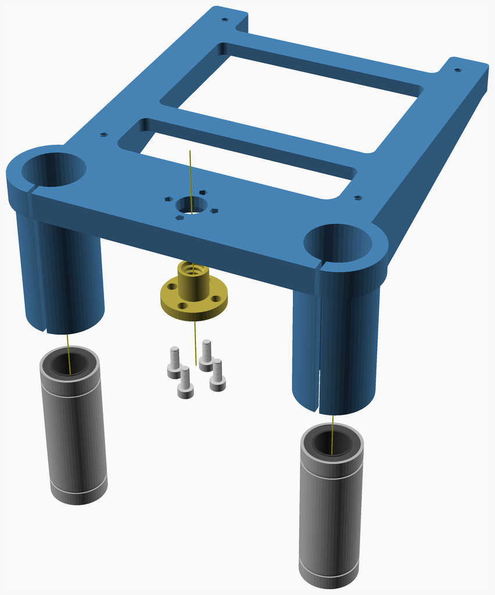

Slide the linear bearings into the Z_Carriage.

Affix the leadscrew nut.

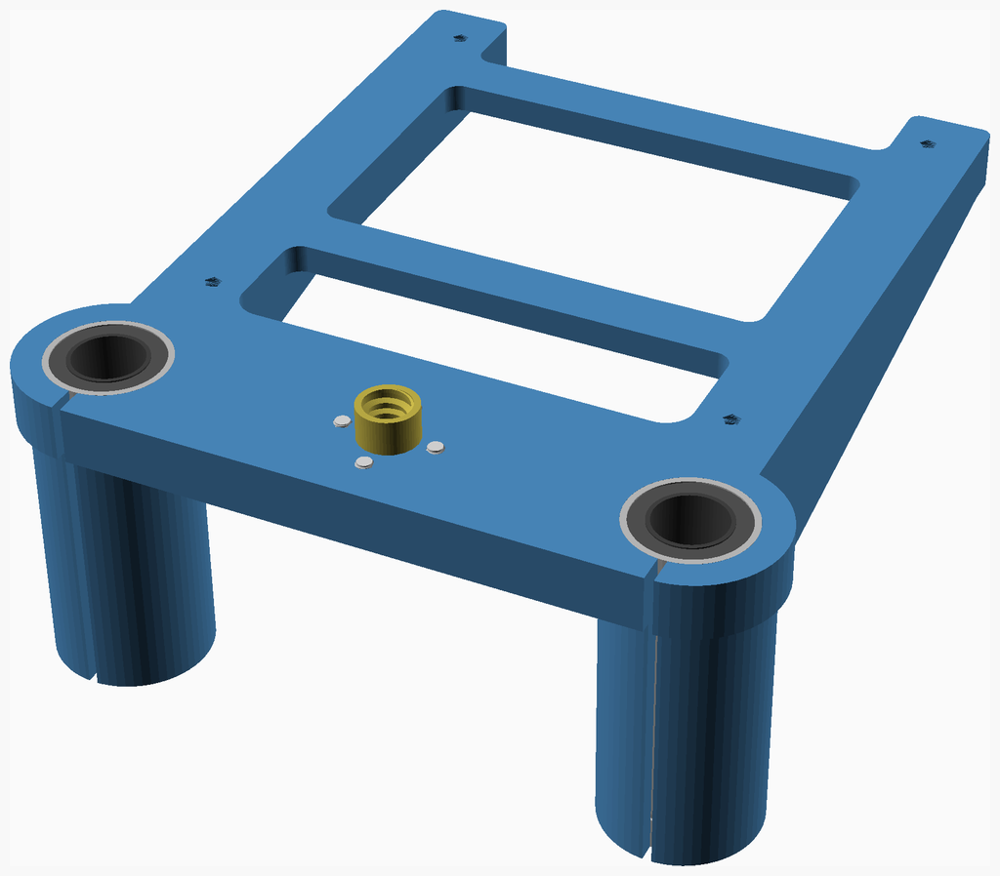

[Top](#TOP)

---

## Print_bed assembly

### Vitamins

|Qty|Description|
|---:|:----------|
|4| Bolt M3 countersunk x 16mm|
|1| Cork underlay 105mm x 105mm x 3mm|
|1| Magnetic base 100mm x 100mm|
|4| O-ring nitrile 3mm x 2mm|
|1| OpenBuilds mini heated bed 100mm x 100mm|
|1| Print surface 100mm x 100mm|
|2| Ziptie 2.5mm x 100mm min length|

### Sub-assemblies

| 1 x Z_Carriage_assembly |
|---|
| 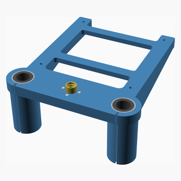 

### Assembly instructions

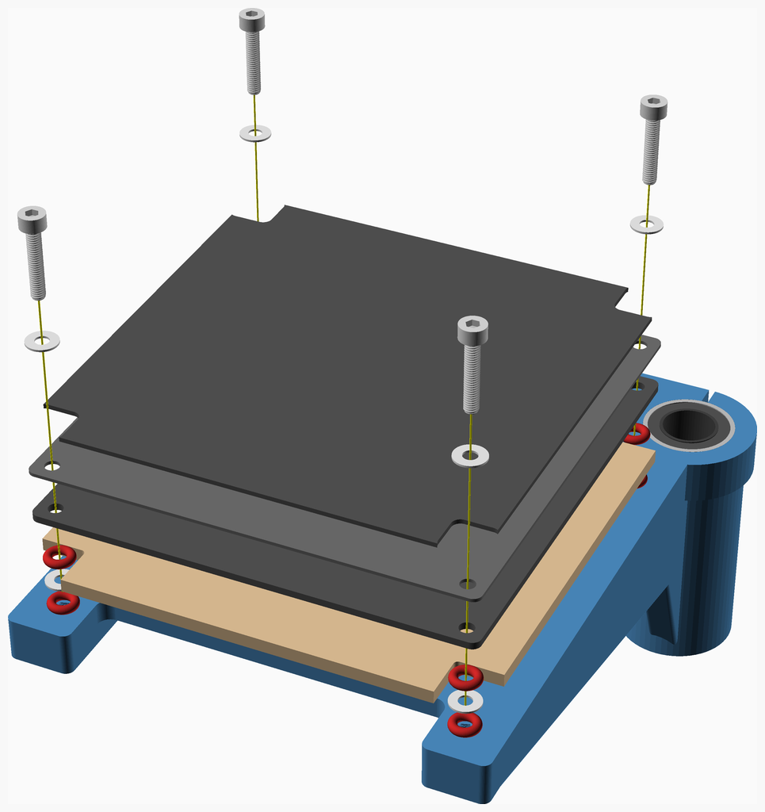

1. Prepare the the cork underlay by cutting it to size, making a cutout for the heated bed wiring, and drilling holes for the bolts.
2. Prepare the heated bed by soldering on the wires and sticking on the magnetic base. Drill bolt holes in the magnetic base.
3. Place the cork underlay on the Z_Carriage and place the heated bed on top.
4. Secure the heated bed to the Z_Carriage, using the bolts and O-rings. Note that the O-rings help thermally insulate the heated bed from the Z_Carriage.

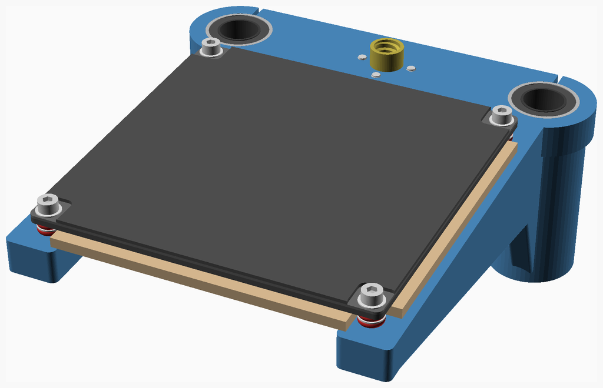

[Top](#TOP)

---

## Back_Face_Stage_1 assembly

### Vitamins

|Qty|Description|
|---:|:----------|
|8| Bolt M5 countersunk x 16mm|
|8| Nut M5 nyloc|
|4| SK12 shaft support bracket|

### 3D Printed parts

| 1 x Back_Face.stl |
|---|
| 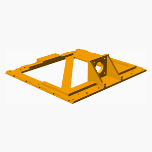 

### Assembly instructions

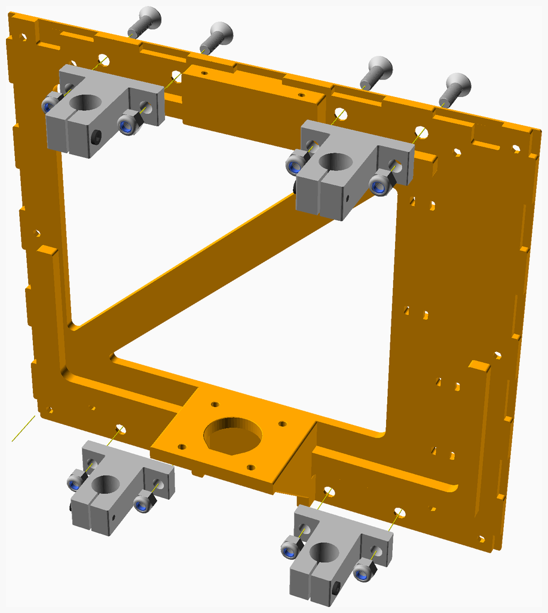

Attach the SK brackets to the back face. Note the orientation of the tightening bolts: the top tightening bolts should face inward and the bottom tightening bolts should face outward. This allows access after the BabyCube is fully assembled.

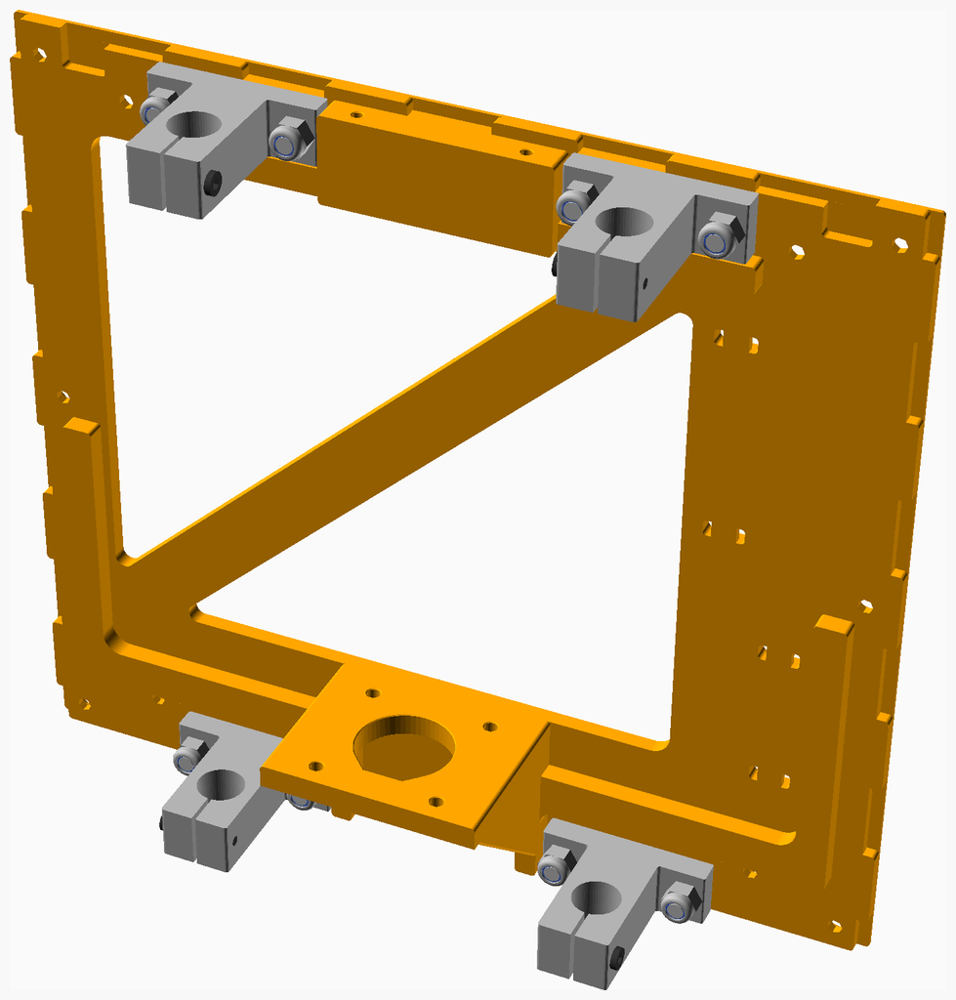

[Top](#TOP)

---

## Back_Face assembly

### Vitamins

|Qty|Description|
|---:|:----------|
|4| Bolt M3 buttonhead x 12mm|
|1| Cork damper NEMA 17|
|1| Leadscrew 8mm x 150mm|
|2| Linear rod 12mm x 200mm|
|1| Stepper motor NEMA17 x 34mm|
|1| Stepper motor cable, 150mm|

### Sub-assemblies

| 1 x Back_Face_Stage_1_assembly | 1 x Print_bed_assembly |
|---|---|
| 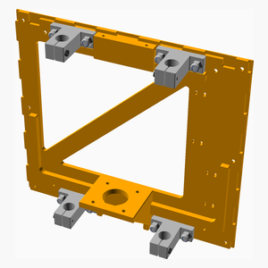 | 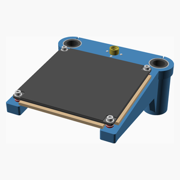 

### Assembly instructions

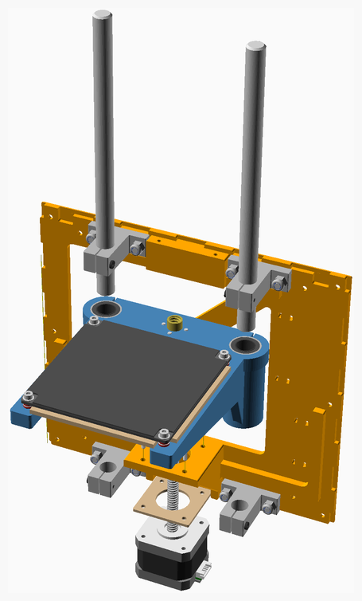

1. Slide the linear rods through the SK brackets and the printbed bearings.
2. Tighten the bolts in the SK brackets, ensuring the Z_Carriage slides freely on the rods.
3. Place the cork damper on the stepper motor and thread the lead screw through the leadnut and attach the stepper motor to the back face. Note the orientation of the JST socket.

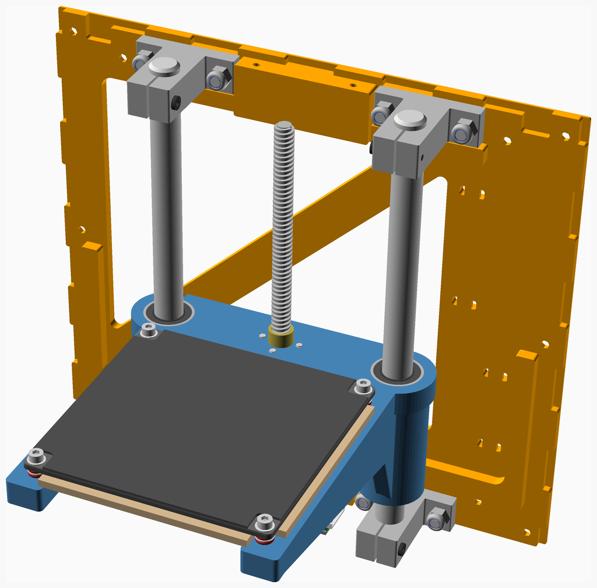

[Top](#TOP)

---

## Right_Face_Stage_1 assembly

### Vitamins

|Qty|Description|
|---:|:----------|
|4| Bolt M3 buttonhead x 12mm|
|1| Bolt M3 countersunk x 30mm|
|1| Cork damper NEMA 14|
|2| Pulley GT2 idler 16 teeth|
|1| Pulley GT2UM 20 teeth|
|1| Stepper motor NEMA14 x 36mm|
|1| Stepper motor cable, 400mm|
|6| Washer  M3|
|3| Ziptie 2.5mm x 100mm min length|

### 3D Printed parts

| 1 x Right_Face.stl |
|---|
| 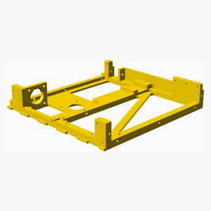 

### Assembly instructions

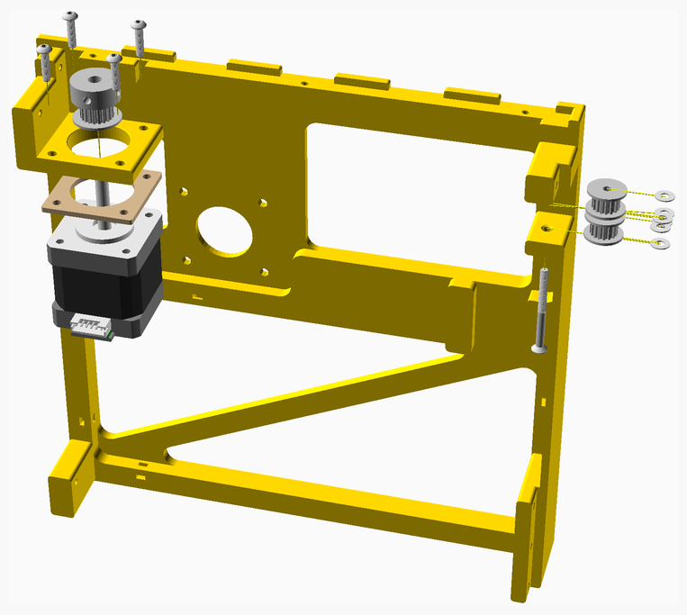

1. Place the cork damper on the stepper motor and bolt the motor to the frame.
Note the cork damper is important as it provides thermal insulation between the stepper motor and the frame.
Note orientation of the JST connector.
2. Attach the toothed idler pulleys to the frame, separated by the washers as shown.
3. Thread the zip ties through the frame, but do not tighten them yet, since the extruder motor cable will also go through the zip ties.

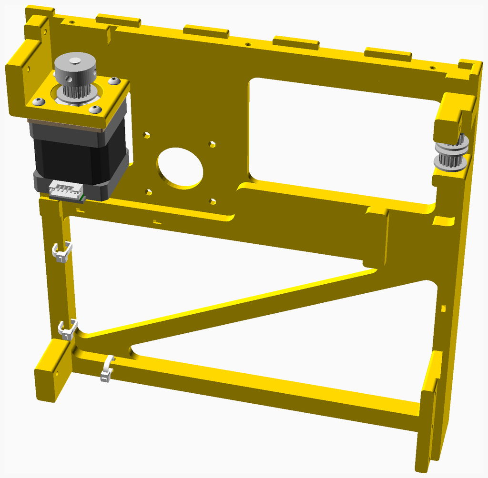

[Top](#TOP)

---

## Right_Face assembly

### Vitamins

|Qty|Description|
|---:|:----------|
|1| Cork damper NEMA 17|
|1| MK10 Dual Pulley Extruder|
|1| Stepper motor NEMA17 x 40mm|
|1| Stepper motor cable, 400mm|
|2| Ziptie 2.5mm x 100mm min length|

### Sub-assemblies

| 1 x Right_Face_Stage_1_assembly |
|---|
| 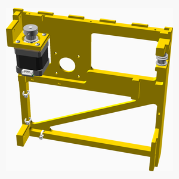 

### Assembly instructions

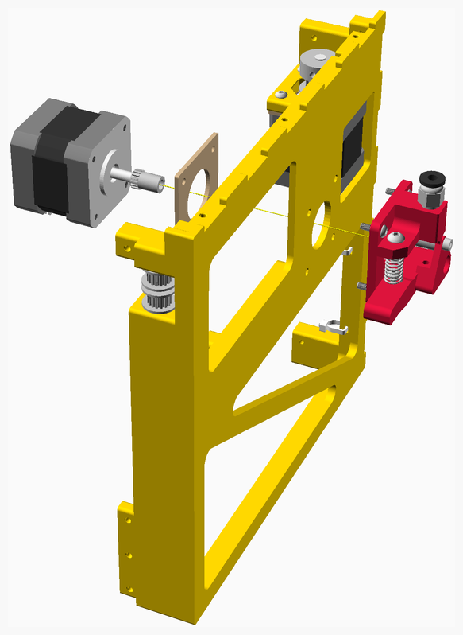

1. Attach the extruder gear to the stepper motor.
2. Place the cork damper on the stepper motor and attach the motor through the frame to the extruder. Note the cork damper is important as it provides thermal insulation between the stepper motor and the frame.
3. Secure the cables for both motors with the zip ties.

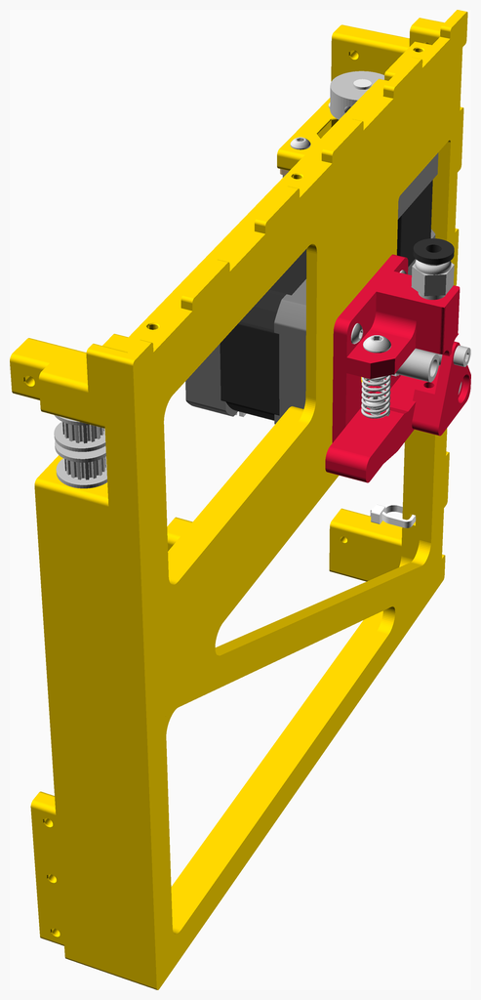

[Top](#TOP)

---

## Base assembly

### Vitamins

|Qty|Description|
|---:|:----------|
|1| Aluminium box section 12mm x 8mm x 1mm, length 85mm|
|1| Aluminium sheet 220mm x 204mm x 3mm|
|1| BigTreeTech SKR Mini E3 v2.0|
|2| Bolt M3 buttonhead x 10mm|
|5| Bolt M3 caphead x  6mm|
|5| Bolt M3 caphead x  8mm|
|5| Pillar hex nylon F/F M3x12|

### 3D Printed parts

| 1 x Base.stl | 1 x Base_Template.stl | 1 x PSU_Bracket.stl |
|---|---|---|
| 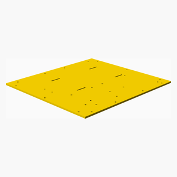 | 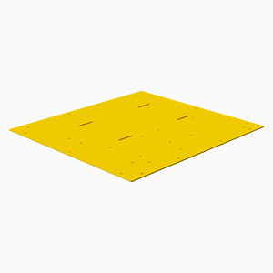 | 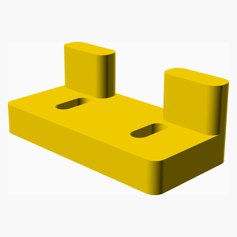 

| 2 x PSU_Support.stl |
|---|
| 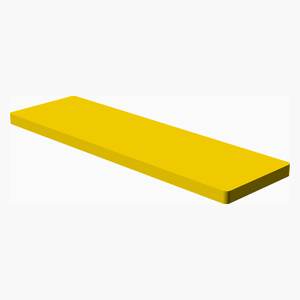 

### CNC Routed parts

| 1 x BaseAL.dxf |
|---|
|  

### Assembly instructions

1. Attach the Base_Template to the aluminium sheet and use it to drill out the holes. The base template has 2mm holes marked out for pilot holes.
Once you have drilled these re-drill the holes with a 3mm bit. Note that the Base_Template has holes marked for the BTT E3 Mini V2, the BTT E3 Turbo and the BTT STL 1.4 boards - choose the appropriate holes for your board.
If you are unable to source an aluminium sheet, it is possible to print and use the Base.stl file, but using and aluminium plate is much prefered.
2. Attach the PSU_Supports to the base plate with double sided tape.
3. Bolt the PSU_Bracket to the base plate.
4. Attach the PSU to the base plate with the velcro straps.
5. Cover the top and bottom sides of the box section with thermal paste.
6. Attach the box section to the bottom of the control board with electrical tape. The tape serves to keep the box section in place until it is attached to the base plate.
7. Using the hex pillars, attach the control board to the base plate.

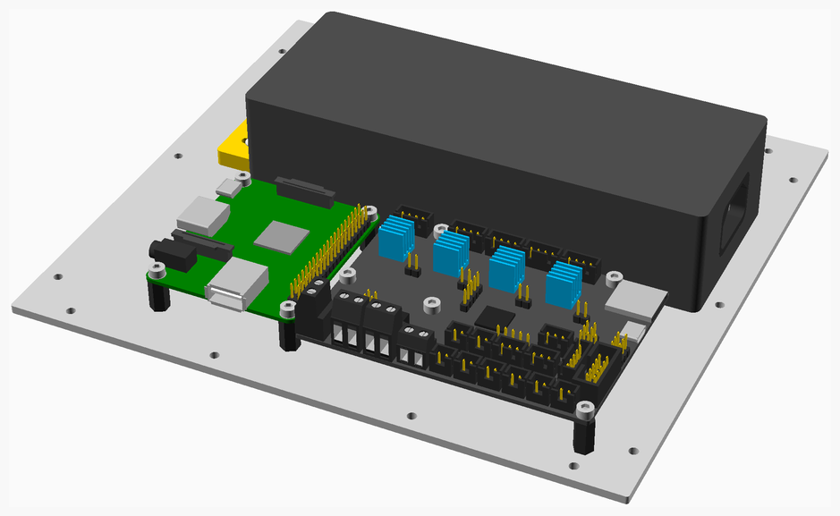

[Top](#TOP)

---

## Switch_Shroud assembly

### Vitamins

|Qty|Description|
|---:|:----------|
|1| Bolt M3 buttonhead x 10mm|
|2| Wire black 12SWG, length 100mm|
|2| Wire red 12SWG, length 100mm|
|1| XT60 Connector Female|
|1| XT60 Connector Female - not shown|
|1| XT60 Connector Male|
|1| XT60 Connector Male - not shown|

### 3D Printed parts

| 1 x Switch_Shroud.stl | 1 x Switch_Shroud_Clamp.stl |
|---|---|
| 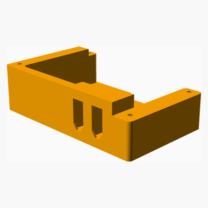 |  

### Assembly instructions

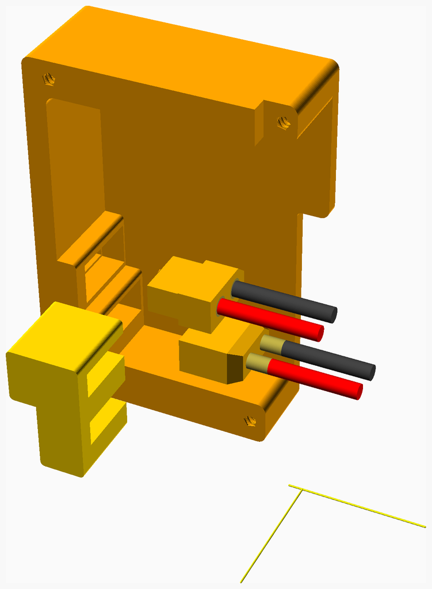

Place the XT60 connectors through the Switch_Shroud and bolt on the Switch_Shroud_Clamp to keep them in place.

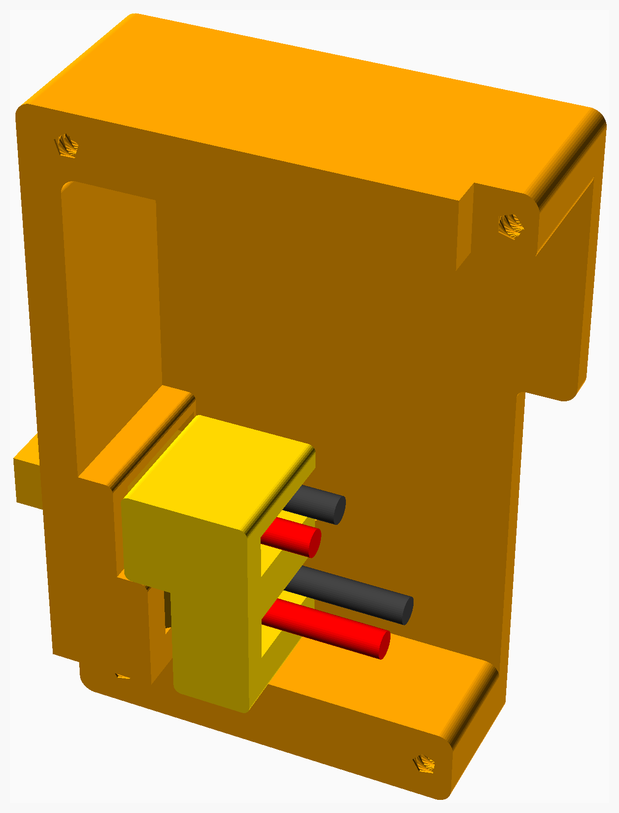

[Top](#TOP)

---

## Left_Face assembly

### Vitamins

|Qty|Description|
|---:|:----------|
|4| Bolt M3 buttonhead x 12mm|
|2| Bolt M3 countersunk x 12mm|
|2| Bolt M3 countersunk x 16mm|
|1| Bolt M3 countersunk x 30mm|
|1| Cork damper NEMA 14|
|2| Pulley GT2 idler 16 teeth|
|1| Pulley GT2UM 20 teeth|
|1| Rocker Switch PRASA1-16F-BB0BW|
|1| Stepper motor NEMA14 x 36mm|
|1| Stepper motor cable, 400mm|
|6| Washer  M3|
|5| Ziptie 2.5mm x 100mm min length|

### 3D Printed parts

| 1 x Left_Face.stl |
|---|
|  

### Sub-assemblies

| 1 x Switch_Shroud_assembly |
|---|
|  

### Assembly instructions


1. Place the cork damper on the stepper motor and bolt the motor to the frame.
Note the cork damper is important as it provides thermal insulation between the stepper motor and the frame.
Note orientation of the JST connector.
2. Secure the motor wires with zip ties.
3. Bolt the two front idler pulleys with washers to the frame.
4. Attach the wires to the switch and bolt the Switch_Shroud to the left face.


[Top](#TOP)

---

## Stage_1 assembly

### Vitamins

|Qty|Description|
|---:|:----------|
|1| Bolt M3 buttonhead x  8mm|
|4| Bolt M3 buttonhead x 12mm|

### 3D Printed parts

| 2 x Foot_LShaped_8mm.stl |
|---|
|  

### Sub-assemblies

| 1 x Base_assembly | 1 x Left_Face_assembly |
|---|---|
|  |  

### Assembly instructions


Bolt the Left_Face and the left feet to the base.


[Top](#TOP)

---

## Stage_2 assembly

### Vitamins

|Qty|Description|
|---:|:----------|
|1| Bolt M3 buttonhead x  8mm|
|4| Bolt M3 buttonhead x 12mm|

### 3D Printed parts

| 2 x Foot_LShaped_8mm.stl |
|---|
|  

### Sub-assemblies

| 1 x Right_Face_assembly | 1 x Stage_1_assembly |
|---|---|
|  |  

### Assembly instructions


Bolt the Right_Face and the right feet to the base.


[Top](#TOP)

---

## Stage_3 assembly

### Vitamins

|Qty|Description|
|---:|:----------|
|2| Bolt M3 buttonhead x 10mm|
|6| Bolt M3 countersunk x  6mm|
|4| Bolt M3 countersunk x 10mm|
|4| Ziptie 2.5mm x 100mm min length|

### Sub-assemblies

| 1 x Back_Face_assembly | 1 x Stage_2_assembly |
|---|---|
|  |  

### Assembly instructions


Add the Back_Face and bolt it to the left and right faces and the base.


[Top](#TOP)

---

## Stage_4 assembly

### Vitamins

|Qty|Description|
|---:|:----------|
|2| Bolt M3 buttonhead x 10mm|
|8| Bolt M3 countersunk x 10mm|

### 3D Printed parts

| 1 x Front_Upper_Chord.stl |
|---|
|  

### Sub-assemblies

| 1 x Display_Housing_assembly | 1 x Stage_3_assembly |
|---|---|
|  |  

### Assembly instructions


Bolt the BabyCube nameplate and the Display_Housing to the front of the frame.


[Top](#TOP)

---

## Stage_5 assembly

### Vitamins

|Qty|Description|
|---:|:----------|
|10| Bolt M3 buttonhead x 12mm|

### Sub-assemblies

| 1 x Stage_4_assembly | 1 x Top_Face_assembly |
|---|---|
|  |  

### Assembly instructions


Add the Top_Face.


[Top](#TOP)

---

## Stage_6 assembly

### Vitamins

|Qty|Description|
|---:|:----------|
|1| Belt GT2 x 6mm x 728mm|
|1| Belt GT2 x 6mm x 728mm|
|2| Bolt M3 buttonhead x 10mm|
|6| Bolt M3 buttonhead x 12mm|
|1| Spiral wrap, 500mm|

### Sub-assemblies

| 1 x Print_head_assembly | 1 x Stage_5_assembly | 1 x X_Carriage_Front_assembly |
|---|---|---|
|  |  |  

### Assembly instructions

1. Add the Print_head.
2. Thread the belts in the pattern shown.
3. Adjust the belts tension.

[Top](#TOP)

---

## main assembly

### Vitamins

|Qty|Description|
|---:|:----------|
|1| PTFE tube 229 mm|

### 3D Printed parts

| 1 x Spool_Holder.stl |
|---|
|  

### Sub-assemblies

| 1 x Stage_6_assembly |
|---|
|  

### Assembly instructions


1. Connect the wiring to the print head.
2. Connect the Bowden tube.
3. Add the spool holder.
4. Calibrate the printer.

[Top](#TOP)
