

# BabyCube Assembly Instructions

These are the assembly instructions for the BabyCube. These instructions are not fully comprehensive, that
is they do not show every small detail of the construction, and in particular they do not show the wiring. However there
is sufficient detail that someone with a good understanding of 3D printers can build the BabyCube.

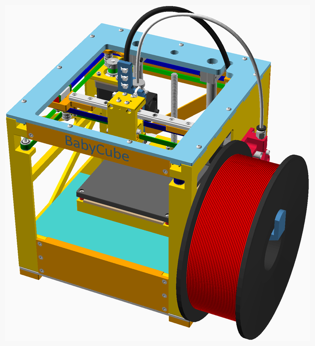

---

## Table of Contents

1. [Parts list](#Parts_list)
1. [Printhead_DropEffect_XG assembly](#Printhead_DropEffect_XG_assembly)
1. [X_Carriage_Belt_Side_MGN9C_RB assembly](#X_Carriage_Belt_Side_MGN9C_RB_assembly)
1. [Left_Face assembly](#Left_Face_assembly)
1. [Top_Face_Stage_1 assembly](#Top_Face_Stage_1_assembly)
1. [Top_Face_Stage_2 assembly](#Top_Face_Stage_2_assembly)
1. [Top_Face assembly](#Top_Face_assembly)
1. [Print_bed_3_point_printed_Stage_1 assembly](#Print_bed_3_point_printed_Stage_1_assembly)
1. [Print_bed_3_point_printed assembly](#Print_bed_3_point_printed_assembly)
1. [Back_Face_Stage_1 assembly](#Back_Face_Stage_1_assembly)
1. [Back_Face assembly](#Back_Face_assembly)
1. [Right_Face_Stage_1 assembly](#Right_Face_Stage_1_assembly)
1. [Right_Face assembly](#Right_Face_assembly)
1. [Base assembly](#Base_assembly)
1. [Stage_1_RB assembly](#Stage_1_RB_assembly)
1. [Stage_2_RB assembly](#Stage_2_RB_assembly)
1. [Stage_3_RB assembly](#Stage_3_RB_assembly)
1. [Stage_4_RB assembly](#Stage_4_RB_assembly)
1. [Stage_5_RB assembly](#Stage_5_RB_assembly)
1. [Stage_6_RB assembly](#Stage_6_RB_assembly)
1. [BC220 assembly](#BC220_assembly)

[Top](#TOP)

---

## Parts list

| Printhead DropEffect XG | X Carriage Belt Side MGN9C RB | Left Face | Top Face | Print Bed 3 Point Printed | Back Face | Right Face | Base | BC220 | TOTALS |  |
|-----:|-----:|-----:|-----:|-----:|-----:|-----:|-----:|-----:|------:|:-------------|
|      |      |      |      |      |      |      |      |      |       | **Vitamins** |
|   .  |   .  |   .  |   .  |   .  |   .  |   .  |   1  |   .  |    1  |  Aluminium box section 12mm x 8mm x 1mm, length 85mm |
|   .  |   .  |   .  |   .  |   .  |   .  |   .  |   1  |   .  |    1  |  Aluminium sheet 220mm x 224mm x 3mm |
|   .  |   .  |   8  |   8  |   .  |   .  |   8  |   .  |   .  |   24  |  Ball bearing F623-2RS 3mm x 10mm x 4mm |
|   .  |   1  |   .  |   .  |   .  |   .  |   .  |   .  |   .  |    1  |  Belt GT2 x 6mm x 842mm - not shown |
|   .  |   1  |   .  |   .  |   .  |   .  |   .  |   .  |   .  |    1  |  Belt GT2 x 6mm x 842mm - not shown |
|   .  |   .  |   .  |   .  |   .  |   .  |   .  |   1  |   .  |    1  |  BigTreeTech SKR Mini E3 v2.0 |
|   4  |   .  |   .  |   .  |   .  |   .  |   .  |   .  |   .  |    4  |  Bolt M2.5 caphead x  6mm |
|   .  |   .  |   .  |   .  |   .  |   .  |   .  |   .  |   2  |    2  |  Bolt M3 buttonhead x  8mm |
|   .  |   .  |   .  |   .  |   .  |   4  |   .  |   .  |   4  |    8  |  Bolt M3 buttonhead x 10mm |
|   .  |   .  |   .  |   .  |   .  |   .  |   .  |   .  |  23  |   23  |  Bolt M3 buttonhead x 12mm |
|   .  |   .  |   .  |   .  |   .  |   .  |   4  |   .  |   .  |    4  |  Bolt M3 buttonhead x 16mm |
|   .  |   .  |   2  |  30  |   2  |   .  |   2  |  10  |   2  |   48  |  Bolt M3 caphead x  8mm |
|   .  |   .  |   .  |   4  |   .  |   .  |   .  |   .  |   .  |    4  |  Bolt M3 caphead x 10mm |
|   .  |   .  |   .  |   2  |   .  |   .  |   .  |   .  |   .  |    2  |  Bolt M3 caphead x 16mm |
|   .  |   .  |   1  |   2  |   .  |   .  |   1  |   .  |   4  |    8  |  Bolt M3 caphead x 25mm |
|   .  |   2  |   .  |   .  |   .  |   .  |   .  |   .  |   .  |    2  |  Bolt M3 caphead x 30mm |
|   .  |   .  |   .  |   .  |   4  |   .  |   .  |   .  |   .  |    4  |  Bolt M3 caphead x 35mm |
|   .  |   .  |   .  |   .  |   .  |   .  |   .  |   .  |   2  |    2  |  Bolt M3 countersunk x  6mm |
|   2  |   .  |   .  |   .  |   .  |   .  |   .  |   .  |   .  |    2  |  Bolt M3 countersunk x  8mm |
|   .  |   .  |   .  |   .  |   .  |   .  |   .  |   .  |  16  |   16  |  Bolt M3 countersunk x 10mm |
|   .  |   .  |   1  |   .  |   3  |   .  |   3  |   .  |   .  |    7  |  Bolt M3 countersunk x 12mm |
|   .  |   .  |   2  |   .  |   .  |   .  |   2  |   .  |   .  |    4  |  Bolt M3 countersunk x 35mm |
|   .  |   .  |   .  |   .  |   .  |   .  |   .  |   2  |   .  |    2  |  Bolt M4 buttonhead x  8mm |
|   .  |   .  |   .  |   .  |   4  |   .  |   .  |   .  |   .  |    4  |  Bolt M5 countersunk x 12mm |
|   .  |   .  |   .  |   .  |   .  |   8  |   .  |   .  |   .  |    8  |  Bolt M5 countersunk x 16mm |
|   .  |   .  |   1  |   .  |   .  |   .  |   1  |   .  |   .  |    2  |  Cork damper NEMA 14 |
|   .  |   .  |   .  |   .  |   .  |   1  |   1  |   .  |   .  |    2  |  Cork damper NEMA 17 |
|   .  |   .  |   .  |   .  |   1  |   .  |   .  |   .  |   .  |    1  |  Cork underlay 120mm x 120mm x 3mm |
|   1  |   .  |   .  |   .  |   .  |   .  |   .  |   .  |   .  |    1  |  DropEffect XG Hotend |
|   .  |   .  |   .  |   .  |   .  |   .  |   1  |   .  |   .  |    1  |  Fan 30mm x 10mm |
|   .  |   .  |   .  |   .  |   1  |   .  |   .  |   .  |   .  |    1  |  Heating pad 100mm x 100mm |
|   .  |   .  |   .  |   .  |   .  |   .  |   1  |   .  |   .  |    1  |  IEC320 C14 switched fused inlet module |
|   .  |   .  |   .  |   .  |   1  |   .  |   .  |   .  |   .  |    1  |  Leadscrew nut 8 x 2 |
|   .  |   .  |   .  |   1  |   .  |   .  |   .  |   .  |   .  |    1  |  Linear rail MGN9 x 150mm |
|   .  |   .  |   .  |   2  |   .  |   .  |   .  |   .  |   .  |    2  |  Linear rail MGN9 x 200mm |
|   .  |   .  |   .  |   3  |   .  |   .  |   .  |   .  |   .  |    3  |  Linear rail carriage MGN9C |
|   .  |   .  |   .  |   .  |   .  |   2  |   .  |   .  |   .  |    2  |  Linear rod 12mm x 200mm |
|   .  |   .  |   .  |   .  |   .  |   .  |   1  |   .  |   .  |    1  |  MK10 Dual Pulley Extruder |
|   .  |   .  |   .  |   .  |   1  |   .  |   .  |   .  |   .  |    1  |  Magnetic base 120mm x 120mm |
|   .  |   .  |   .  |   .  |   .  |   .  |   4  |   .  |   .  |    4  |  Nut M3 x 2.4mm  |
|   .  |   .  |   .  |   .  |   .  |   8  |   .  |   .  |   .  |    8  |  Nut M5 x 4mm nyloc |
|   .  |   .  |   .  |   .  |   9  |   .  |   .  |   .  |   .  |    9  |  O-ring nitrile 3mm x 2mm |
|   .  |   .  |   .  |   .  |   .  |   .  |   .  |   1  |   .  |    1  |  PSU NIUGUY CB-200W-24V |
|   .  |   .  |   .  |   .  |   .  |   .  |   .  |   .  |   1  |    1  |  PTFE tube 307 mm |
|   .  |   .  |   .  |   .  |   .  |   .  |   .  |   5  |   .  |    5  |  Pillar hex nylon F/F M3x12 |
|   .  |   .  |   1  |   .  |   .  |   .  |   1  |   .  |   .  |    2  |  Pulley GT2OB 20 teeth |
|   .  |   .  |   .  |   .  |   .  |   .  |   .  |   1  |   .  |    1  |  Raspberry Pi 3A+ (optional) |
|   .  |   .  |   .  |   .  |   2  |   .  |   .  |   .  |   .  |    2  |  SCS12UU bearing block |
|   .  |   .  |   .  |   .  |   .  |   4  |   .  |   .  |   .  |    4  |  SK12 shaft support bracket |
|   1  |   .  |   .  |   .  |   .  |   .  |   .  |   .  |   .  |    1  |  Spiral cable wrap, 500mm |
|   1  |   .  |   .  |   .  |   .  |   .  |   .  |   .  |   .  |    1  |  Square radial fan 3010 |
|   .  |   .  |   1  |   .  |   .  |   .  |   1  |   .  |   .  |    2  |  Stepper motor NEMA14 x 36mm |
|   .  |   .  |   .  |   .  |   .  |   1  |   .  |   .  |   .  |    1  |  Stepper motor NEMA17 x 34mm, 150mm integrated leadscrew |
|   .  |   .  |   .  |   .  |   .  |   .  |   1  |   .  |   .  |    1  |  Stepper motor NEMA17 x 40mm |
|   .  |   .  |   .  |   .  |   .  |   1  |   .  |   .  |   .  |    1  |  Stepper motor cable, 150mm |
|   .  |   .  |   .  |   .  |   .  |   .  |   1  |   .  |   .  |    1  |  Stepper motor cable, 300mm |
|   .  |   .  |   .  |   .  |   1  |   .  |   .  |   .  |   .  |    1  |  Voron V0 aluminium build plate 120mm x 120mm x 6mm |
|   .  |   2  |  14  |  10  |   .  |   .  |  14  |   .  |   .  |   40  |  Washer M3 x 7mm x 0.5mm |
|   6  |   .  |   .  |   .  |   1  |   .  |   2  |   .  |   4  |   13  |  Ziptie 2.5mm x 100mm min length |
|  15  |   6  |  31  |  62  |  30  |  29  |  49  |  22  |  58  |  302  | Total vitamins count |
|      |      |      |      |      |      |      |      |      |       | **3D printed parts** |
|   .  |   .  |   .  |   .  |   .  |   1  |   .  |   .  |   .  |    1  | Back_Face_x220_z210.stl |
|   .  |   .  |   .  |   .  |   .  |   .  |   .  |   .  |   1  |    1  | Base_Cover_RB.stl |
|   1  |   .  |   .  |   .  |   .  |   .  |   .  |   .  |   .  |    1  | DropEffectXG_Fan_Duct.stl |
|   .  |   .  |   .  |   .  |   .  |   .  |   .  |   .  |   4  |    4  | Foot_LShaped_8mm.stl |
|   .  |   .  |   .  |   .  |   .  |   .  |   .  |   .  |   1  |    1  | Front_Lower_Chord_Solid.stl |
|   .  |   .  |   .  |   .  |   .  |   .  |   .  |   .  |   1  |    1  | Front_Upper_Chord.stl |
|   .  |   .  |   .  |   .  |   .  |   .  |   1  |   .  |   .  |    1  | IEC_Housing.stl |
|   .  |   .  |   1  |   .  |   .  |   .  |   .  |   .  |   .  |    1  | Left_Face_y220_z210.stl |
|   .  |   .  |   .  |   .  |   1  |   .  |   .  |   .  |   .  |    1  | Printbed_Frame.stl |
|   .  |   .  |   .  |   .  |   .  |   .  |   1  |   .  |   .  |    1  | Right_Face_y220_z210.stl |
|   .  |   .  |   .  |   .  |   .  |   .  |   .  |   .  |   1  |    1  | Spool_Holder.stl |
|   .  |   .  |   .  |   1  |   .  |   .  |   .  |   .  |   .  |    1  | Top_Face_x220_y220.stl |
|   .  |   .  |   1  |   .  |   .  |   .  |   .  |   .  |   .  |    1  | XY_Motor_Mount_Brace_Left.stl |
|   .  |   .  |   .  |   .  |   .  |   .  |   1  |   .  |   .  |    1  | XY_Motor_Mount_Brace_Right.stl |
|   .  |   .  |   1  |   .  |   .  |   .  |   1  |   .  |   .  |    2  | XY_Pulley_Spacer_M3.stl |
|   .  |   .  |   .  |   .  |   .  |   .  |   .  |   .  |   1  |    1  | X_Carriage_Belt_Clamp.stl |
|   .  |   1  |   .  |   .  |   .  |   .  |   .  |   .  |   .  |    1  | X_Carriage_Belt_Side_MGN9C_RB.stl |
|   .  |   2  |   .  |   .  |   .  |   .  |   .  |   .  |   .  |    2  | X_Carriage_Belt_Tensioner_RB.stl |
|   1  |   .  |   .  |   .  |   .  |   .  |   .  |   .  |   .  |    1  | X_Carriage_DropEffect_XG.stl |
|   .  |   .  |   .  |   1  |   .  |   .  |   .  |   .  |   .  |    1  | Y_Carriage_Brace_Left_RB.stl |
|   .  |   .  |   .  |   1  |   .  |   .  |   .  |   .  |   .  |    1  | Y_Carriage_Brace_Right_RB.stl |
|   .  |   .  |   .  |   1  |   .  |   .  |   .  |   .  |   .  |    1  | Y_Carriage_Left_RB.stl |
|   .  |   .  |   .  |   1  |   .  |   .  |   .  |   .  |   .  |    1  | Y_Carriage_Right_RB.stl |
|   2  |   3  |   3  |   5  |   1  |   1  |   4  |   .  |   9  |   28  | Total 3D printed parts count |
|      |      |      |      |      |      |      |      |      |       | **CNC routed parts** |
|   .  |   .  |   .  |   .  |   .  |   .  |   .  |   1  |   .  |    1  | BaseAL_x220_y220.dxf |
|   .  |   .  |   .  |   .  |   .  |   .  |   .  |   1  |   .  |    1  | Total CNC routed parts count |

[Top](#TOP)

---

## Printhead_DropEffect_XG assembly

### Vitamins

| Qty | Description |
|----:|:------------|
|   4 | Bolt M2.5 caphead x  6mm |
|   2 | Bolt M3 countersunk x  8mm |
|   1 | DropEffect XG Hotend |
|   1 | Spiral cable wrap, 500mm |
|   1 | Square radial fan 3010 |
|   6 | Ziptie 2.5mm x 100mm min length |

### 3D Printed parts

| 1 x DropEffectXG_Fan_Duct.stl | 1 x X_Carriage_DropEffect_XG.stl |
|----------|----------|
| 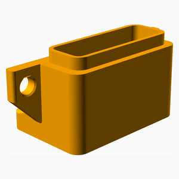 | 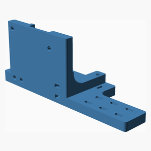 |

### Assembly instructions

1. Assemble the DropEffect XG hotend, including fan and Bowden adaptor.
2. Attach the DropEffect XG hotend to the **X_Carriage**
3. Gather the cables from the printhead and wrap them in spiral cable wrap.
4. Use zipties to secure the wrapped cables to the printhead

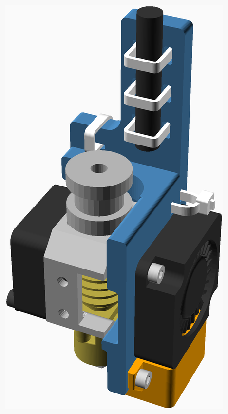

[Top](#TOP)

---

## X_Carriage_Belt_Side_MGN9C_RB assembly

### Vitamins

| Qty | Description |
|----:|:------------|
|   1 | Belt GT2 x 6mm x 842mm - not shown |
|   1 | Belt GT2 x 6mm x 842mm - not shown |
|   2 | Bolt M3 caphead x 30mm |
|   2 | Washer M3 x 7mm x 0.5mm |

### 3D Printed parts

| 1 x X_Carriage_Belt_Side_MGN9C_RB.stl | 2 x X_Carriage_Belt_Tensioner_RB.stl |
|----------|----------|
| 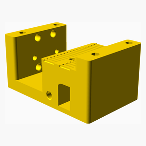 | 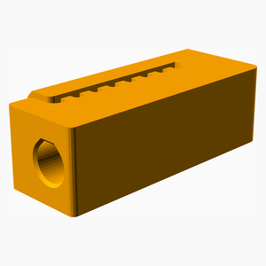 |

### Assembly instructions

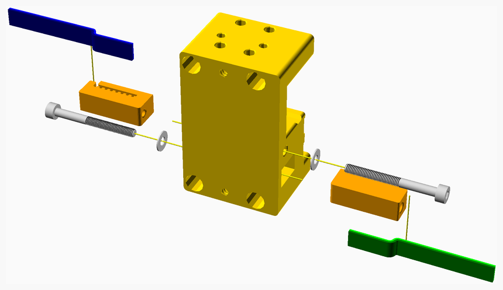

1. Insert the belts into the **X_Carriage_Belt_Tensioner**s.
2. Bolt the tensioners into the **X_Carriage_Belt_Side_MGN9C** part as shown.

Note: it may be a tight fit to insert the **X_Carriage_Belt_Tensioner**s into the **X_Carriage_Belt_Side_MGN9C**.
It may be necessary to use a small file to file the slots in the X_Carriage. This is especially the case with the tops
of the slots - these are printed using bridging and depending on how well your printer does bridging, so adjustemnt
may be required.

Note: for clarity, only a segment of the belts are shown in this diagram.

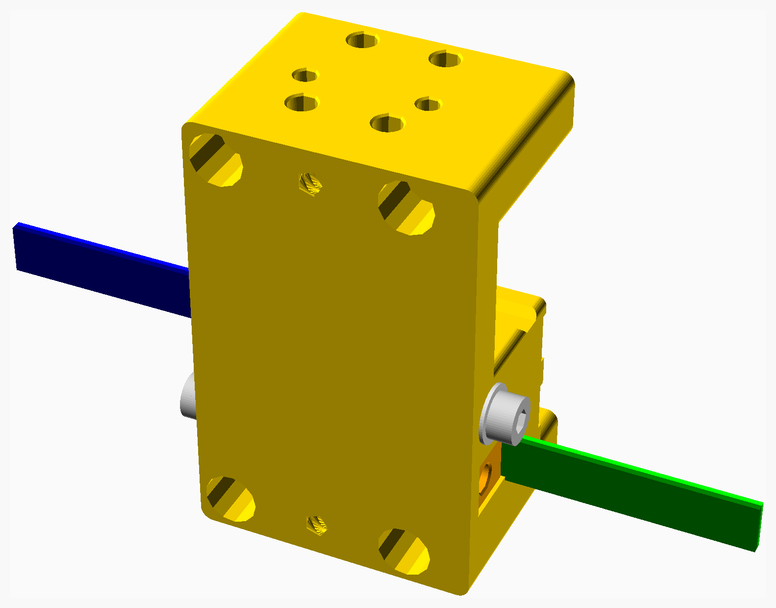

[Top](#TOP)

---

## Left_Face assembly

### Vitamins

| Qty | Description |
|----:|:------------|
|   8 | Ball bearing F623-2RS 3mm x 10mm x 4mm |
|   2 | Bolt M3 caphead x  8mm |
|   1 | Bolt M3 caphead x 25mm |
|   1 | Bolt M3 countersunk x 12mm |
|   2 | Bolt M3 countersunk x 35mm |
|   1 | Cork damper NEMA 14 |
|   1 | Pulley GT2OB 20 teeth |
|   1 | Stepper motor NEMA14 x 36mm |
|  14 | Washer M3 x 7mm x 0.5mm |

### 3D Printed parts

| 1 x Left_Face_y220_z210.stl | 1 x XY_Motor_Mount_Brace_Left.stl | 1 x XY_Pulley_Spacer_M3.stl |
|----------|----------|----------|
| 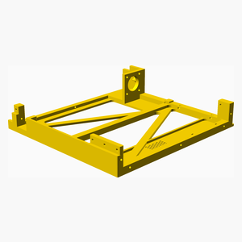 | 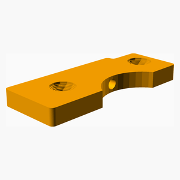 | 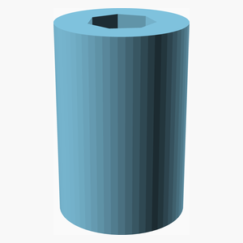 |

### Assembly instructions

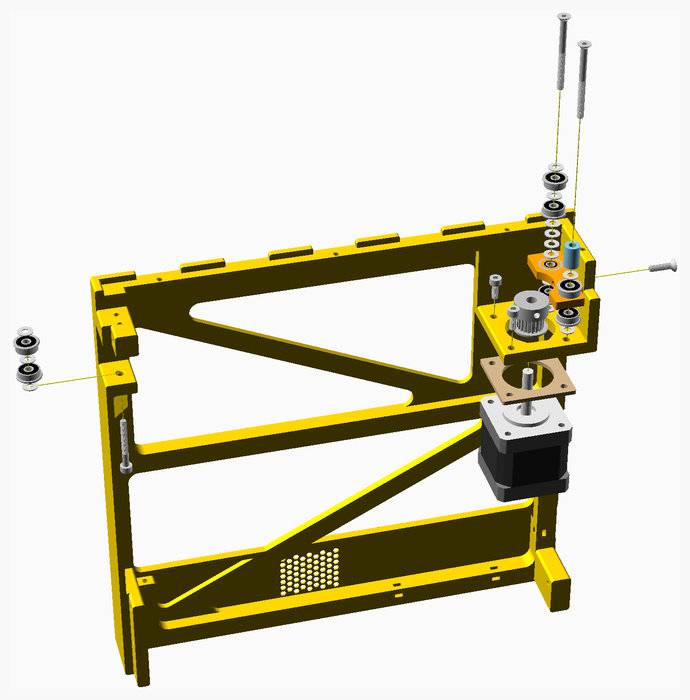

1. Place the cork damper on the stepper motor and bolt the motor to the frame.
Note the cork damper is important as it provides thermal insulation between the stepper motor and the frame.
Note orientation of the JST connector.
2. Secure the motor wires with zip ties.
3. Bolt the two front idler pulleys with washers to the frame.
4. Attach the wires to the switch and bolt the **Switch_Shroud** to the left face.

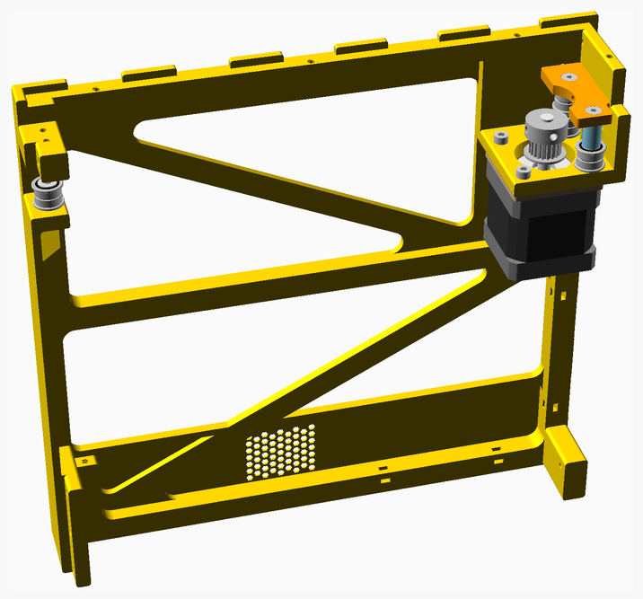

[Top](#TOP)

---

## Top_Face_Stage_1 assembly

### Vitamins

| Qty | Description |
|----:|:------------|
|  20 | Bolt M3 caphead x  8mm |
|   2 | Linear rail MGN9 x 200mm |
|   2 | Linear rail carriage MGN9C |

### 3D Printed parts

| 1 x Top_Face_x220_y220.stl |
|----------|
| 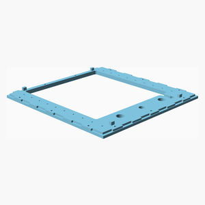 |

### Assembly instructions

1. Turn the **Top_Face** upside down and place it on a flat surface.
2. Bolt the rails to the **Top_Face**. Note that the first and last bolts on the left rail are countersunk bolts and act
as pilot bolts to ensure the rails are aligned precisely - they should be tightened before all the other bolts on the
left side.
3. The bolts on the right side rail should be only loosely tightened - they will be fully tightened when the right rail
is aligned when the X axis rail is added.

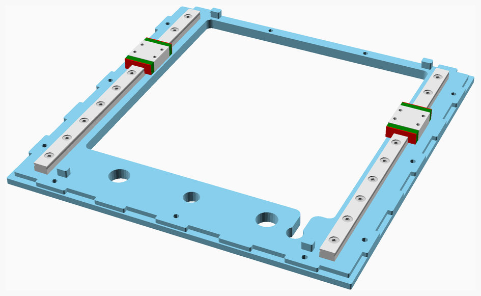

[Top](#TOP)

---

## Top_Face_Stage_2 assembly

### Vitamins

| Qty | Description |
|----:|:------------|
|   8 | Ball bearing F623-2RS 3mm x 10mm x 4mm |
|  10 | Bolt M3 caphead x  8mm |
|   2 | Bolt M3 caphead x 16mm |
|   2 | Bolt M3 caphead x 25mm |
|  10 | Washer M3 x 7mm x 0.5mm |

### 3D Printed parts

| 1 x Y_Carriage_Brace_Left_RB.stl | 1 x Y_Carriage_Brace_Right_RB.stl | 1 x Y_Carriage_Left_RB.stl |
|----------|----------|----------|
| 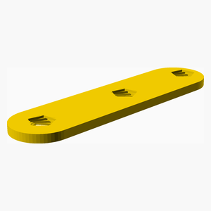 | 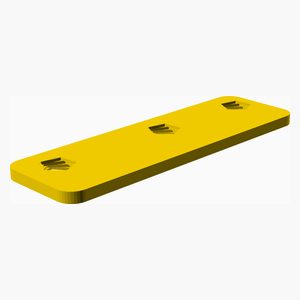 | 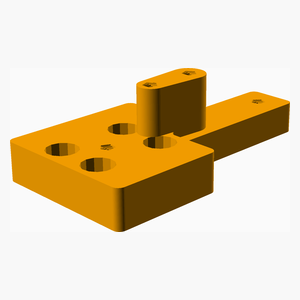 |

| 1 x Y_Carriage_Right_RB.stl |
|----------|
| 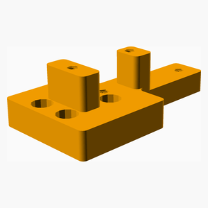 |

### Sub-assemblies

| 1 x Top_Face_Stage_1_assembly |
|----------|
| 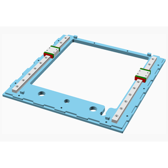 |

### Assembly instructions

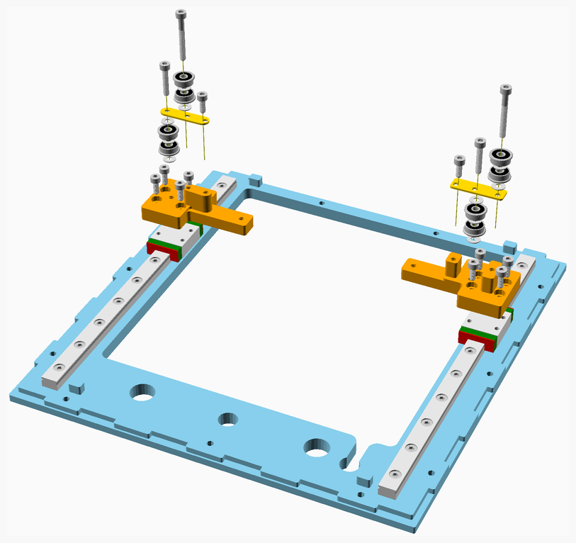

Attach the left and right **Y_carriages** to the top face rails. Note that the two carriages are not interchangeable
so be sure to attach them as shown in the diagram.

The carriages should be attached to the rails before the pulleys are added, since otherwise the bolts are not
accessible.
Attach the pulleys to the carriages. Note that the toothless pulleys are on the inside. Note also that there is a
washer under each of the upper pulleys, but not on top of those pulleys.

Tighten the pulley bolts until the pulleys stop running freely, and then loosen them slightly (approximately 1/16
of a turn) so they run freely.

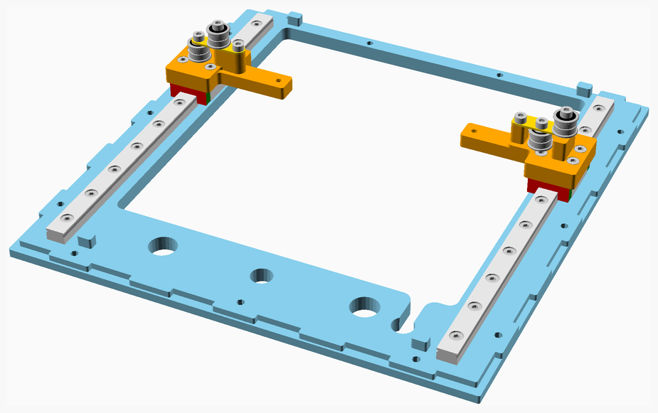

[Top](#TOP)

---

## Top_Face assembly

### Vitamins

| Qty | Description |
|----:|:------------|
|   4 | Bolt M3 caphead x 10mm |
|   1 | Linear rail MGN9 x 150mm |
|   1 | Linear rail carriage MGN9C |

### Sub-assemblies

| 1 x Top_Face_Stage_2_assembly |
|----------|
| 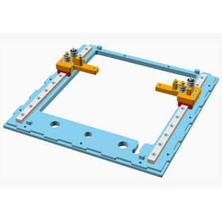 |

### Assembly instructions

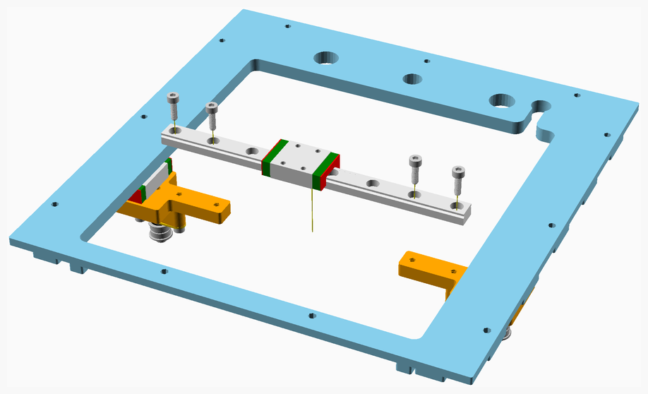

1. Turn the **Top_Face** into its normal orientation.
2. Bolt the X-axis linear rail onto the Y carriages.
3. Turn the Top_Face upside down again and place it on a flat surface.
4. Align the left and right Y-axis linear rails. Do this by pushing the X-axis rail to the rear of the **Top_Face** and tighten
the corresponding bolts (left loose in a previous step) and then push the X-axis rails to the front of the **Top_Face**,
again tightening the corresponding bolts.
5. Check that the carriages run smoothly on the Y-axis linear rails.

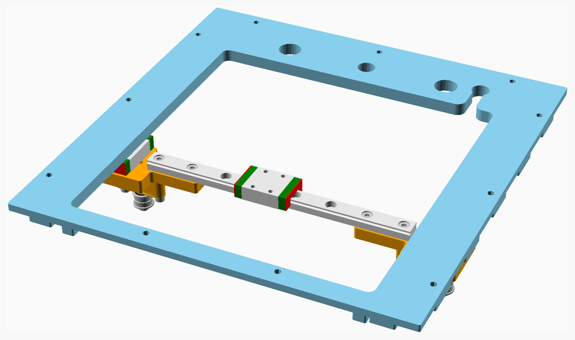

[Top](#TOP)

---

## Print_bed_3_point_printed_Stage_1 assembly

### Vitamins

| Qty | Description |
|----:|:------------|
|   2 | Bolt M3 caphead x  8mm |
|   4 | Bolt M3 caphead x 35mm |
|   4 | Bolt M5 countersunk x 12mm |
|   1 | Leadscrew nut 8 x 2 |
|   2 | SCS12UU bearing block |

### 3D Printed parts

| 1 x Printbed_Frame.stl |
|----------|
| 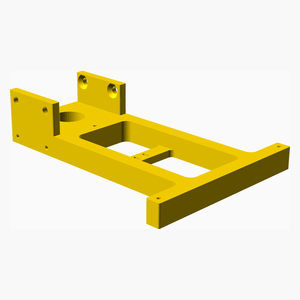 |

### Assembly instructions

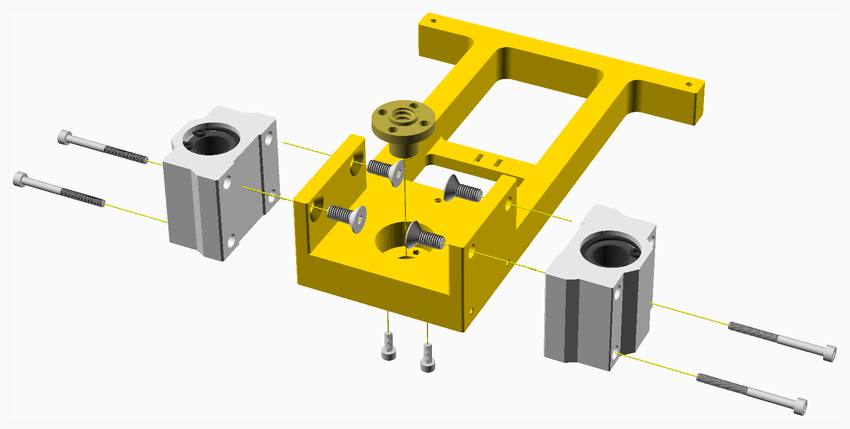

1. Bolt the bearing blocks to the sides of the **Printbed_Frame**.
2. Insert the leadnut and bolt it to the **Printbed_Frame**.

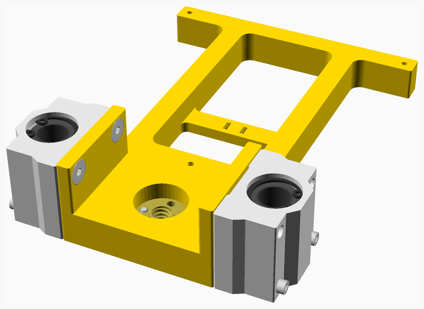

[Top](#TOP)

---

## Print_bed_3_point_printed assembly

### Vitamins

| Qty | Description |
|----:|:------------|
|   3 | Bolt M3 countersunk x 12mm |
|   1 | Cork underlay 120mm x 120mm x 3mm |
|   1 | Heating pad 100mm x 100mm |
|   1 | Magnetic base 120mm x 120mm |
|   9 | O-ring nitrile 3mm x 2mm |
|   1 | Voron V0 aluminium build plate 120mm x 120mm x 6mm |
|   1 | Ziptie 2.5mm x 100mm min length |

### Sub-assemblies

| 1 x Print_bed_3_point_printed_Stage_1_assembly |
|----------|
| 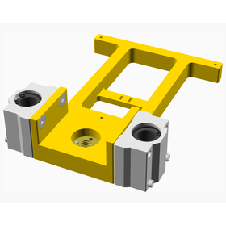 |

### Assembly instructions

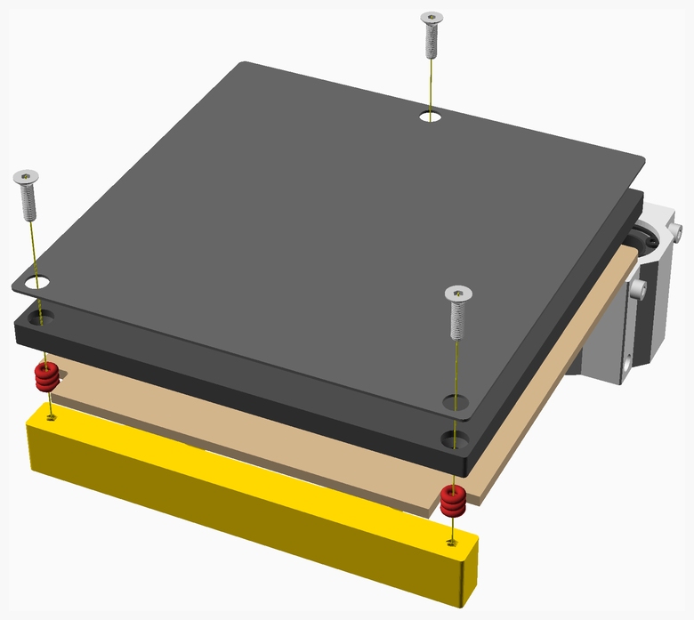

1. Prepare the the cork underlay by cutting it to size, making a cutout for the heated bed wiring, and drilling holes
for the bolts.
2. Attach the magnetic base to the top side of the aluminium tooling plate.
3. Attach the heating pad to the bottom side of the tooling plate.
4. Place the cork underlay on the **Printbed_Frame** and place the tooling plate on top.
5. Secure the tooling plate to the **Printbed_Frame**, using the bolts and O-rings. Note that the O-rings allow bed
leveling and help thermally insulate the heated bed from the **Printbed_Frame**.
6. Secure the heating pad wiring to the underside of the **Printbed_Frame** using a cable tie.

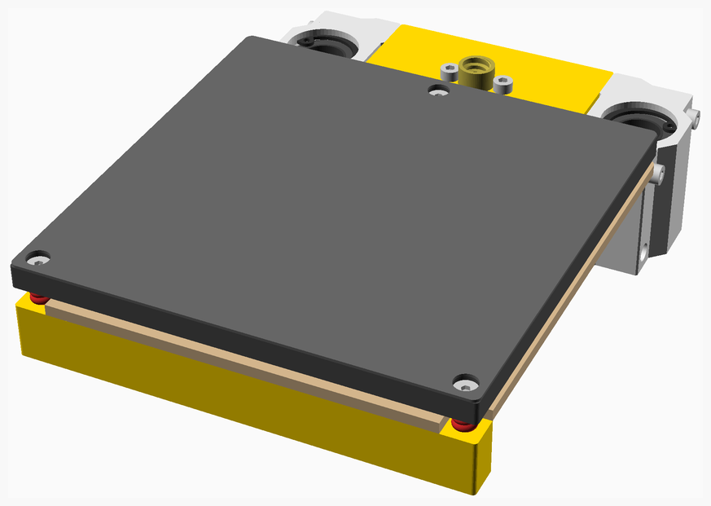

[Top](#TOP)

---

## Back_Face_Stage_1 assembly

### Vitamins

| Qty | Description |
|----:|:------------|
|   8 | Bolt M5 countersunk x 16mm |
|   8 | Nut M5 x 4mm nyloc |
|   4 | SK12 shaft support bracket |

### 3D Printed parts

| 1 x Back_Face_x220_z210.stl |
|----------|
| 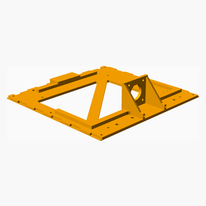 |

### Assembly instructions

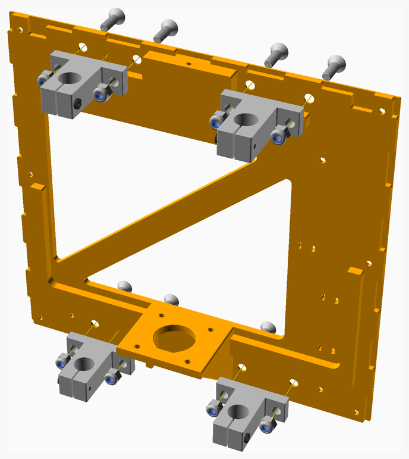

Attach the SK brackets to the **Back_Face**. Note the orientation of the tightening bolts: the top tightening bolts should
face inward and the bottom tightening bolts should face outward. This allows access after the BabyCube is fully assembled.

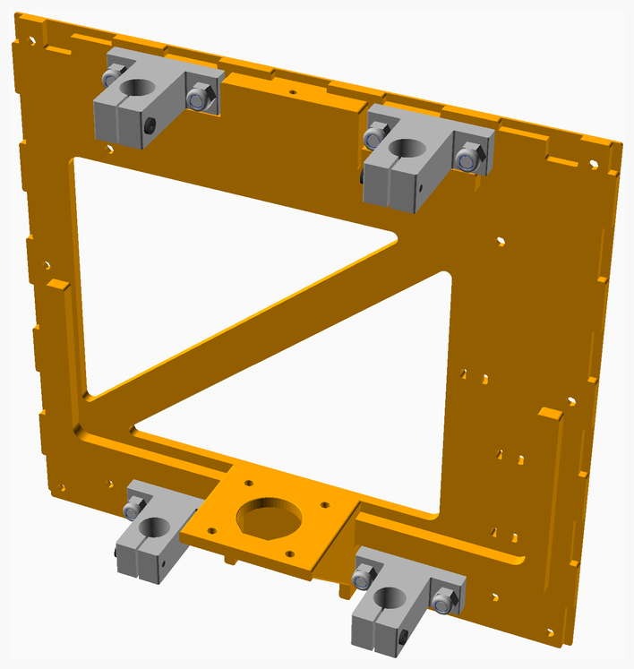

[Top](#TOP)

---

## Back_Face assembly

### Vitamins

| Qty | Description |
|----:|:------------|
|   4 | Bolt M3 buttonhead x 10mm |
|   1 | Cork damper NEMA 17 |
|   2 | Linear rod 12mm x 200mm |
|   1 | Stepper motor NEMA17 x 34mm, 150mm integrated leadscrew |
|   1 | Stepper motor cable, 150mm |

### Sub-assemblies

| 1 x Back_Face_Stage_1_assembly | 1 x Print_bed_3_point_printed_assembly |
|----------|----------|
| 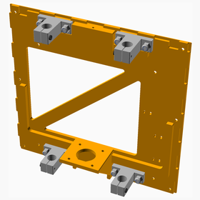 | 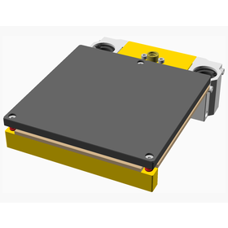 |

### Assembly instructions

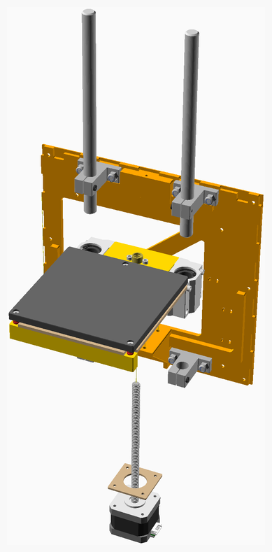

1. Slide the linear rods through the SK brackets and the printbed bearings.
2. Tighten the bolts in the SK brackets, ensuring the **Z_Carriage** slides freely on the rods.
3. Place the cork damper on the stepper motor and thread the lead screw through the leadnut and attach the stepper motor
  to the **Back_Face**. Note the orientation of the JST socket.

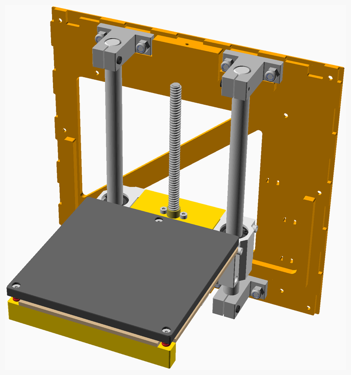

[Top](#TOP)

---

## Right_Face_Stage_1 assembly

### Vitamins

| Qty | Description |
|----:|:------------|
|   8 | Ball bearing F623-2RS 3mm x 10mm x 4mm |
|   2 | Bolt M3 caphead x  8mm |
|   1 | Bolt M3 caphead x 25mm |
|   1 | Bolt M3 countersunk x 12mm |
|   2 | Bolt M3 countersunk x 35mm |
|   1 | Cork damper NEMA 14 |
|   1 | Pulley GT2OB 20 teeth |
|   1 | Stepper motor NEMA14 x 36mm |
|  14 | Washer M3 x 7mm x 0.5mm |

### 3D Printed parts

| 1 x Right_Face_y220_z210.stl | 1 x XY_Motor_Mount_Brace_Right.stl | 1 x XY_Pulley_Spacer_M3.stl |
|----------|----------|----------|
| 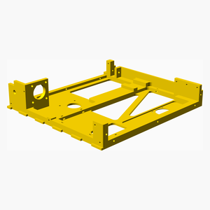 | 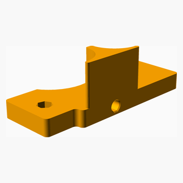 |  |

### Assembly instructions

1. Place the cork damper on the stepper motor and bolt the motor to the frame.
Note the cork damper is important as it provides thermal insulation between the stepper motor and the frame.
Note orientation of the JST connector.
2. Attach the toothed idler pulleys to the frame, separated by the washers as shown.
3. Thread the zip ties through the frame, but do not tighten them yet, since the extruder motor cable will also go through
the zip ties.

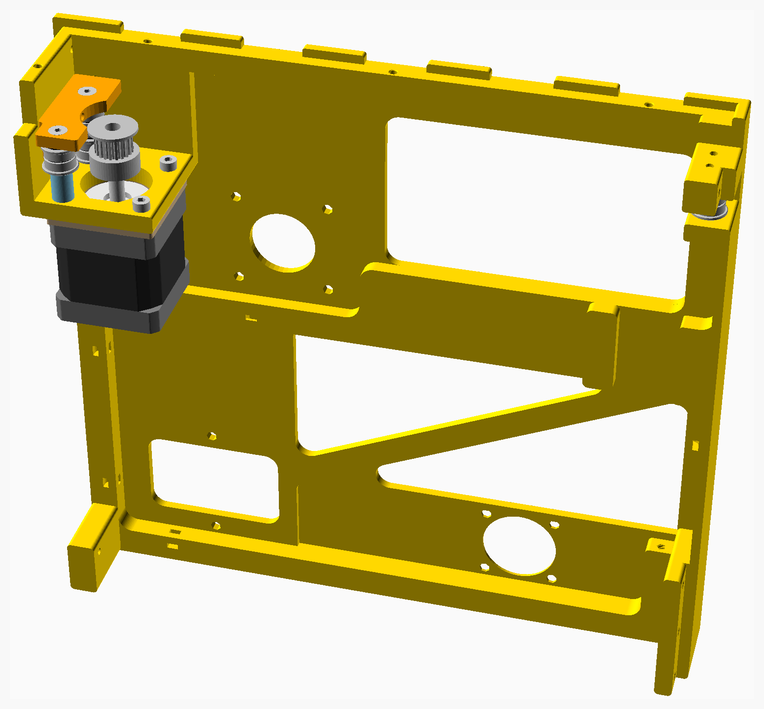

[Top](#TOP)

---

## Right_Face assembly

### Vitamins

| Qty | Description |
|----:|:------------|
|   4 | Bolt M3 buttonhead x 16mm |
|   2 | Bolt M3 countersunk x 12mm |
|   1 | Cork damper NEMA 17 |
|   1 | Fan 30mm x 10mm |
|   1 | IEC320 C14 switched fused inlet module |
|   1 | MK10 Dual Pulley Extruder |
|   4 | Nut M3 x 2.4mm  |
|   1 | Stepper motor NEMA17 x 40mm |
|   1 | Stepper motor cable, 300mm |
|   2 | Ziptie 2.5mm x 100mm min length |

### 3D Printed parts

| 1 x IEC_Housing.stl |
|----------|
| 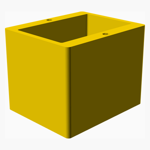 |

### Sub-assemblies

| 1 x Right_Face_Stage_1_assembly |
|----------|
| 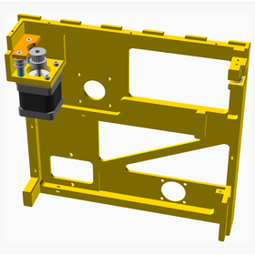 |

### Assembly instructions

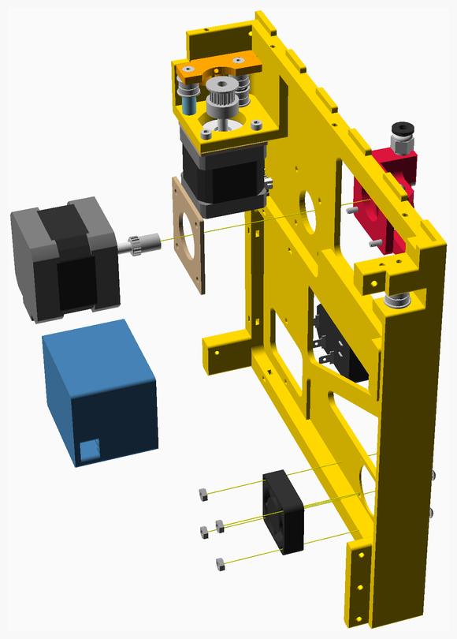

1. Attach the extruder gear to the stepper motor.
2. Place the cork damper on the stepper motor and attach the motor through the frame to the extruder. Note the cork
damper is important as it provides thermal insulation between the stepper motor and the frame.
3. Secure the cables for both motors with the zip ties.

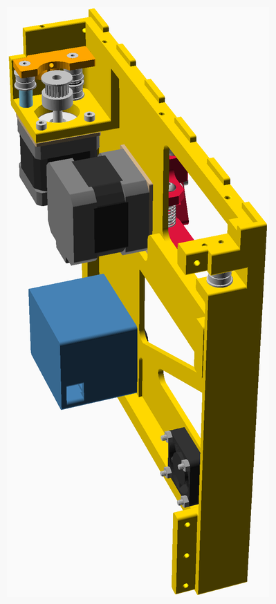

[Top](#TOP)

---

## Base assembly

### Vitamins

| Qty | Description |
|----:|:------------|
|   1 | Aluminium box section 12mm x 8mm x 1mm, length 85mm |
|   1 | Aluminium sheet 220mm x 224mm x 3mm |
|   1 | BigTreeTech SKR Mini E3 v2.0 |
|  10 | Bolt M3 caphead x  8mm |
|   2 | Bolt M4 buttonhead x  8mm |
|   1 | PSU NIUGUY CB-200W-24V |
|   5 | Pillar hex nylon F/F M3x12 |
|   1 | Raspberry Pi 3A+ (optional) |

### CNC Routed parts

| 1 x BaseAL_x220_y220.dxf |
|----------|
|  

### Assembly instructions

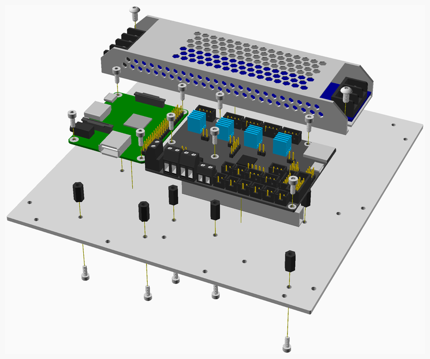

1. Attach the **Base_Template** to the aluminium sheet and use it to drill out the holes. The base template has 2mm holes
marked out for pilot holes. Once you have drilled these re-drill the holes with a 3mm bit. Note that the **Base_Template**
has holes marked for the BTT E3 Mini V2, the BTT E3 Turbo and the BTT STL 1.4 boards - choose the appropriate holes for
your board. If you are unable to source an aluminium sheet, it is possible to print and use the Base.stl file, but
using and aluminium plate is much preferred.
2. Attach the PSU_Supports to the base plate with double sided tape.
3. Bolt the PSU_Bracket to the base plate.
4. Attach the PSU to the base plate with the velcro straps.
5. Cover the top and bottom sides of the box section with thermal paste.
6. Attach the box section to the bottom of the control board with electrical tape. The tape serves to keep the box
section in place until it is attached to the base plate.
7. Using the hex pillars, attach the control board to the base plate.

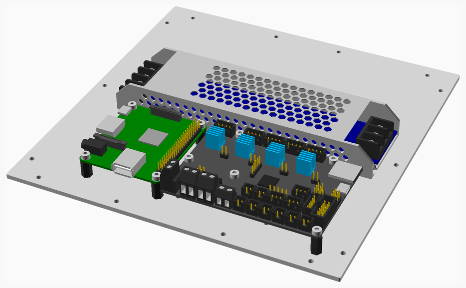

[Top](#TOP)

---

## Stage_1_RB assembly

### Vitamins

| Qty | Description |
|----:|:------------|
|   1 | Bolt M3 buttonhead x  8mm |
|   4 | Bolt M3 buttonhead x 12mm |

### 3D Printed parts

| 2 x Foot_LShaped_8mm.stl |
|----------|
| 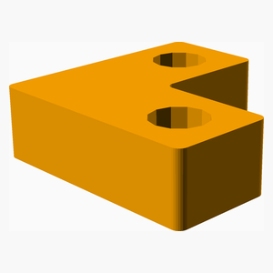 |

### Sub-assemblies

| 1 x Base_assembly | 1 x Right_Face_assembly |
|----------|----------|
| 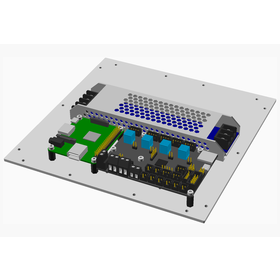 | 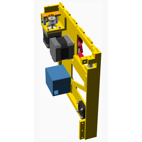 |

### Assembly instructions

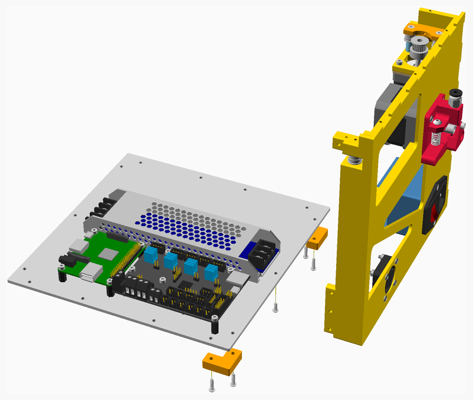

1. Bolt the **Right_Face** and the right feet to the base.

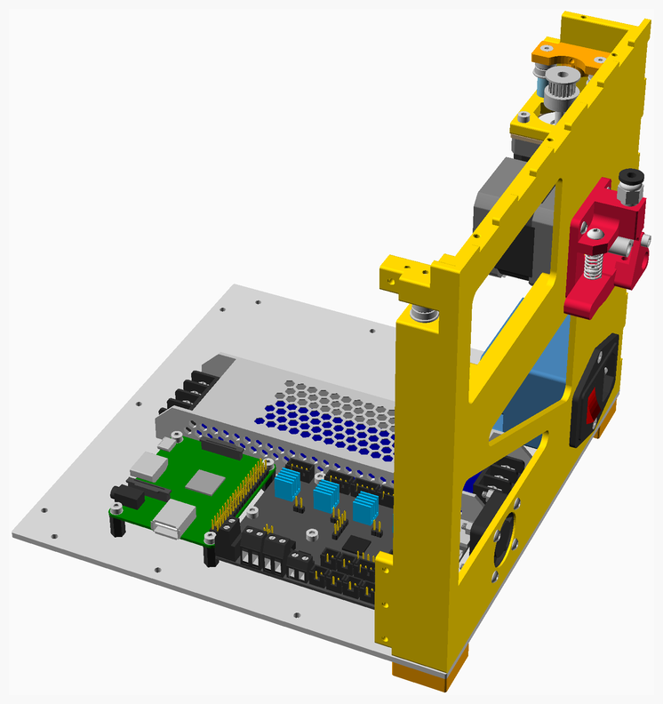

[Top](#TOP)

---

## Stage_2_RB assembly

### Vitamins

| Qty | Description |
|----:|:------------|
|   2 | Bolt M3 buttonhead x 10mm |
|   1 | Bolt M3 countersunk x  6mm |
|   3 | Bolt M3 countersunk x 10mm |
|   4 | Ziptie 2.5mm x 100mm min length |

### Sub-assemblies

| 1 x Back_Face_assembly | 1 x Stage_1_RB_assembly |
|----------|----------|
| 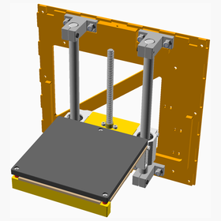 | 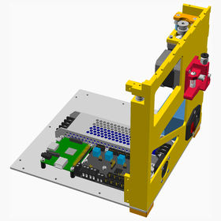 |

### Assembly instructions

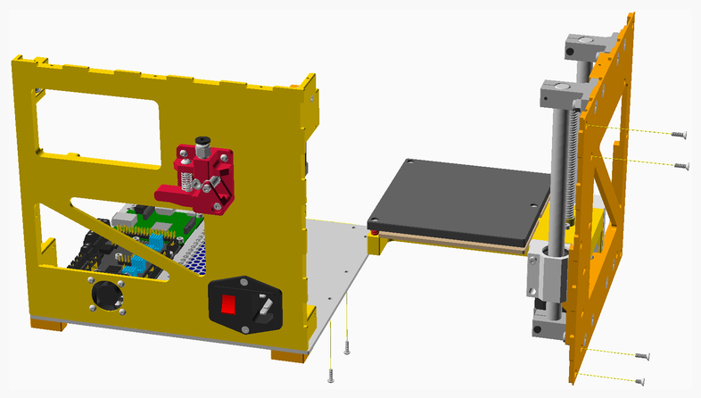

Add the **Back_Face** and bolt it to the right face and the base.

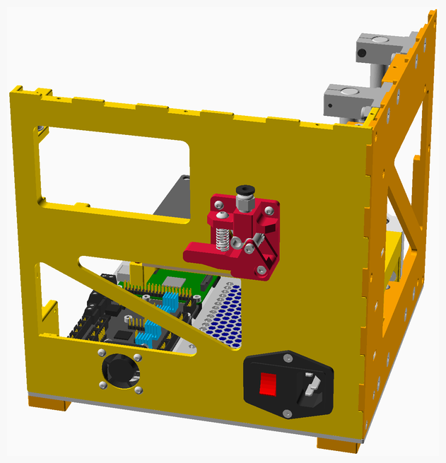

[Top](#TOP)

---

## Stage_3_RB assembly

### Vitamins

| Qty | Description |
|----:|:------------|
|   5 | Bolt M3 buttonhead x 12mm |

### Sub-assemblies

| 1 x Stage_2_RB_assembly | 1 x Top_Face_assembly |
|----------|----------|
| 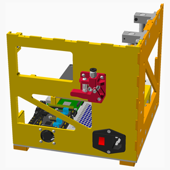 | 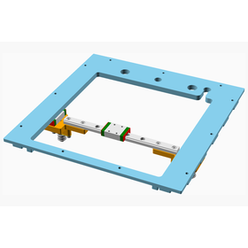 |

### Assembly instructions

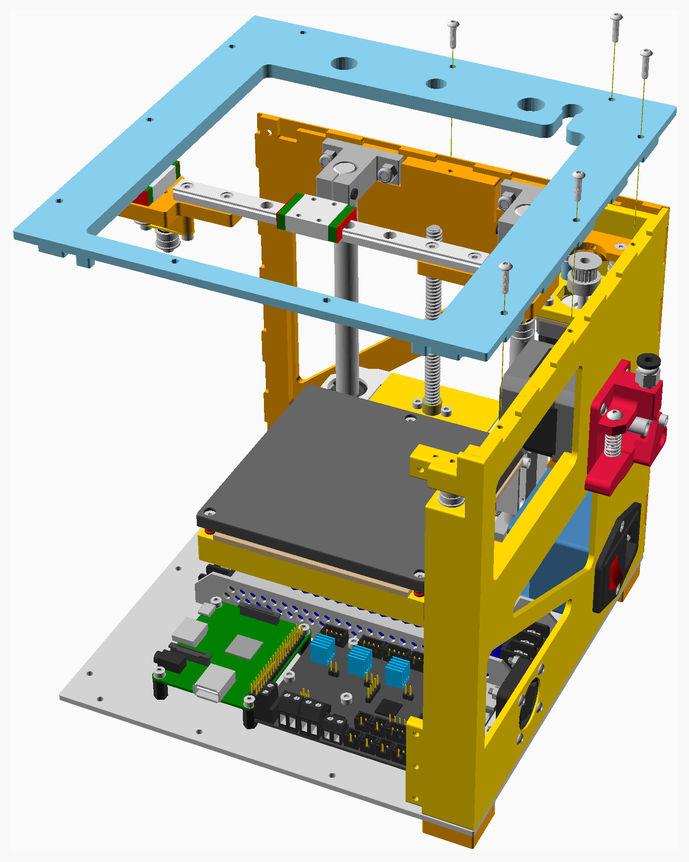

Add the **Top_Face**.

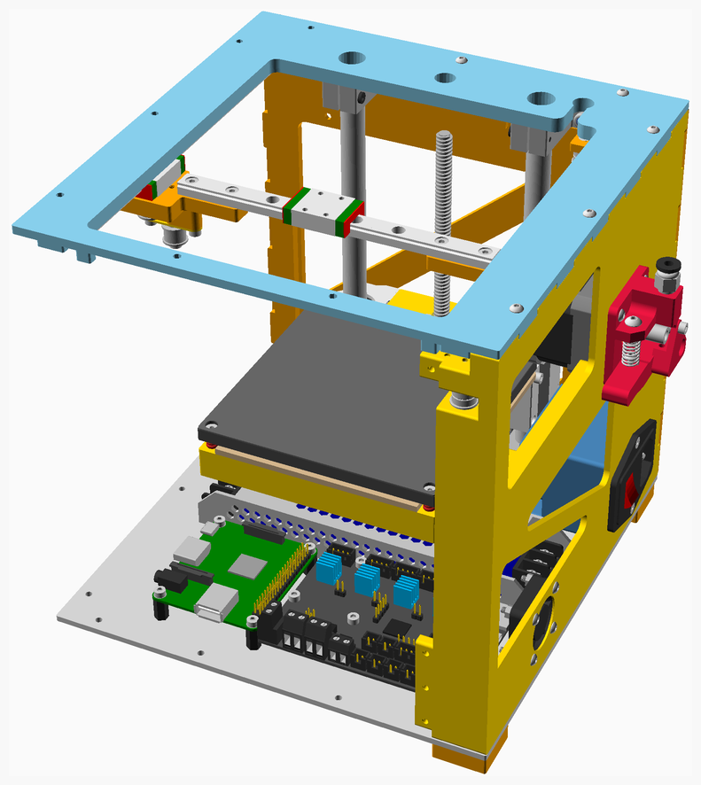

[Top](#TOP)

---

## Stage_4_RB assembly

### Vitamins

| Qty | Description |
|----:|:------------|
|   1 | Bolt M3 buttonhead x  8mm |
|   8 | Bolt M3 buttonhead x 12mm |
|   2 | Bolt M3 caphead x  8mm |
|   1 | Bolt M3 countersunk x  6mm |
|   3 | Bolt M3 countersunk x 10mm |

### 3D Printed parts

| 1 x Base_Cover_RB.stl | 2 x Foot_LShaped_8mm.stl |
|----------|----------|
| 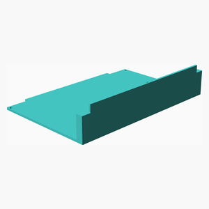 |  |

### Sub-assemblies

| 1 x Left_Face_assembly | 1 x Stage_3_RB_assembly |
|----------|----------|
|  | 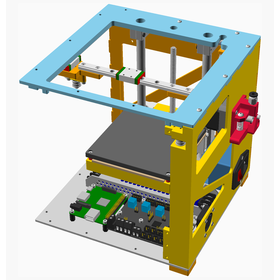 |

### Assembly instructions

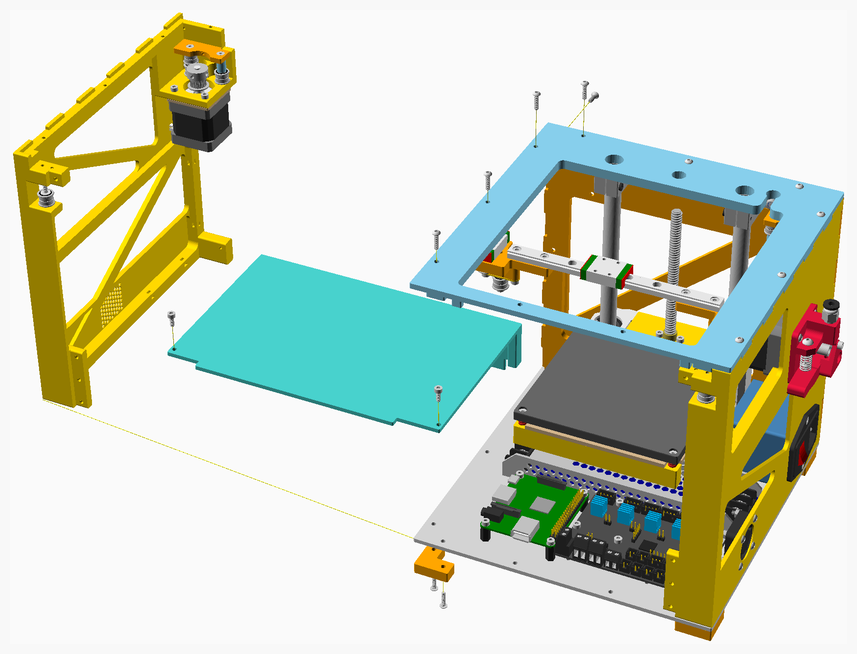

1. Bolt the **Left_Face** and the left feet to the base.
2. Bolt the **Left_Face** to the back face and the top face.

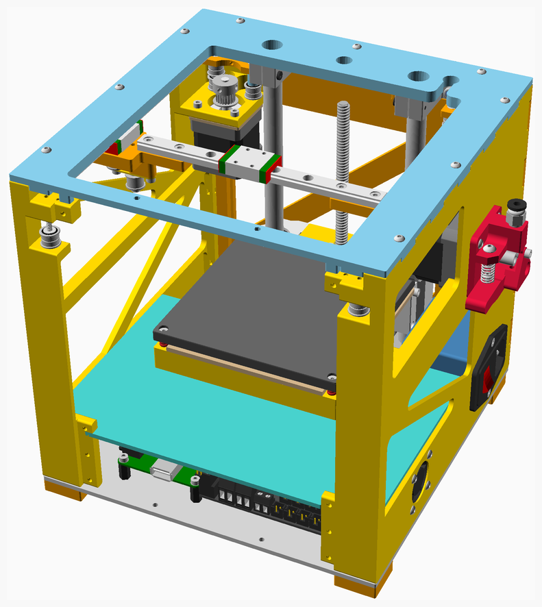

[Top](#TOP)

---

## Stage_5_RB assembly

### Vitamins

| Qty | Description |
|----:|:------------|
|   4 | Bolt M3 buttonhead x 12mm |
|   2 | Bolt M3 countersunk x 10mm |

### 3D Printed parts

| 1 x X_Carriage_Belt_Clamp.stl |
|----------|
| 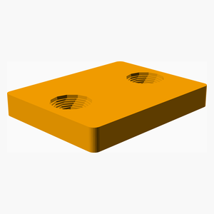 |

### Sub-assemblies

| 1 x Stage_4_RB_assembly | 1 x X_Carriage_Belt_Side_MGN9C_RB_assembly |
|----------|----------|
| 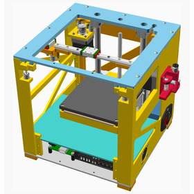 | 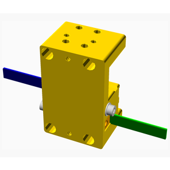 |

### Assembly instructions

1. Add the **X_Carriage_Belt_Side_MGN9C_RB** assembly
2. Thread the belts in the pattern shown.
4. Clamp the belts using the **XX_Carriage_Belt_Clamp**
3. Adjust the belt tension.

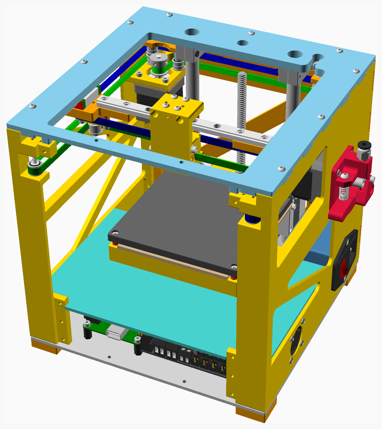

[Top](#TOP)

---

## Stage_6_RB assembly

### Vitamins

| Qty | Description |
|----:|:------------|
|   4 | Bolt M3 caphead x 25mm |

### Sub-assemblies

| 1 x Printhead_DropEffect_XG_assembly | 1 x Stage_5_RB_assembly |
|----------|----------|
| 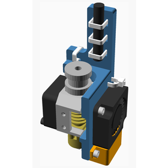 | 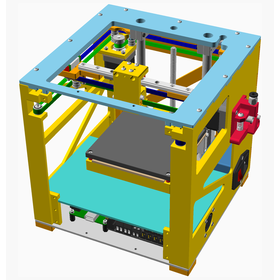 |

### Assembly instructions

1. Attach the **Printhead Assembly** to the X_Carriage

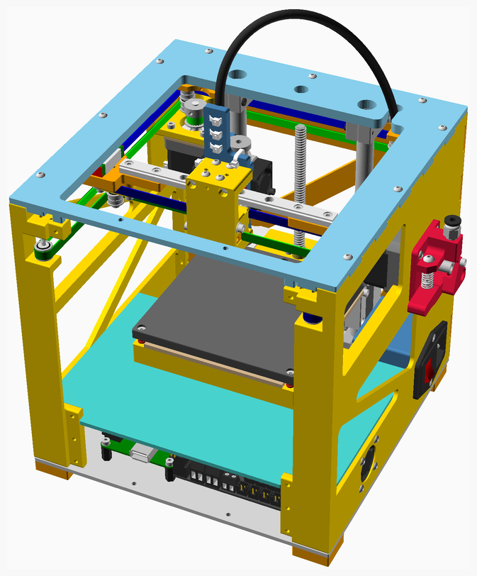

[Top](#TOP)

---

## BC220 assembly

### Vitamins

| Qty | Description |
|----:|:------------|
|   2 | Bolt M3 buttonhead x 10mm |
|   2 | Bolt M3 buttonhead x 12mm |
|   8 | Bolt M3 countersunk x 10mm |
|   1 | PTFE tube 307 mm |

### 3D Printed parts

| 1 x Front_Lower_Chord_Solid.stl | 1 x Front_Upper_Chord.stl | 1 x Spool_Holder.stl |
|----------|----------|----------|
| 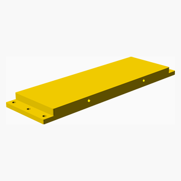 | 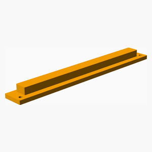 | 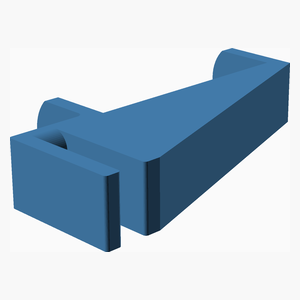 |

### Sub-assemblies

| 1 x Stage_6_RB_assembly |
|----------|
| 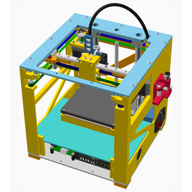 |

### Assembly instructions

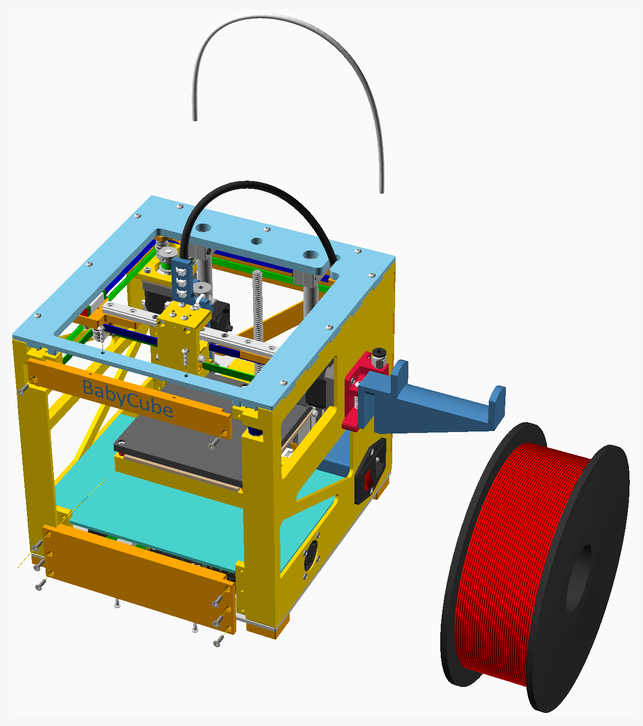

1. Bolt the BabyCube nameplate and the **Front_Lower_Chord** to the front of the frame.
2. Connect the Bowden tube.
3. Add the spool holder and spool.

[Top](#TOP)
