

# Carbon Fiber BabyCube Assembly Instructions

**Note that the Carbon Fiber BabyCube is very much a work in progress.**

These are the assembly instructions for the Carbon Fiber BabyCube. These instructions are not fully comprehensive, that
is they do not show every small detail of the construction, and in particular they do not show the wiring. However there
is sufficient detail that someone with a good understanding of 3D printers can build the BabyCube.

---

## Table of Contents

1. [Parts list](#Parts_list)
1. [Printhead_DropEffect_XG assembly](#Printhead_DropEffect_XG_assembly)
1. [X_Carriage_Belt_Side_MGN9C_RB assembly](#X_Carriage_Belt_Side_MGN9C_RB_assembly)
1. [XY_Motor_Mount_Right_RB assembly](#XY_Motor_Mount_Right_RB_assembly)
1. [XY_Motor_Mount_Left_RB assembly](#XY_Motor_Mount_Left_RB_assembly)
1. [Y_Carriage_Right_Rail assembly](#Y_Carriage_Right_Rail_assembly)
1. [Y_Carriage_Left_Rail assembly](#Y_Carriage_Left_Rail_assembly)
1. [XY_Idler_Bracket_Right assembly](#XY_Idler_Bracket_Right_assembly)
1. [XY_Idler_Bracket_Left assembly](#XY_Idler_Bracket_Left_assembly)
1. [Top_Face_CF_Stage_1 assembly](#Top_Face_CF_Stage_1_assembly)
1. [Top_Face_CF_Stage_2 assembly](#Top_Face_CF_Stage_2_assembly)
1. [Top_Face_CF_Stage_3 assembly](#Top_Face_CF_Stage_3_assembly)
1. [Top_Face_CF_Stage_4 assembly](#Top_Face_CF_Stage_4_assembly)
1. [Top_Face_CF assembly](#Top_Face_CF_assembly)
1. [Right_Face_CF assembly](#Right_Face_CF_assembly)
1. [Print_bed_3_point_printed_Stage_1 assembly](#Print_bed_3_point_printed_Stage_1_assembly)
1. [Print_bed_3_point_printed assembly](#Print_bed_3_point_printed_assembly)
1. [Back_Face_CF_Stage_1 assembly](#Back_Face_CF_Stage_1_assembly)
1. [Back_Face_CF_Stage_2 assembly](#Back_Face_CF_Stage_2_assembly)
1. [Back_Face_CF assembly](#Back_Face_CF_assembly)
1. [Base_CF_Stage_1 assembly](#Base_CF_Stage_1_assembly)
1. [Base_CF assembly](#Base_CF_assembly)
1. [Stage_1_CF assembly](#Stage_1_CF_assembly)
1. [Stage_2_CF assembly](#Stage_2_CF_assembly)
1. [Stage_3_CF assembly](#Stage_3_CF_assembly)
1. [Stage_4_CF assembly](#Stage_4_CF_assembly)
1. [Stage_5_CF assembly](#Stage_5_CF_assembly)
1. [BC220CF assembly](#BC220CF_assembly)

[Top](#TOP)

---

## Parts list

| Printhead DropEffect XG | X Carriage Belt Side MGN9C RB | Top Face CF | Right Face CF | Print Bed 3 Point Printed | Back Face CF | Base CF Stage 1 | Base CF | BC220CF | TOTALS |  |
|-----:|-----:|-----:|-----:|-----:|-----:|-----:|-----:|-----:|------:|:-------------|
|      |      |      |      |      |      |      |      |      |       | **Vitamins** |
|   .  |   .  |   .  |   .  |   .  |   .  |   .  |   1  |   .  |    1  |  Aluminium box section 12mm x 8mm x 1mm, length 85mm |
|   .  |   .  |   .  |   .  |   .  |   .  |   1  |   .  |   .  |    1  |  Aluminium sheet 220mm x 220mm x 3mm |
|   .  |   .  |  24  |   .  |   .  |   .  |   .  |   .  |   .  |   24  |  Ball bearing F623-2RS 3mm x 10mm x 4mm |
|   .  |   .  |   1  |   .  |   .  |   .  |   .  |   .  |   .  |    1  |  Belt GT2 x 6mm x 836mm |
|   .  |   .  |   1  |   .  |   .  |   .  |   .  |   .  |   .  |    1  |  Belt GT2 x 6mm x 836mm |
|   .  |   1  |   .  |   .  |   .  |   .  |   .  |   .  |   .  |    1  |  Belt GT2 x 6mm x 836mm - not shown |
|   .  |   1  |   .  |   .  |   .  |   .  |   .  |   .  |   .  |    1  |  Belt GT2 x 6mm x 836mm - not shown |
|   .  |   .  |   .  |   .  |   .  |   .  |   .  |   1  |   .  |    1  |  BigTreeTech SKR Mini E3 v2.0 |
|   4  |   .  |   .  |   .  |   .  |   .  |   .  |   .  |   .  |    4  |  Bolt M2.5 caphead x  6mm |
|   .  |   .  |  12  |   .  |   .  |   .  |   .  |   .  |  15  |   27  |  Bolt M3 buttonhead x  8mm |
|   .  |   .  |   .  |   .  |   .  |  10  |   3  |   .  |  32  |   45  |  Bolt M3 buttonhead x 10mm |
|   .  |   .  |   4  |   2  |   .  |   2  |   8  |   .  |   2  |   18  |  Bolt M3 buttonhead x 12mm |
|   .  |   .  |   .  |   4  |   .  |   .  |   .  |   .  |   .  |    4  |  Bolt M3 buttonhead x 16mm |
|   .  |   .  |  14  |   .  |   2  |   .  |   .  |  18  |   2  |   36  |  Bolt M3 caphead x  8mm |
|   .  |   .  |  14  |   .  |   .  |   .  |   .  |   .  |   .  |   14  |  Bolt M3 caphead x 10mm |
|   .  |   .  |   2  |   .  |   .  |   .  |   .  |   .  |   .  |    2  |  Bolt M3 caphead x 16mm |
|   .  |   .  |   4  |   .  |   .  |   .  |   .  |   .  |   4  |    8  |  Bolt M3 caphead x 25mm |
|   .  |   2  |   .  |   .  |   .  |   .  |   .  |   .  |   .  |    2  |  Bolt M3 caphead x 30mm |
|   .  |   .  |   .  |   .  |   4  |   .  |   .  |   .  |   .  |    4  |  Bolt M3 caphead x 35mm |
|   2  |   .  |   .  |   .  |   .  |   .  |   .  |   .  |   .  |    2  |  Bolt M3 countersunk x  8mm |
|   .  |   .  |   2  |   .  |   .  |   .  |   .  |   .  |   .  |    2  |  Bolt M3 countersunk x 10mm |
|   .  |   .  |   2  |   2  |   3  |   .  |   .  |   .  |   .  |    7  |  Bolt M3 countersunk x 12mm |
|   .  |   .  |   4  |   .  |   .  |   .  |   .  |   .  |   .  |    4  |  Bolt M3 countersunk x 35mm |
|   .  |   .  |   .  |   .  |   .  |   .  |   .  |   2  |   .  |    2  |  Bolt M4 buttonhead x  8mm |
|   .  |   .  |   .  |   .  |   .  |   8  |   .  |   .  |   .  |    8  |  Bolt M5 buttonhead x 16mm |
|   .  |   .  |   .  |   .  |   4  |   .  |   .  |   .  |   .  |    4  |  Bolt M5 countersunk x 12mm |
|   .  |   .  |   2  |   .  |   .  |   .  |   .  |   .  |   .  |    2  |  Cork damper NEMA 14 |
|   .  |   .  |   .  |   .  |   .  |   1  |   .  |   .  |   .  |    1  |  Cork damper NEMA 17 |
|   .  |   .  |   .  |   .  |   1  |   .  |   .  |   .  |   .  |    1  |  Cork underlay 120mm x 120mm x 3mm |
|   1  |   .  |   .  |   .  |   .  |   .  |   .  |   .  |   .  |    1  |  DropEffect XG Hotend |
|   .  |   .  |   .  |   1  |   .  |   .  |   .  |   .  |   .  |    1  |  Fan 30mm x 10mm |
|   .  |   .  |   .  |   .  |   1  |   .  |   .  |   .  |   .  |    1  |  Heating pad 100mm x 100mm |
|   .  |   .  |   .  |   1  |   .  |   .  |   .  |   .  |   .  |    1  |  IEC320 C14 switched fused inlet module |
|   .  |   .  |   .  |   .  |   1  |   .  |   .  |   .  |   .  |    1  |  Leadscrew nut 8 x 2 |
|   .  |   .  |   1  |   .  |   .  |   .  |   .  |   .  |   .  |    1  |  Linear rail MGN9 x 150mm |
|   .  |   .  |   2  |   .  |   .  |   .  |   .  |   .  |   .  |    2  |  Linear rail MGN9 x 200mm |
|   .  |   .  |   3  |   .  |   .  |   .  |   .  |   .  |   .  |    3  |  Linear rail carriage MGN9C |
|   .  |   .  |   .  |   .  |   .  |   2  |   .  |   .  |   .  |    2  |  Linear rod 12mm x 200mm |
|   .  |   .  |   .  |   1  |   .  |   .  |   .  |   .  |   .  |    1  |  MK10 Dual Pulley Extruder |
|   .  |   .  |   .  |   .  |   1  |   .  |   .  |   .  |   .  |    1  |  Magnetic base 120mm x 120mm |
|   .  |   .  |   .  |   .  |   .  |   .  |   .  |   1  |   .  |    1  |  Micro SD card |
|   .  |   .  |   .  |   4  |   .  |   .  |   .  |   .  |   .  |    4  |  Nut M3 x 2.4mm  |
|   .  |   .  |   .  |   2  |   .  |   .  |   .  |   .  |   .  |    2  |  Nut M3 x 2.4mm nyloc |
|   .  |   .  |   .  |   .  |   .  |   8  |   .  |   .  |   .  |    8  |  Nut M5 x 4mm nyloc |
|   .  |   .  |   .  |   .  |   9  |   .  |   .  |   .  |   .  |    9  |  O-ring nitrile 3mm x 2mm |
|   .  |   .  |   .  |   .  |   .  |   .  |   .  |   1  |   .  |    1  |  PSU NIUGUY CB-200W-24V |
|   .  |   .  |   .  |   .  |   .  |   .  |   .  |   .  |   1  |    1  |  PTFE tube 311 mm |
|   .  |   .  |   .  |   .  |   .  |   .  |   .  |   9  |   .  |    9  |  Pillar hex nylon F/F M3x12 |
|   .  |   .  |   2  |   .  |   .  |   .  |   .  |   .  |   .  |    2  |  Pulley GT2OB 20 teeth |
|   .  |   .  |   .  |   .  |   .  |   .  |   .  |   1  |   .  |    1  |  Raspberry Pi 3A+ |
|   .  |   .  |   .  |   .  |   2  |   .  |   .  |   .  |   .  |    2  |  SCS12UU bearing block |
|   .  |   .  |   .  |   .  |   .  |   4  |   .  |   .  |   .  |    4  |  SK12 shaft support bracket |
|   .  |   .  |   .  |   .  |   .  |   1  |   .  |   .  |   1  |    2  |  Sheet carbon fiber 220mm x 210mm x 3mm |
|   .  |   .  |   1  |   .  |   .  |   .  |   .  |   .  |   .  |    1  |  Sheet carbon fiber 220mm x 223mm x 3mm |
|   .  |   .  |   .  |   1  |   .  |   .  |   .  |   .  |   1  |    2  |  Sheet carbon fiber 223mm x 210mm x 3mm |
|   1  |   .  |   .  |   .  |   .  |   .  |   .  |   .  |   .  |    1  |  Spiral cable wrap, 500mm |
|   1  |   .  |   .  |   .  |   .  |   .  |   .  |   .  |   .  |    1  |  Square radial fan 3010 |
|   .  |   .  |   2  |   .  |   .  |   .  |   .  |   .  |   .  |    2  |  Stepper motor NEMA14 x 36mm (5x24 shaft) |
|   .  |   .  |   .  |   .  |   .  |   1  |   .  |   .  |   .  |    1  |  Stepper motor NEMA17 x 34mm, 150mm integrated leadscrew |
|   .  |   .  |   .  |   1  |   .  |   .  |   .  |   .  |   .  |    1  |  Stepper motor NEMA17 x 40mm (5x20 shaft) |
|   .  |   .  |   .  |   .  |   .  |   1  |   .  |   .  |   .  |    1  |  Stepper motor cable, 150mm |
|   .  |   .  |   .  |   1  |   .  |   1  |   .  |   .  |   .  |    2  |  Stepper motor cable, 300mm |
|   .  |   .  |   .  |   .  |   .  |   1  |   .  |   .  |   .  |    1  |  Stepper motor cable, 400mm |
|   .  |   .  |   .  |   .  |   1  |   .  |   .  |   .  |   .  |    1  |  Voron V0 aluminium build plate 120mm x 120mm x 6mm |
|   .  |   2  |  38  |   2  |   .  |   .  |   .  |   .  |   .  |   42  |  Washer M3 x 7mm x 0.5mm |
|   6  |   .  |   .  |   .  |   1  |   4  |   .  |   .  |   .  |   11  |  Ziptie 2.5mm x 100mm min length |
|  15  |   6  | 135  |  22  |  30  |  44  |  12  |  34  |  58  |  356  | Total vitamins count |
|      |      |      |      |      |      |      |      |      |       | **3D printed parts** |
|   .  |   .  |   .  |   .  |   .  |   1  |   .  |   .  |   .  |    1  | Back_Face_Left_Joiner.stl |
|   .  |   .  |   .  |   .  |   .  |   1  |   .  |   .  |   .  |    1  | Back_Face_Right_Joiner.stl |
|   .  |   .  |   .  |   .  |   .  |   1  |   .  |   .  |   .  |    1  | Back_Face_Top_Joiner.stl |
|   .  |   .  |   .  |   .  |   .  |   .  |   .  |   .  |   1  |    1  | Base_Cover_CF.stl |
|   .  |   .  |   .  |   .  |   .  |   .  |   1  |   .  |   .  |    1  | Base_Front_Joiner.stl |
|   .  |   .  |   .  |   .  |   .  |   .  |   1  |   .  |   .  |    1  | Base_Left_Joiner.stl |
|   .  |   .  |   .  |   .  |   .  |   .  |   1  |   .  |   .  |    1  | Base_Right_Joiner.stl |
|   .  |   .  |   .  |   .  |   .  |   .  |   1  |   .  |   .  |    1  | Base_Template.stl |
|   1  |   .  |   .  |   .  |   .  |   .  |   .  |   .  |   .  |    1  | DropEffectXG_Fan_Duct.stl |
|   .  |   .  |   .  |   .  |   .  |   .  |   4  |   .  |   .  |    4  | Foot_LShaped_8mm.stl |
|   .  |   .  |   .  |   1  |   .  |   .  |   .  |   .  |   .  |    1  | IEC_Housing.stl |
|   .  |   .  |   .  |   .  |   .  |   .  |   .  |   .  |   1  |    1  | Nameplate.stl |
|   .  |   .  |   .  |   .  |   .  |   .  |   .  |   .  |   1  |    1  | Nameplate_Back.stl |
|   .  |   .  |   .  |   .  |   1  |   .  |   .  |   .  |   .  |    1  | Printbed_Frame.stl |
|   .  |   .  |   .  |   1  |   .  |   .  |   .  |   .  |   .  |    1  | Spool_Holder_Bracket.stl |
|   .  |   .  |   .  |   .  |   .  |   .  |   .  |   .  |   1  |    1  | Spool_Holder_CF.stl |
|   .  |   .  |   1  |   .  |   .  |   .  |   .  |   .  |   .  |    1  | Top_Face_Front_Joiner.stl |
|   .  |   .  |   1  |   .  |   .  |   .  |   .  |   .  |   .  |    1  | Top_Face_Left_Joiner.stl |
|   .  |   .  |   1  |   .  |   .  |   .  |   .  |   .  |   .  |    1  | Top_Face_Right_Joiner.stl |
|   .  |   .  |   1  |   .  |   .  |   .  |   .  |   .  |   .  |    1  | XY_Idler_Bracket_Left.stl |
|   .  |   .  |   1  |   .  |   .  |   .  |   .  |   .  |   .  |    1  | XY_Idler_Bracket_Right.stl |
|   .  |   .  |   1  |   .  |   .  |   .  |   .  |   .  |   .  |    1  | XY_Motor_Mount_Brace_Left.stl |
|   .  |   .  |   1  |   .  |   .  |   .  |   .  |   .  |   .  |    1  | XY_Motor_Mount_Brace_Right.stl |
|   .  |   .  |   1  |   .  |   .  |   .  |   .  |   .  |   .  |    1  | XY_Motor_Mount_Left.stl |
|   .  |   .  |   1  |   .  |   .  |   .  |   .  |   .  |   .  |    1  | XY_Motor_Mount_Right.stl |
|   .  |   .  |   2  |   .  |   .  |   .  |   .  |   .  |   .  |    2  | XY_Pulley_Spacer_M3.stl |
|   .  |   .  |   1  |   .  |   .  |   .  |   .  |   .  |   .  |    1  | X_Carriage_Belt_Clamp.stl |
|   .  |   1  |   .  |   .  |   .  |   .  |   .  |   .  |   .  |    1  | X_Carriage_Belt_Side_MGN9C_RB.stl |
|   .  |   2  |   .  |   .  |   .  |   .  |   .  |   .  |   .  |    2  | X_Carriage_Belt_Tensioner_RB.stl |
|   1  |   .  |   .  |   .  |   .  |   .  |   .  |   .  |   .  |    1  | X_Carriage_DropEffect_XG.stl |
|   .  |   .  |   1  |   .  |   .  |   .  |   .  |   .  |   .  |    1  | Y_Carriage_Brace_Left_RB.stl |
|   .  |   .  |   1  |   .  |   .  |   .  |   .  |   .  |   .  |    1  | Y_Carriage_Brace_Right_RB.stl |
|   .  |   .  |   1  |   .  |   .  |   .  |   .  |   .  |   .  |    1  | Y_Carriage_Left_RB.stl |
|   .  |   .  |   1  |   .  |   .  |   .  |   .  |   .  |   .  |    1  | Y_Carriage_Right_RB.stl |
|   .  |   .  |   2  |   .  |   .  |   .  |   .  |   .  |   .  |    2  | Y_Rail_Handle.stl |
|   .  |   .  |   .  |   .  |   .  |   1  |   .  |   .  |   .  |    1  | Z_Motor_Mount.stl |
|   2  |   3  |  18  |   2  |   1  |   4  |   8  |   .  |   4  |   42  | Total 3D printed parts count |
|      |      |      |      |      |      |      |      |      |       | **CNC routed parts** |
|   .  |   .  |   .  |   .  |   .  |   1  |   .  |   .  |   .  |    1  | Back_Face_x220_z210.dxf |
|   .  |   .  |   .  |   .  |   .  |   .  |   1  |   .  |   .  |    1  | BaseAL_x220_y220.dxf |
|   .  |   .  |   .  |   .  |   .  |   .  |   .  |   .  |   1  |    1  | Front_Face_x220_z210.dxf |
|   .  |   .  |   .  |   .  |   .  |   .  |   .  |   .  |   1  |    1  | Left_Face_y220_z210.dxf |
|   .  |   .  |   .  |   1  |   .  |   .  |   .  |   .  |   .  |    1  | Right_Face_y220_z210.dxf |
|   .  |   .  |   1  |   .  |   .  |   .  |   .  |   .  |   .  |    1  | Top_Face_x220_y220.dxf |
|   .  |   .  |   1  |   1  |   .  |   1  |   1  |   .  |   2  |    6  | Total CNC routed parts count |

[Top](#TOP)

---

## Printhead_DropEffect_XG assembly

### Vitamins

|Qty|Description|
|---:|:----------|
| 4 | Bolt M2.5 caphead x  6mm |
| 2 | Bolt M3 countersunk x  8mm |
| 1 | DropEffect XG Hotend |
| 1 | Spiral cable wrap, 500mm |
| 1 | Square radial fan 3010 |
| 6 | Ziptie 2.5mm x 100mm min length |

### 3D Printed parts

| 1 x DropEffectXG_Fan_Duct.stl | 1 x X_Carriage_DropEffect_XG.stl |
|----------|----------|
| 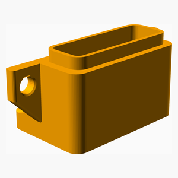 | 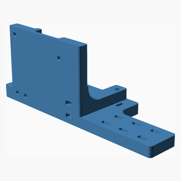 |

### Assembly instructions

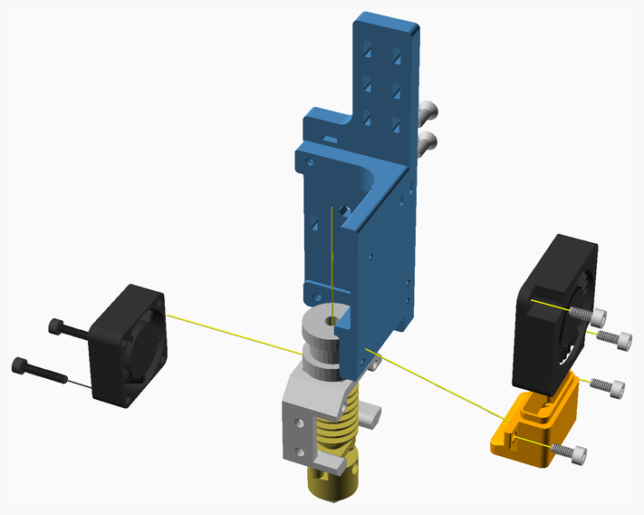

1. Assemble the DropEffect XG hotend, including fan and Bowden adaptor.
2. Attach the DropEffect XG hotend to the **X_Carriage**
3. Gather the cables from the printhead and wrap them in spiral cable wrap.
4. Use zipties to secure the wrapped cables to the printhead

[Top](#TOP)

---

## X_Carriage_Belt_Side_MGN9C_RB assembly

### Vitamins

|Qty|Description|
|---:|:----------|
| 1 | Belt GT2 x 6mm x 836mm - not shown |
| 1 | Belt GT2 x 6mm x 836mm - not shown |
| 2 | Bolt M3 caphead x 30mm |
| 2 | Washer M3 x 7mm x 0.5mm |

### 3D Printed parts

| 1 x X_Carriage_Belt_Side_MGN9C_RB.stl | 2 x X_Carriage_Belt_Tensioner_RB.stl |
|----------|----------|
| 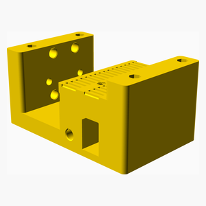 | 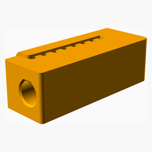 |

### Assembly instructions

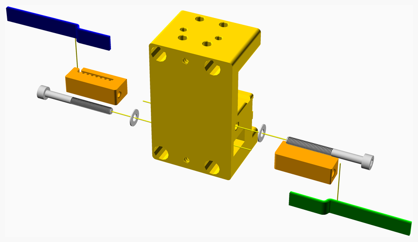

1. Insert the belts into the **X_Carriage_Belt_Tensioner**s.
2. Bolt the tensioners into the **X_Carriage_Belt_Side_MGN9C** part as shown.

Note: it may be a tight fit to insert the **X_Carriage_Belt_Tensioner**s into the **X_Carriage_Belt_Side_MGN9C**.
It may be necessary to use a small file to file the slots in the X_Carriage. This is especially the case with the tops
of the slots - these are printed using bridging and depending on how well your printer does bridging, so adjustemnt
may be required.

Note: for clarity, only a segment of the belts are shown in this diagram.

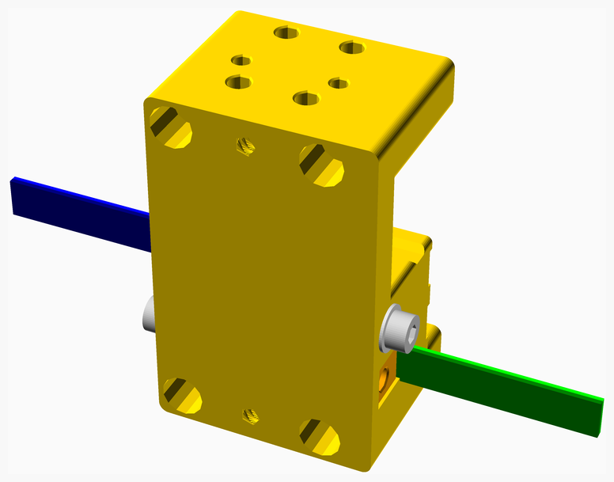

[Top](#TOP)

---

## XY_Motor_Mount_Right_RB assembly

### Vitamins

|Qty|Description|
|---:|:----------|
| 6 | Ball bearing F623-2RS 3mm x 10mm x 4mm |
| 2 | Bolt M3 caphead x  8mm |
| 1 | Bolt M3 countersunk x 12mm |
| 2 | Bolt M3 countersunk x 35mm |
| 1 | Cork damper NEMA 14 |
| 1 | Pulley GT2OB 20 teeth |
| 1 | Stepper motor NEMA14 x 36mm (5x24 shaft) |
| 11 | Washer M3 x 7mm x 0.5mm |

### 3D Printed parts

| 1 x XY_Motor_Mount_Brace_Right.stl | 1 x XY_Motor_Mount_Right.stl | 1 x XY_Pulley_Spacer_M3.stl |
|----------|----------|----------|
| 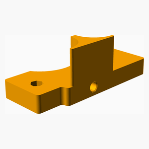 | 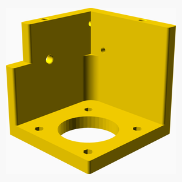 |  |

### Assembly instructions

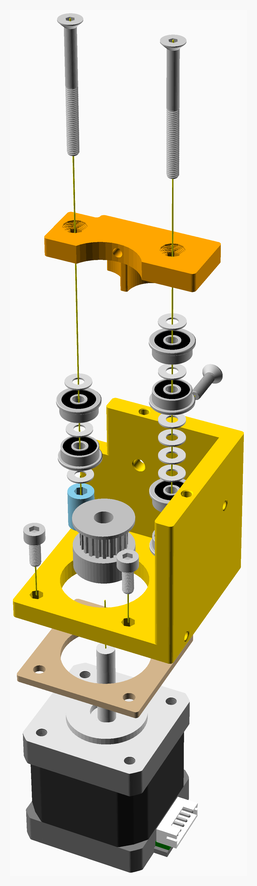

1. Place the cork damper on the stepper motor and bolt the motor to the **XY_Motor_Mount_Right**, using two bolts at the front,
2. Bolt the bearing, washers, and spacer **XY_Motor_Mount_Right** as shown. The bolts screw into the mounting holes on the stepper motor.
3. Bolt the **XY_Motor_Mount_Brace_Right** to the **XY_Motor_Mount_Right**.
3. Bolt the pulley to the motor shaft, aligning it with the bearings.

Note the cork damper is important as it provides thermal insulation between the stepper motor and the frame.

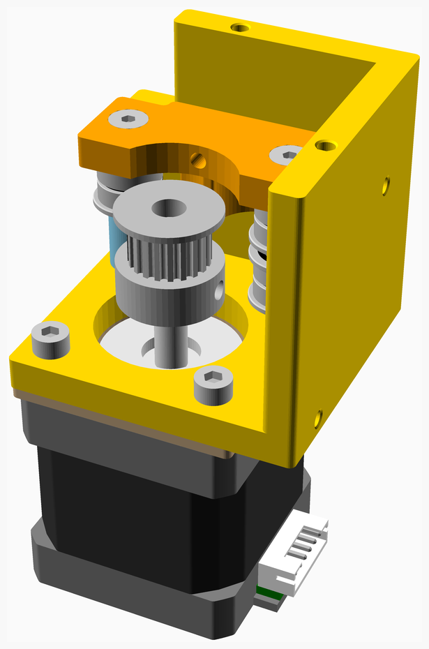

[Top](#TOP)

---

## XY_Motor_Mount_Left_RB assembly

### Vitamins

|Qty|Description|
|---:|:----------|
| 6 | Ball bearing F623-2RS 3mm x 10mm x 4mm |
| 2 | Bolt M3 caphead x  8mm |
| 1 | Bolt M3 countersunk x 12mm |
| 2 | Bolt M3 countersunk x 35mm |
| 1 | Cork damper NEMA 14 |
| 1 | Pulley GT2OB 20 teeth |
| 1 | Stepper motor NEMA14 x 36mm (5x24 shaft) |
| 11 | Washer M3 x 7mm x 0.5mm |

### 3D Printed parts

| 1 x XY_Motor_Mount_Brace_Left.stl | 1 x XY_Motor_Mount_Left.stl | 1 x XY_Pulley_Spacer_M3.stl |
|----------|----------|----------|
| 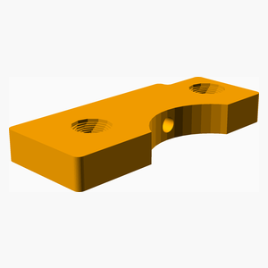 | 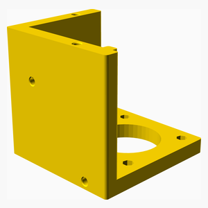 |  |

### Assembly instructions

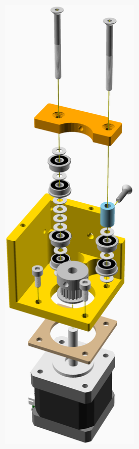

1. Place the cork damper on the stepper motor and bolt the motor to the **XY_Motor_Mount_Right**, using two bolts at the front,
2. Bolt the bearing, washers, and spacer **XY_Motor_Mount_Right** as shown. The bolts screw into the mounting holes on the stepper motor.
It's easier to do this if the motor mount is turned upside down.
3. Bolt the **XY_Motor_Mount_Brace_Right** to the **XY_Motor_Mount_Right**.
3. Bolt the pulley to the motor shaft, aligning it with the bearings.

Note the cork damper is important as it provides thermal insulation between the stepper motor and the frame.

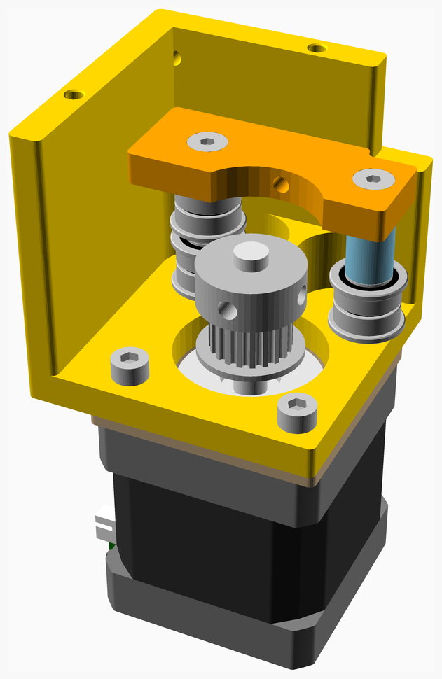

[Top](#TOP)

---

## Y_Carriage_Right_Rail assembly

### Vitamins

|Qty|Description|
|---:|:----------|
| 4 | Ball bearing F623-2RS 3mm x 10mm x 4mm |
| 5 | Bolt M3 caphead x  8mm |
| 1 | Bolt M3 caphead x 16mm |
| 1 | Bolt M3 caphead x 25mm |
| 1 | Linear rail MGN9 x 200mm |
| 1 | Linear rail carriage MGN9C |
| 5 | Washer M3 x 7mm x 0.5mm |

### 3D Printed parts

| 1 x Y_Carriage_Brace_Right_RB.stl | 1 x Y_Carriage_Right_RB.stl |
|----------|----------|
| 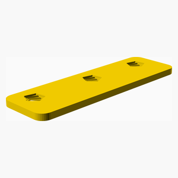 | 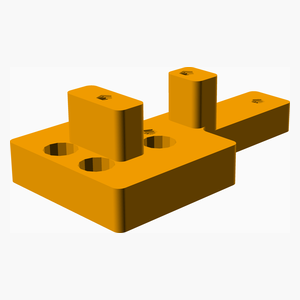 |

### Assembly instructions

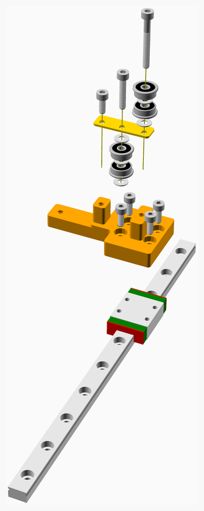

1. The Y_Carriage should be bolted to the MGN carriage before the pulleys are added, since otherwise the bolts are not accessible.
2. Bolt the pulleys to the Y_carriage. Note also that there is a washer under each pulley, but not on top of the pulley.

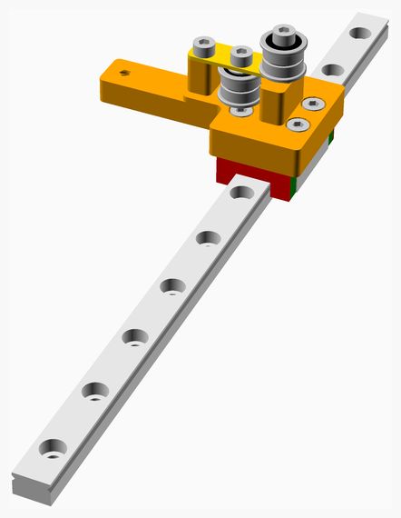

[Top](#TOP)

---

## Y_Carriage_Left_Rail assembly

### Vitamins

|Qty|Description|
|---:|:----------|
| 4 | Ball bearing F623-2RS 3mm x 10mm x 4mm |
| 5 | Bolt M3 caphead x  8mm |
| 1 | Bolt M3 caphead x 16mm |
| 1 | Bolt M3 caphead x 25mm |
| 1 | Linear rail MGN9 x 200mm |
| 1 | Linear rail carriage MGN9C |
| 5 | Washer M3 x 7mm x 0.5mm |

### 3D Printed parts

| 1 x Y_Carriage_Brace_Left_RB.stl | 1 x Y_Carriage_Left_RB.stl |
|----------|----------|
| 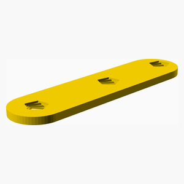 | 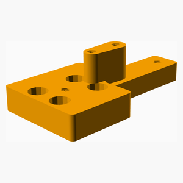 |

### Assembly instructions

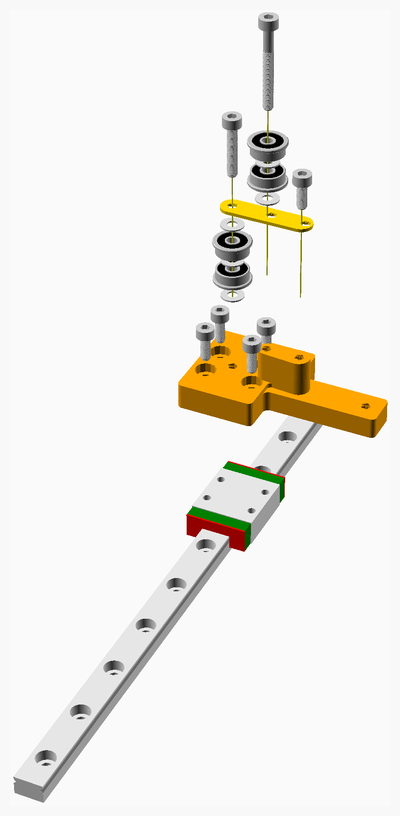

1. The Y_Carriage should be bolted to the MGN carriage before the pulleys are added, since otherwise the bolts are not accessible.
2. Bolt the pulleys to the Y_Carriage. Note also that there is a washer under each pulley, but not on top of the pulley.

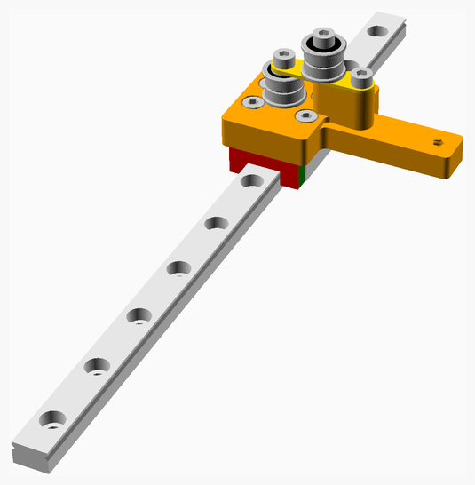

[Top](#TOP)

---

## XY_Idler_Bracket_Right assembly

### Vitamins

|Qty|Description|
|---:|:----------|
| 2 | Ball bearing F623-2RS 3mm x 10mm x 4mm |
| 1 | Bolt M3 caphead x 25mm |
| 3 | Washer M3 x 7mm x 0.5mm |

### 3D Printed parts

| 1 x XY_Idler_Bracket_Right.stl |
|----------|
| 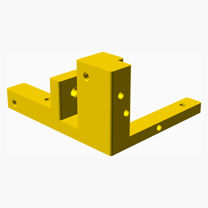 |

### Assembly instructions

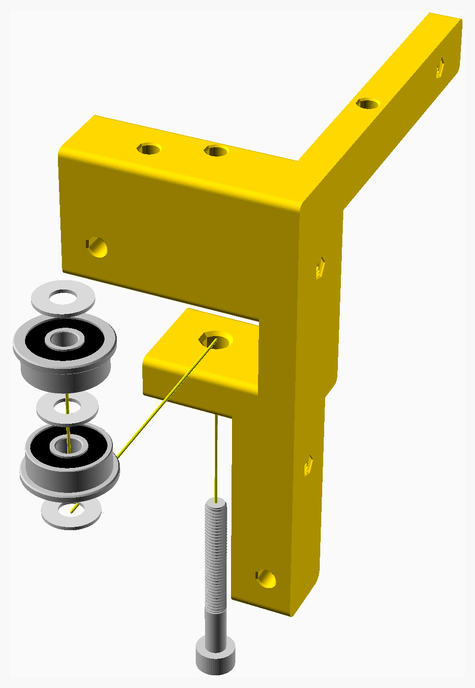

Bolt the two bearings with washers into the **XY_Idler_Bracket_Right**, as shown.

[Top](#TOP)

---

## XY_Idler_Bracket_Left assembly

### Vitamins

|Qty|Description|
|---:|:----------|
| 2 | Ball bearing F623-2RS 3mm x 10mm x 4mm |
| 1 | Bolt M3 caphead x 25mm |
| 3 | Washer M3 x 7mm x 0.5mm |

### 3D Printed parts

| 1 x XY_Idler_Bracket_Left.stl |
|----------|
| 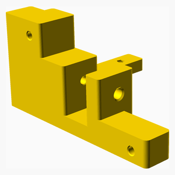 |

### Assembly instructions

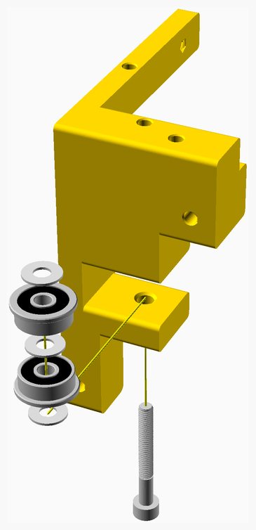

Bolt the two bearings with washers into the **XY_Idler_Bracket_Left**, as shown.

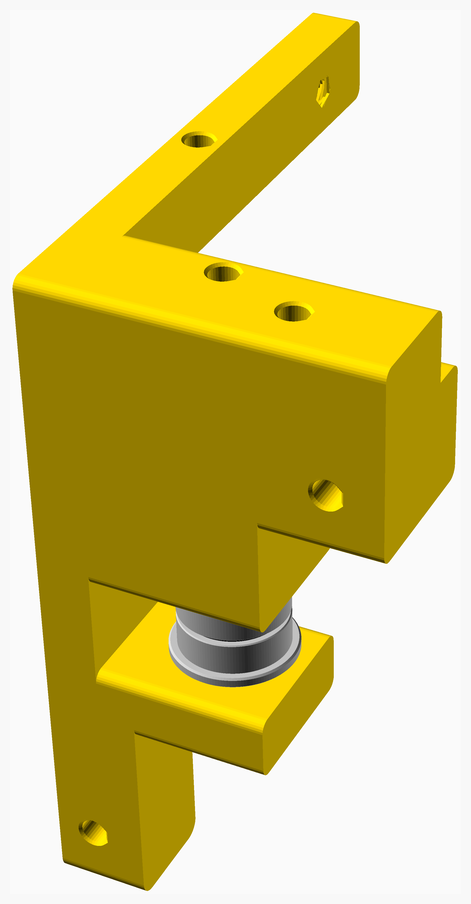

[Top](#TOP)

---

## Top_Face_CF_Stage_1 assembly

### Vitamins

|Qty|Description|
|---:|:----------|
| 8 | Bolt M3 buttonhead x  8mm |
| 1 | Sheet carbon fiber 220mm x 223mm x 3mm |

### 3D Printed parts

| 1 x Top_Face_Front_Joiner.stl | 1 x Top_Face_Left_Joiner.stl | 1 x Top_Face_Right_Joiner.stl |
|----------|----------|----------|
| 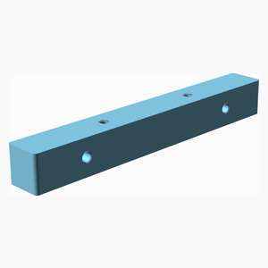 |  | 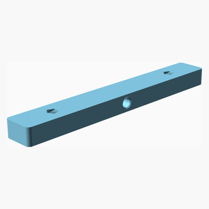 |

### CNC Routed parts

| 1 x Top_Face_x220_y220.dxf |
|----------|
| 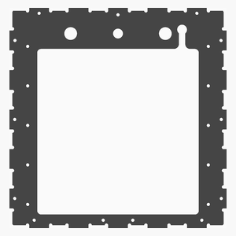 

### Sub-assemblies

| 1 x XY_Idler_Bracket_Left_assembly | 1 x XY_Idler_Bracket_Right_assembly |
|----------|----------|
| 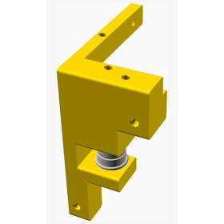 | 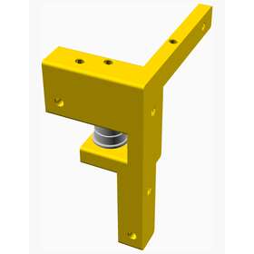 |

### Assembly instructions

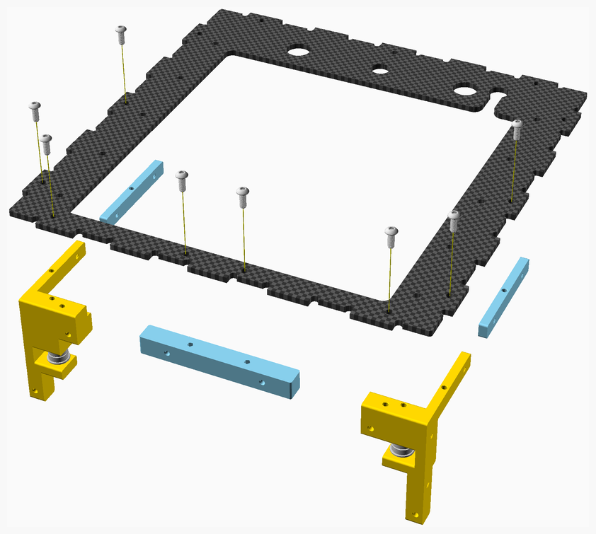

1. Bolt the **Top_Face Joiners** to the **Top_Face_CF**.
2. Bolt the **XY_Idler_Bracket** assemblies to the **Top_Face_CF**.

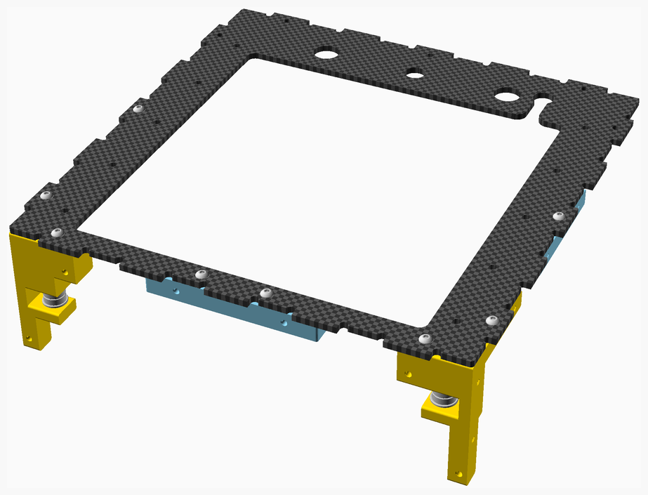

[Top](#TOP)

---

## Top_Face_CF_Stage_2 assembly

### Vitamins

|Qty|Description|
|---:|:----------|
| 10 | Bolt M3 caphead x 10mm |

### 3D Printed parts

| 2 x Y_Rail_Handle.stl |
|----------|
| 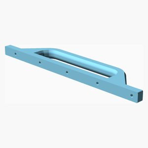 |

### Sub-assemblies

| 1 x Top_Face_CF_Stage_1_assembly | 1 x Y_Carriage_Left_Rail_assembly | 1 x Y_Carriage_Right_Rail_assembly |
|----------|----------|----------|
| 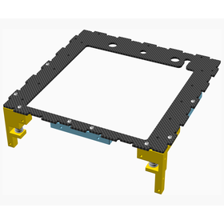 |  | 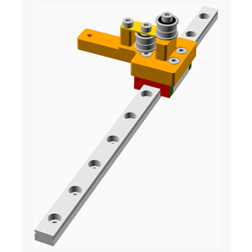 |

### Assembly instructions

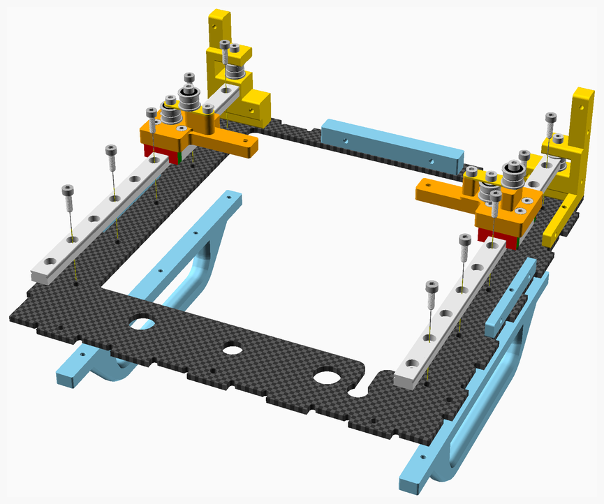

1. Bolt the rails to the **Top_Face**. Ensure that the left rail is parallel with the left edge before fully tightening the
bolts on the left side.
2. The bolts on the right side rail should be only loosely tightened - they will be fully tightened when the right rail
is aligned when the X axis rail is added.

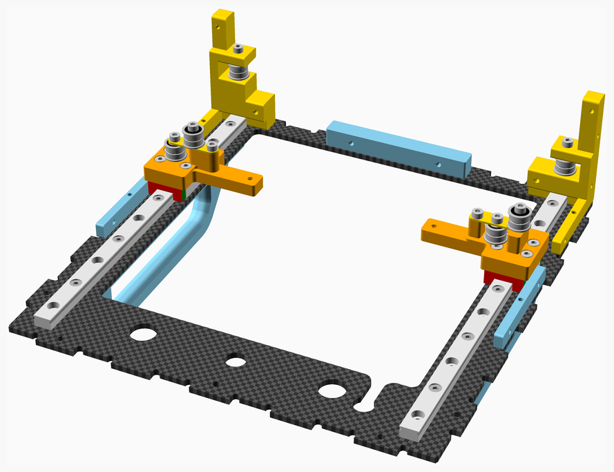

[Top](#TOP)

---

## Top_Face_CF_Stage_3 assembly

### Vitamins

|Qty|Description|
|---:|:----------|
| 4 | Bolt M3 buttonhead x  8mm |

### Sub-assemblies

| 1 x Top_Face_CF_Stage_2_assembly | 1 x XY_Motor_Mount_Left_RB_assembly | 1 x XY_Motor_Mount_Right_RB_assembly |
|----------|----------|----------|
| 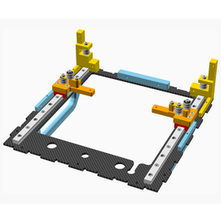 | 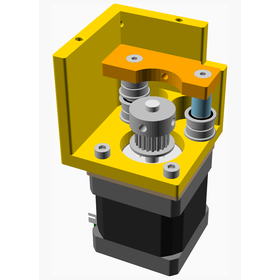 | 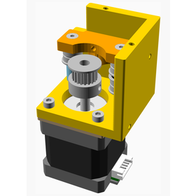 |

### Assembly instructions

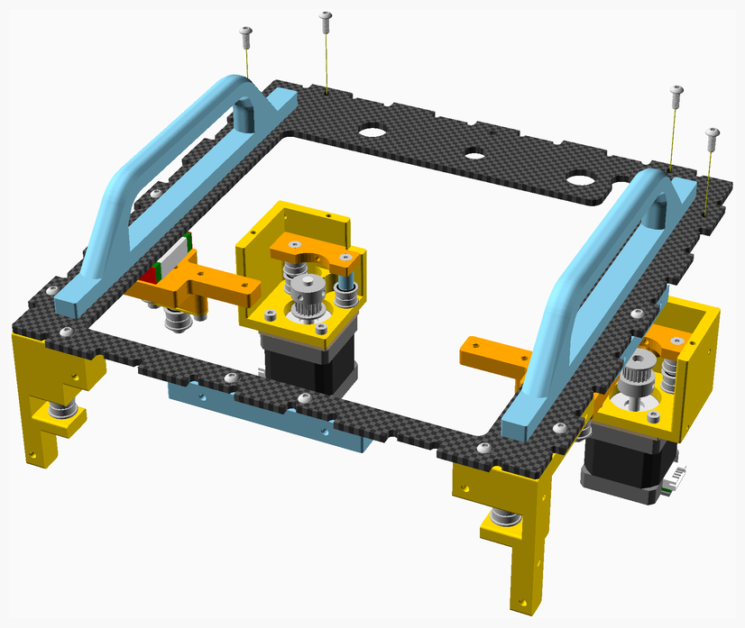

1. Bolt the **XY_Motor_Mount** assemblies to the **Top_Face_CF**.

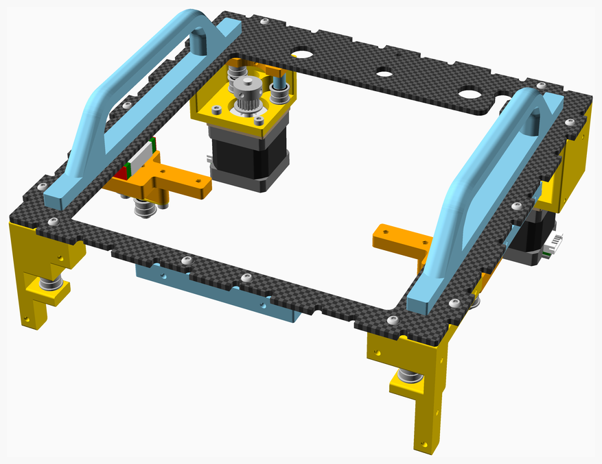

[Top](#TOP)

---

## Top_Face_CF_Stage_4 assembly

### Vitamins

|Qty|Description|
|---:|:----------|
| 4 | Bolt M3 caphead x 10mm |
| 1 | Linear rail MGN9 x 150mm |
| 1 | Linear rail carriage MGN9C |

### Sub-assemblies

| 1 x Top_Face_CF_Stage_3_assembly |
|----------|
| 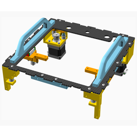 |

### Assembly instructions

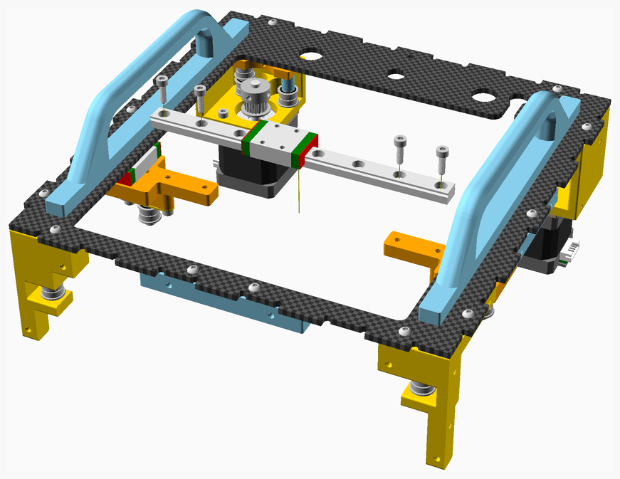

1. Turn the **Top_Face** into its normal orientation.
2. Bolt the X-axis linear rail onto the **Y_Carriages**.
3. Turn the Top_Face upside down again and place it on a flat surface.
4. Align the left and right Y-axis linear rails. Do this by pushing the X-axis rail to the rear of the top face and tighten
the corresponding bolts (left loose in a previous step) and then push the X-axis rails to the front of the top face,
again tightening the corresponding bolts.
5. Check that the carriages run smoothly on the Y-axis linear rails.

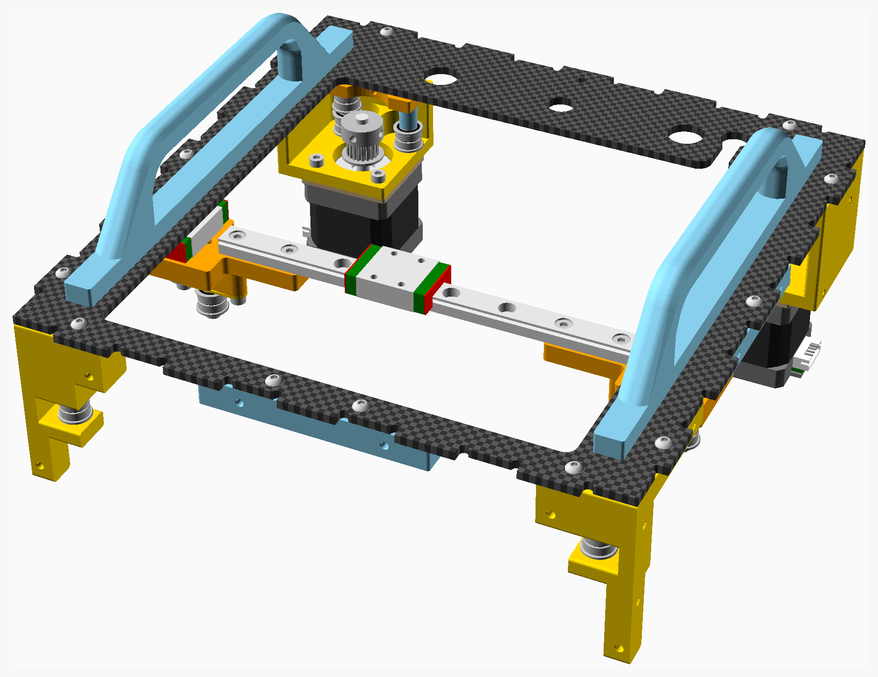

[Top](#TOP)

---

## Top_Face_CF assembly

### Vitamins

|Qty|Description|
|---:|:----------|
| 1 | Belt GT2 x 6mm x 836mm |
| 1 | Belt GT2 x 6mm x 836mm |
| 4 | Bolt M3 buttonhead x 12mm |
| 2 | Bolt M3 countersunk x 10mm |

### 3D Printed parts

| 1 x X_Carriage_Belt_Clamp.stl |
|----------|
| 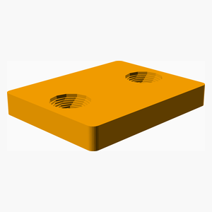 |

### Sub-assemblies

| 1 x Top_Face_CF_Stage_4_assembly | 1 x X_Carriage_Belt_Side_MGN9C_RB_assembly |
|----------|----------|
| 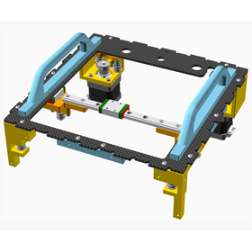 | 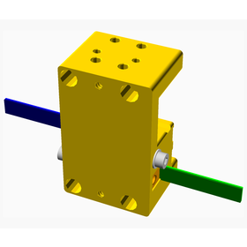 |

### Assembly instructions

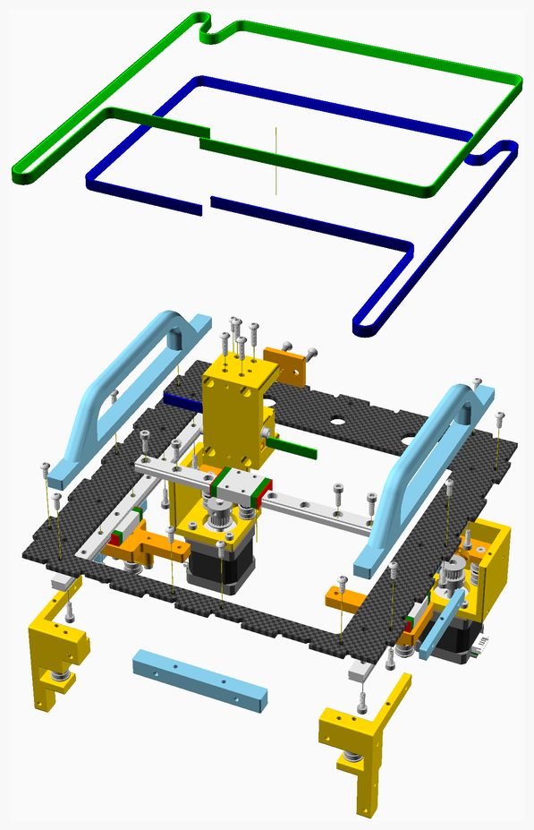

Thread the belts as shown and attach to the **X_Carriage_Belt_Side**.

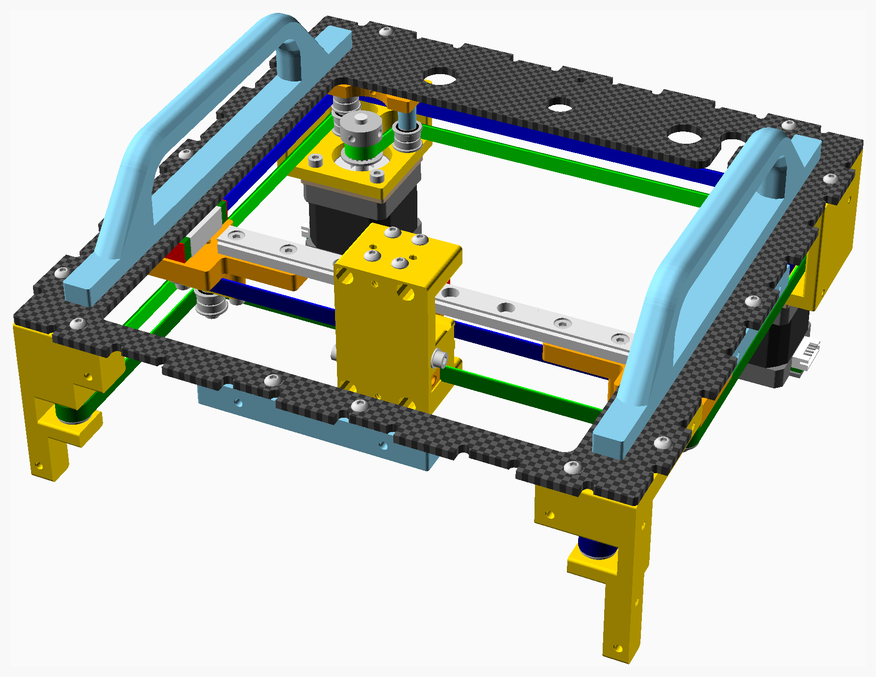

[Top](#TOP)

---

## Right_Face_CF assembly

### Vitamins

|Qty|Description|
|---:|:----------|
| 2 | Bolt M3 buttonhead x 12mm |
| 4 | Bolt M3 buttonhead x 16mm |
| 2 | Bolt M3 countersunk x 12mm |
| 1 | Fan 30mm x 10mm |
| 1 | IEC320 C14 switched fused inlet module |
| 1 | MK10 Dual Pulley Extruder |
| 4 | Nut M3 x 2.4mm  |
| 2 | Nut M3 x 2.4mm nyloc |
| 1 | Sheet carbon fiber 223mm x 210mm x 3mm |
| 1 | Stepper motor NEMA17 x 40mm (5x20 shaft) |
| 1 | Stepper motor cable, 300mm |
| 2 | Washer M3 x 7mm x 0.5mm |

### 3D Printed parts

| 1 x IEC_Housing.stl | 1 x Spool_Holder_Bracket.stl |
|----------|----------|
| 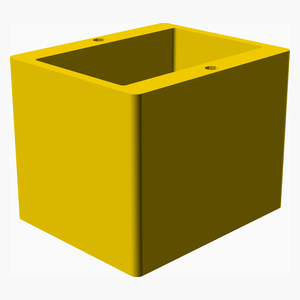 | 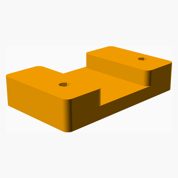 |

### CNC Routed parts

| 1 x Right_Face_y220_z210.dxf |
|----------|
|  

### Assembly instructions

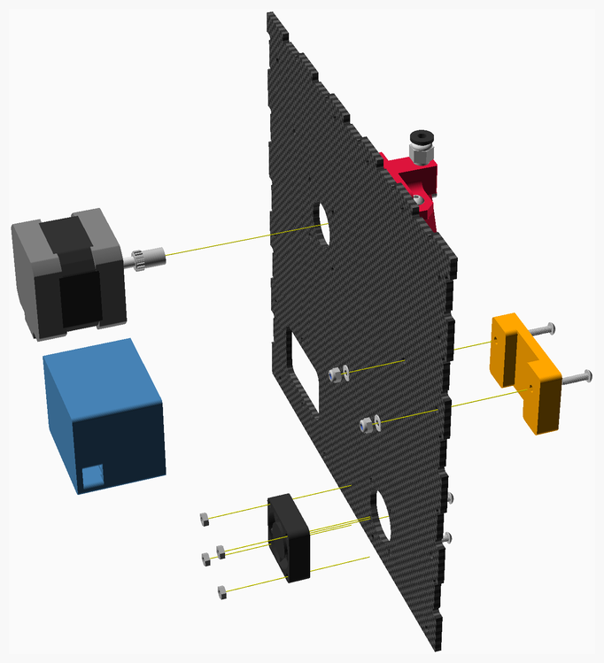

1. Bolt the extruder and stepper motor to the **Right_Face**.
2. Wire up the IEC power connector and bolt it through the **Right_Face** to the **IEC_Housing_stl**.
3. Bolt the **Spool_Holder_Bracket** to the **Right_Face**.
4. Bolt the fan to the **Right_Face**.
5. Attach the stepper motor cable to the stepper motor.

[Top](#TOP)

---

## Print_bed_3_point_printed_Stage_1 assembly

### Vitamins

|Qty|Description|
|---:|:----------|
| 2 | Bolt M3 caphead x  8mm |
| 4 | Bolt M3 caphead x 35mm |
| 4 | Bolt M5 countersunk x 12mm |
| 1 | Leadscrew nut 8 x 2 |
| 2 | SCS12UU bearing block |

### 3D Printed parts

| 1 x Printbed_Frame.stl |
|----------|
| 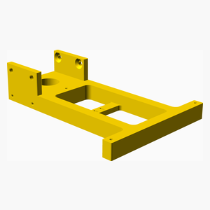 |

### Assembly instructions

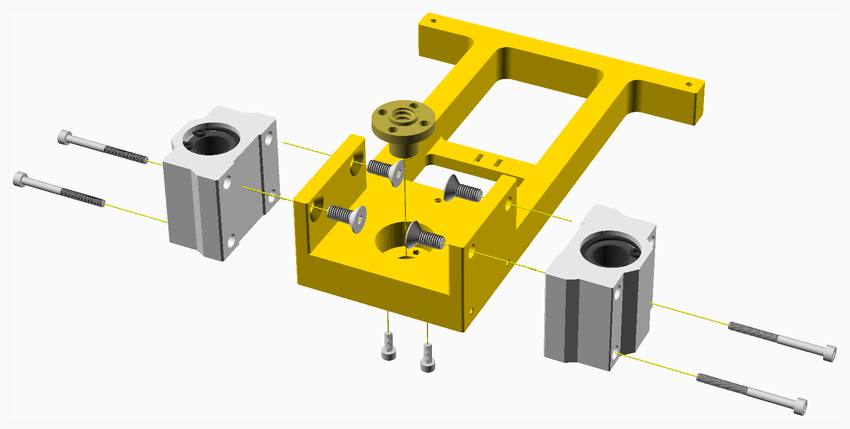

1. Bolt the bearing blocks to the sides of the **Printbed_Frame**.
2. Insert the leadnut and bolt it to the **Printbed_Frame**.

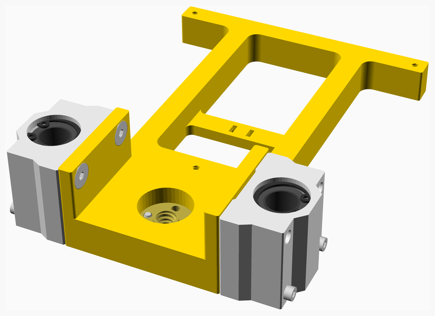

[Top](#TOP)

---

## Print_bed_3_point_printed assembly

### Vitamins

|Qty|Description|
|---:|:----------|
| 3 | Bolt M3 countersunk x 12mm |
| 1 | Cork underlay 120mm x 120mm x 3mm |
| 1 | Heating pad 100mm x 100mm |
| 1 | Magnetic base 120mm x 120mm |
| 9 | O-ring nitrile 3mm x 2mm |
| 1 | Voron V0 aluminium build plate 120mm x 120mm x 6mm |
| 1 | Ziptie 2.5mm x 100mm min length |

### Sub-assemblies

| 1 x Print_bed_3_point_printed_Stage_1_assembly |
|----------|
| 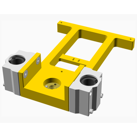 |

### Assembly instructions

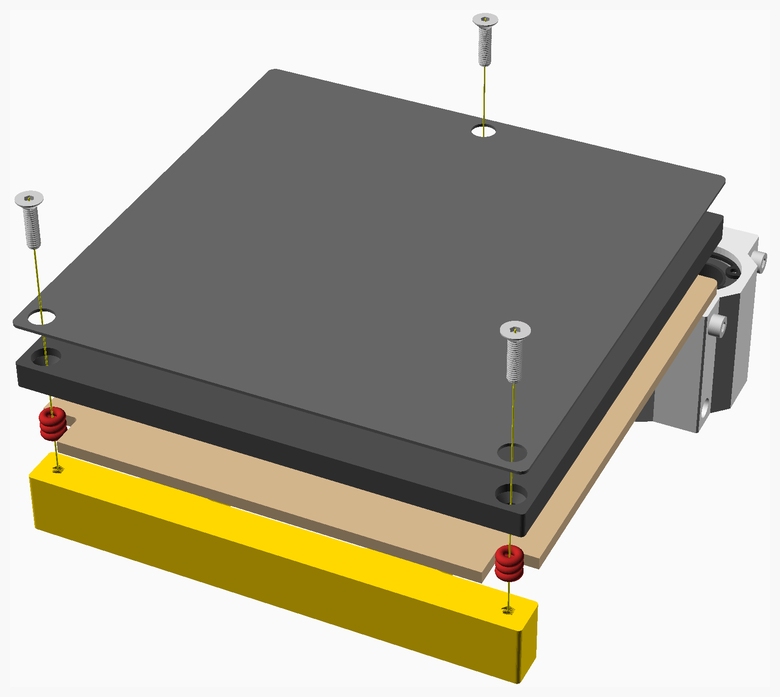

1. Prepare the the cork underlay by cutting it to size, making a cutout for the heated bed wiring, and drilling holes
for the bolts.
2. Attach the magnetic base to the top side of the aluminium tooling plate.
3. Attach the heating pad to the bottom side of the tooling plate.
4. Place the cork underlay on the **Printbed_Frame** and place the tooling plate on top.
5. Secure the tooling plate to the **Printbed_Frame**, using the bolts and O-rings. Note that the O-rings allow bed
leveling and help thermally insulate the heated bed from the **Printbed_Frame**.
6. Secure the heating pad wiring to the underside of the **Printbed_Frame** using a cable tie.

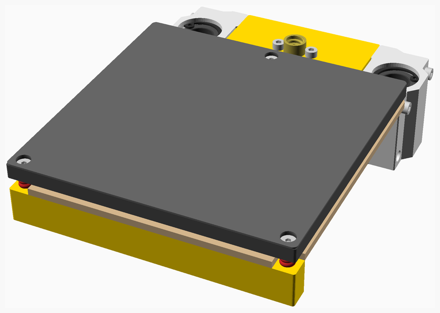

[Top](#TOP)

---

## Back_Face_CF_Stage_1 assembly

### Vitamins

|Qty|Description|
|---:|:----------|
| 6 | Bolt M3 buttonhead x 10mm |
| 2 | Bolt M3 buttonhead x 12mm |
| 8 | Bolt M5 buttonhead x 16mm |
| 8 | Nut M5 x 4mm nyloc |
| 4 | SK12 shaft support bracket |
| 1 | Sheet carbon fiber 220mm x 210mm x 3mm |
| 1 | Stepper motor cable, 300mm |
| 1 | Stepper motor cable, 400mm |
| 4 | Ziptie 2.5mm x 100mm min length |

### 3D Printed parts

| 1 x Back_Face_Left_Joiner.stl | 1 x Back_Face_Right_Joiner.stl | 1 x Back_Face_Top_Joiner.stl |
|----------|----------|----------|
| 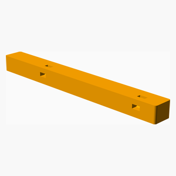 | 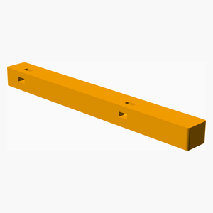 | 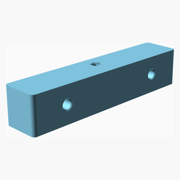 |

| 1 x Z_Motor_Mount.stl |
|----------|
| 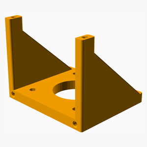 |

### CNC Routed parts

| 1 x Back_Face_x220_z210.dxf |
|----------|
|  

### Assembly instructions

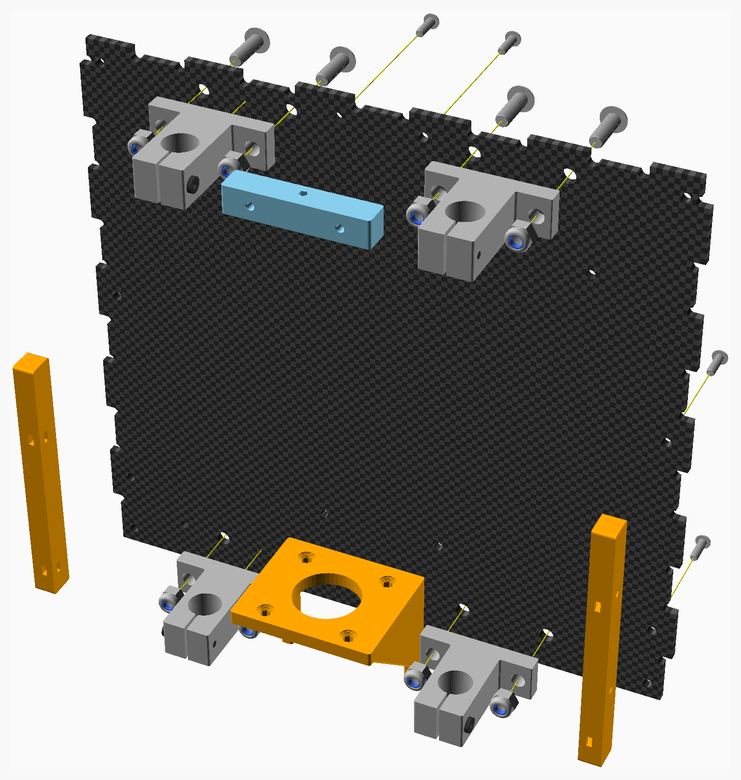

1. Bolt the **Z_Motor_Mount** to the **Back_Face**.
2. Attach the SK brackets to the **Back_Face**. Note the orientation of the tightening bolts: the top tightening bolts should
face inward and the bottom tightening bolts should face outward. This allows access after the BabyCube is fully assembled.
3. Bolt the **Back_Face_Top_Joiner** to the **Back_Face**.
4. Bolt the **Back_Face_Left_Joiner** and the **Back_Face_Right_Joiner** to the **Back_Face**
5. Loosely attach the stepper motor cables to the side joiners with cable ties. The longer cable goes to the left motor.
6. Dry fit the **Top_Face** assembly to the **Back_Face** and adjust the position of the cables to reach the motors. Tighten
the cable ties and remove the **Top_Face**.

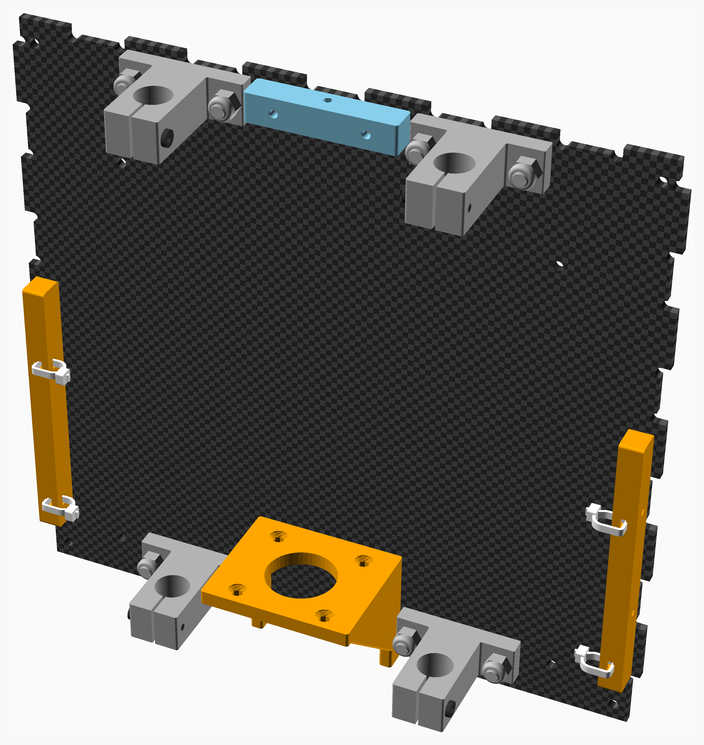

[Top](#TOP)

---

## Back_Face_CF_Stage_2 assembly

### Vitamins

|Qty|Description|
|---:|:----------|
| 2 | Linear rod 12mm x 200mm |

### Sub-assemblies

| 1 x Back_Face_CF_Stage_1_assembly | 1 x Print_bed_3_point_printed_assembly |
|----------|----------|
| 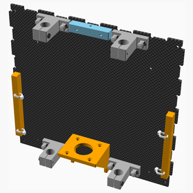 | 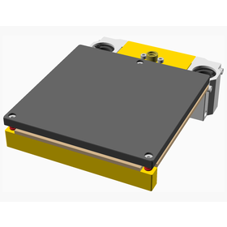 |

### Assembly instructions

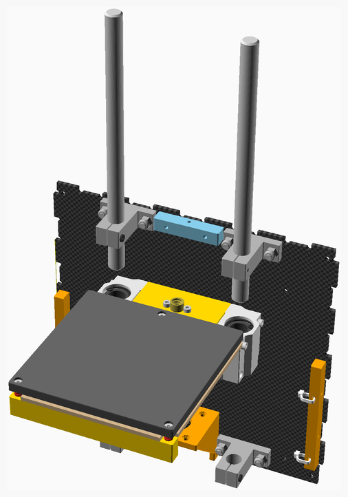

1. Slide the linear rods through the SK brackets and the printbed bearings.
2. Tighten the bolts in the SK brackets, ensuring the **Z_Carriage** slides freely on the rods.

[Top](#TOP)

---

## Back_Face_CF assembly

### Vitamins

|Qty|Description|
|---:|:----------|
| 4 | Bolt M3 buttonhead x 10mm |
| 1 | Cork damper NEMA 17 |
| 1 | Stepper motor NEMA17 x 34mm, 150mm integrated leadscrew |
| 1 | Stepper motor cable, 150mm |

### Sub-assemblies

| 1 x Back_Face_CF_Stage_2_assembly |
|----------|
| 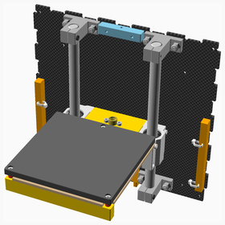 |

### Assembly instructions

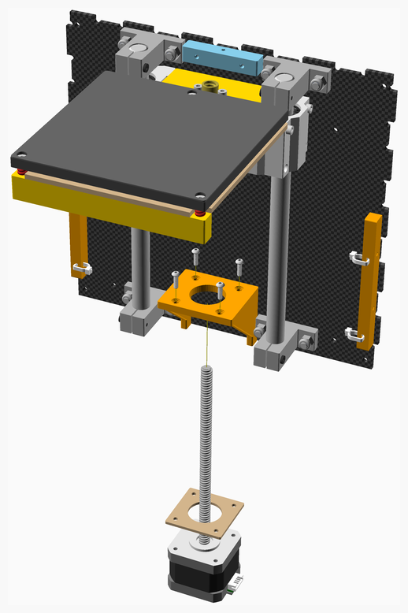

1. Place the cork damper on the stepper motor and thread the lead screw through the leadnut and attach the stepper
motor to the **Back_Face**. Note the orientation of the JST socket.

[Top](#TOP)

---

## Base_CF_Stage_1 assembly

### Vitamins

|Qty|Description|
|---:|:----------|
| 1 | Aluminium sheet 220mm x 220mm x 3mm |
| 3 | Bolt M3 buttonhead x 10mm |
| 8 | Bolt M3 buttonhead x 12mm |

### 3D Printed parts

| 1 x Base_Front_Joiner.stl | 1 x Base_Left_Joiner.stl | 1 x Base_Right_Joiner.stl |
|----------|----------|----------|
| 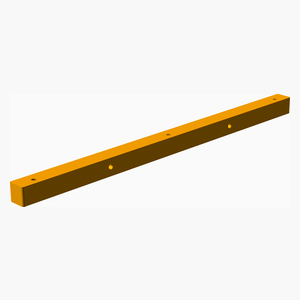 | 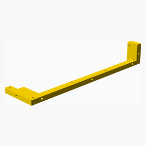 | 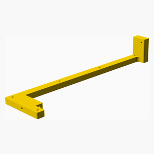 |

| 1 x Base_Template.stl | 4 x Foot_LShaped_8mm.stl |
|----------|----------|
| 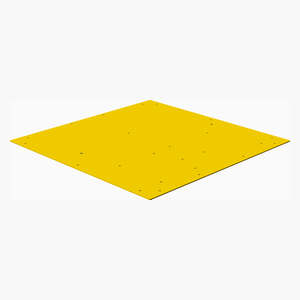 | 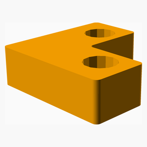 |

### CNC Routed parts

| 1 x BaseAL_x220_y220.dxf |
|----------|
|  

### Assembly instructions

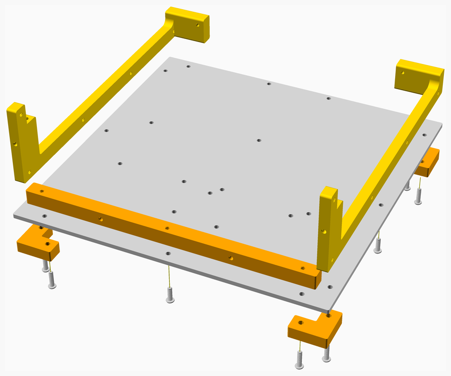

1. Attach the Base_Template to the aluminium sheet and use it to drill out the holes. The base template has 2mm holes
marked out for pilot holes. Once you have drilled these re-drill the holes with a 3mm bit.
2. Bolt the **Base_Front_Joiner**, the **Base_Left_Joiner**, the **Base_Right_Joiner** and the L-shaped feet to the
base plate.

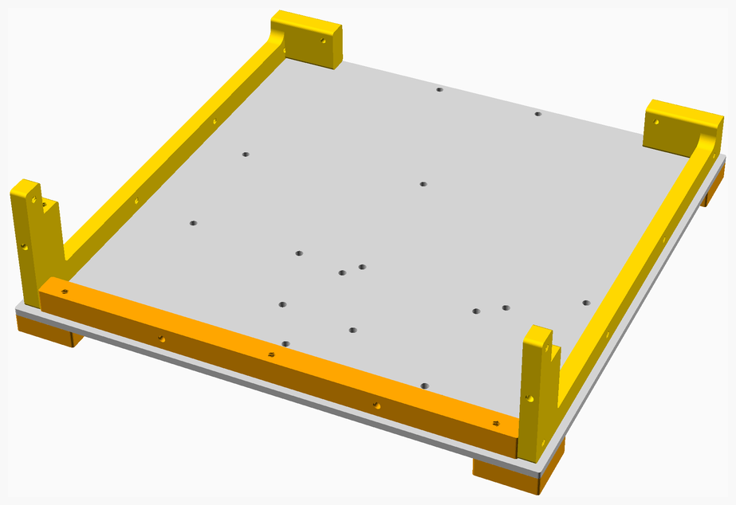

[Top](#TOP)

---

## Base_CF assembly

### Vitamins

|Qty|Description|
|---:|:----------|
| 1 | Aluminium box section 12mm x 8mm x 1mm, length 85mm |
| 1 | BigTreeTech SKR Mini E3 v2.0 |
| 18 | Bolt M3 caphead x  8mm |
| 2 | Bolt M4 buttonhead x  8mm |
| 1 | Micro SD card |
| 1 | PSU NIUGUY CB-200W-24V |
| 9 | Pillar hex nylon F/F M3x12 |
| 1 | Raspberry Pi 3A+ |

### Sub-assemblies

| 1 x Base_CF_Stage_1_assembly |
|----------|
| 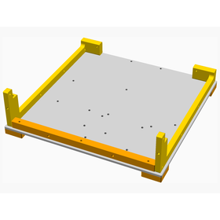 |

### Assembly instructions

1. Cover the top and bottom sides of the box section with thermal paste.
2. Attach the box section to the bottom of the control board with electrical tape. The tape serves to keep the box
section in place until it is attached to the base plate.
3. Using the hex pillars, attach the **mainboard** and the **Raspberry Pi** to the base plate.
4. Wire the **mainboard** to the **Raspberry Pi**.
5. Bolt the PSU to the base plate.

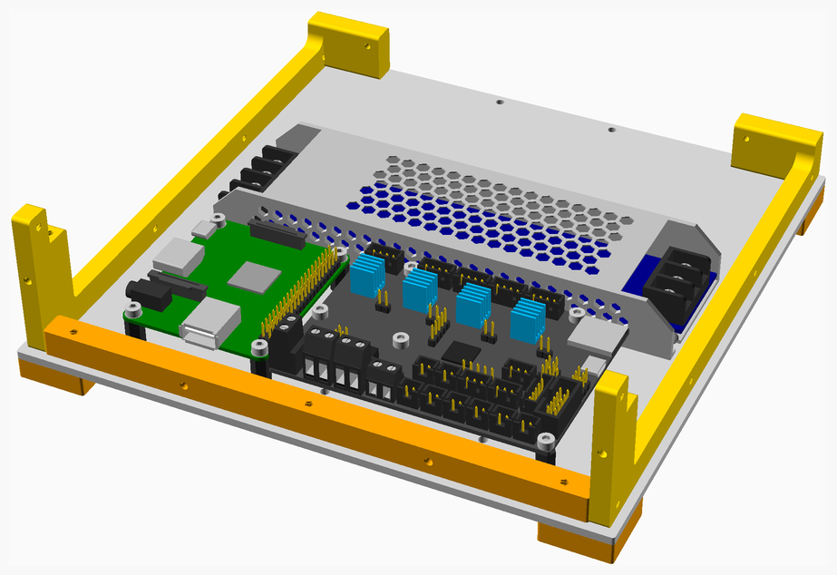

[Top](#TOP)

---

## Stage_1_CF assembly

### Vitamins

|Qty|Description|
|---:|:----------|
| 6 | Bolt M3 buttonhead x 10mm |

### Sub-assemblies

| 1 x Back_Face_CF_assembly | 1 x Base_CF_assembly |
|----------|----------|
|  | 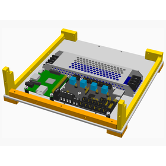 |

### Assembly instructions

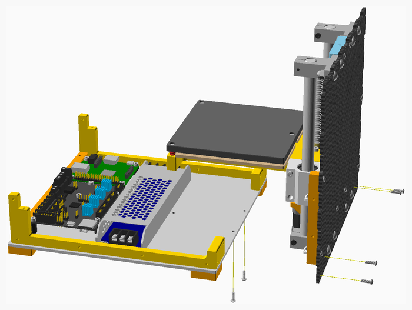

Bolt the **Back_Face_CF_assembly** to the **Base_CF_assembly**.

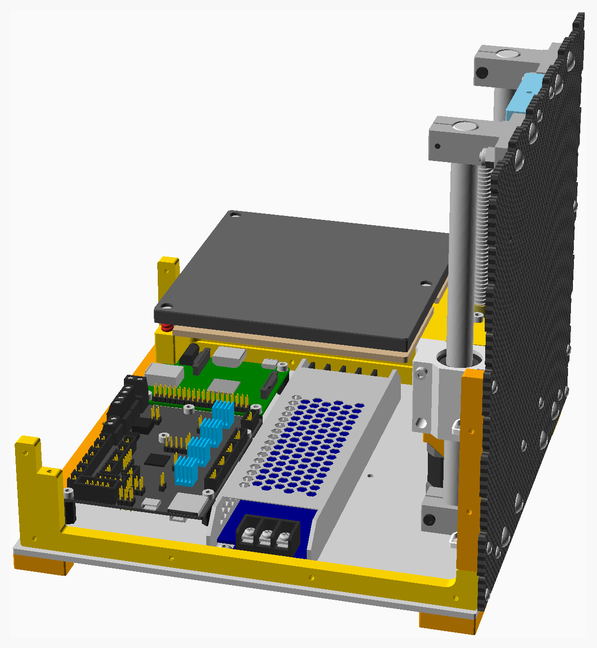

[Top](#TOP)

---

## Stage_2_CF assembly

### Vitamins

|Qty|Description|
|---:|:----------|
| 4 | Bolt M3 buttonhead x  8mm |
| 3 | Bolt M3 buttonhead x 10mm |

### Sub-assemblies

| 1 x Right_Face_CF_assembly | 1 x Stage_1_CF_assembly |
|----------|----------|
| 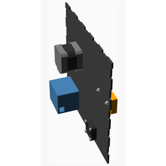 |  |

### Assembly instructions

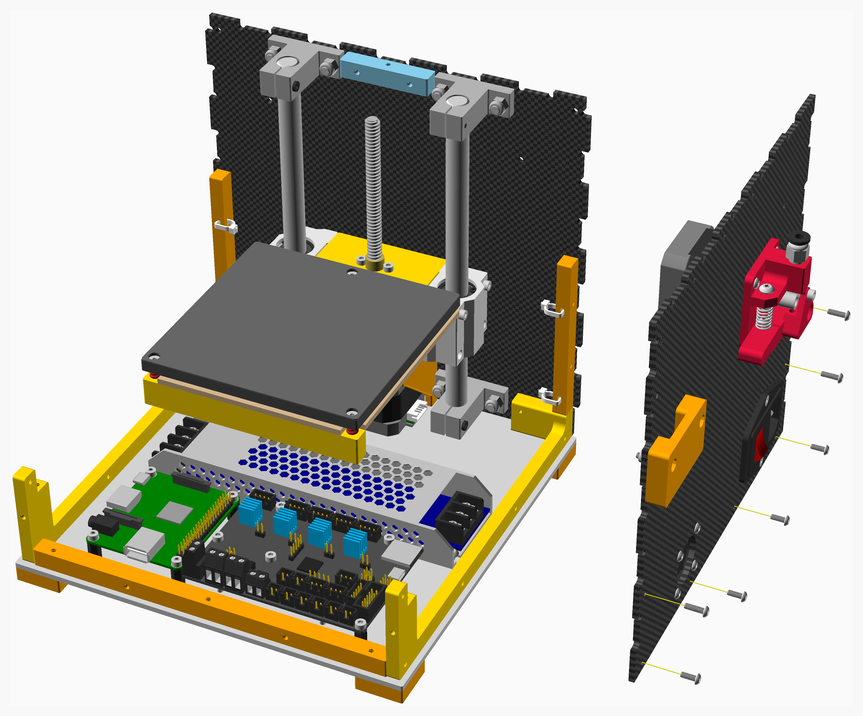

1. Bolt the **Right_Face_CF_assembly** to the **Base_CF_assembly** and the **Back_Face_CF_assembly**.
2. Connect the wires from the **IEC** to the **PSU**.
3. Connect the stepper motor cable from the extruder motor to the mainboard.

[Top](#TOP)

---

## Stage_3_CF assembly

### Vitamins

|Qty|Description|
|---:|:----------|
| 4 | Bolt M3 buttonhead x  8mm |
| 8 | Bolt M3 buttonhead x 10mm |
| 4 | Bolt M3 caphead x 25mm |

### Sub-assemblies

| 1 x Printhead_DropEffect_XG_assembly | 1 x Stage_2_CF_assembly | 1 x Top_Face_CF_assembly |
|----------|----------|----------|
| 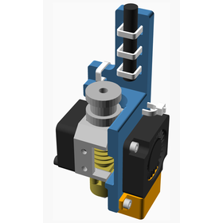 | 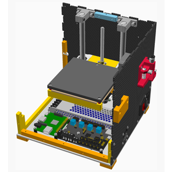 | 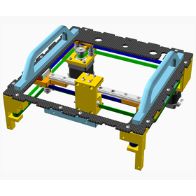 |

### Assembly instructions

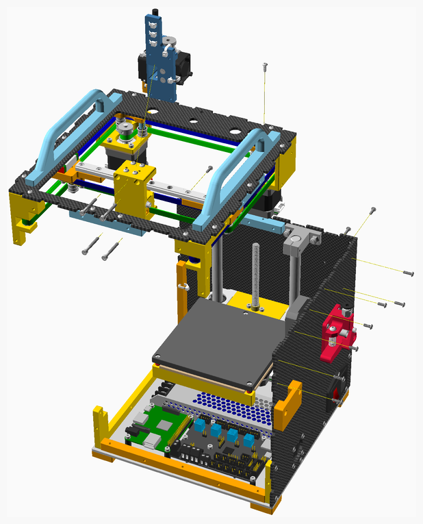

1. Connect the printhead cables to the mainboard.
2. Attach the **Top_Face_CF_assembly** to the back and right faces.
3. Attach the **Printhead Assembly** to the X_Carriage.

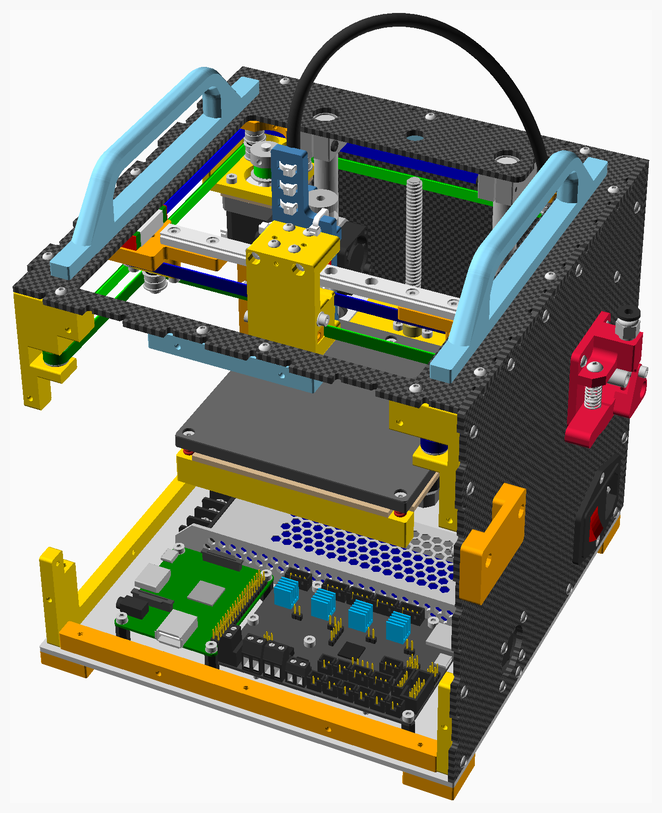

[Top](#TOP)

---

## Stage_4_CF assembly

### Vitamins

|Qty|Description|
|---:|:----------|
| 7 | Bolt M3 buttonhead x  8mm |
| 7 | Bolt M3 buttonhead x 10mm |
| 2 | Bolt M3 caphead x  8mm |
| 1 | Sheet carbon fiber 223mm x 210mm x 3mm |

### 3D Printed parts

| 1 x Base_Cover_CF.stl |
|----------|
| 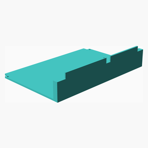 |

### CNC Routed parts

| 1 x Left_Face_y220_z210.dxf |
|----------|
|  

### Sub-assemblies

| 1 x Stage_3_CF_assembly |
|----------|
| 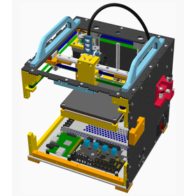 |

### Assembly instructions

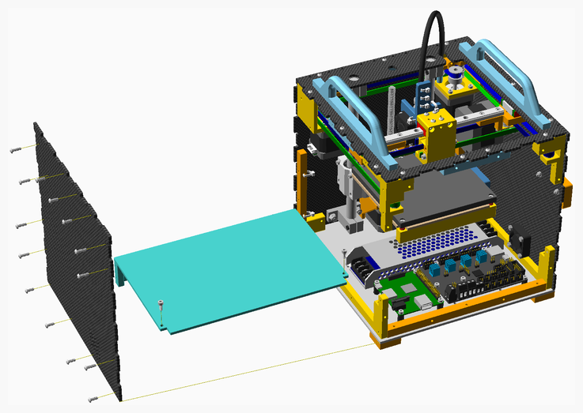

1. Bolt the **Base_Cover** to the base, ensuring all cables are routed correctly.
2. Bolt the **Left_Face_CF** to the base and the back and top faces.

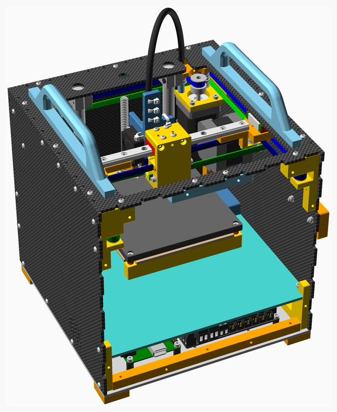

[Top](#TOP)

---

## Stage_5_CF assembly

### Vitamins

|Qty|Description|
|---:|:----------|
| 8 | Bolt M3 buttonhead x 10mm |
| 2 | Bolt M3 buttonhead x 12mm |
| 1 | Sheet carbon fiber 220mm x 210mm x 3mm |

### 3D Printed parts

| 1 x Nameplate.stl | 1 x Nameplate_Back.stl |
|----------|----------|
| 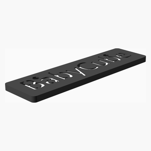 | 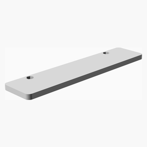 |

### CNC Routed parts

| 1 x Front_Face_x220_z210.dxf |
|----------|
|  

### Sub-assemblies

| 1 x Stage_4_CF_assembly |
|----------|
| 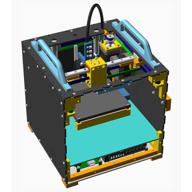 |

### Assembly instructions

Bolt the **Nameplate** and the **Front_Face_CF** to the base and the top, left, and right faces.

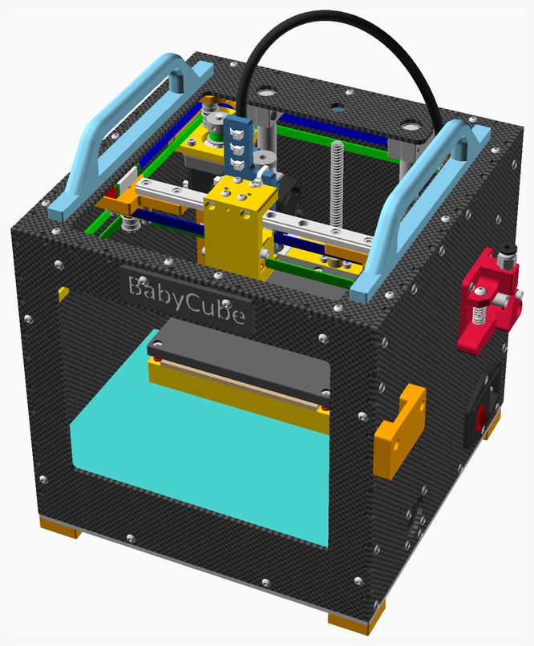

[Top](#TOP)

---

## BC220CF assembly

### Vitamins

|Qty|Description|
|---:|:----------|
| 1 | PTFE tube 311 mm |

### 3D Printed parts

| 1 x Spool_Holder_CF.stl |
|----------|
| 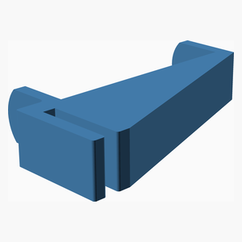 |

### Sub-assemblies

| 1 x Stage_5_CF_assembly |
|----------|
| 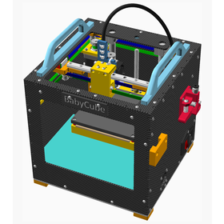 |

### Assembly instructions

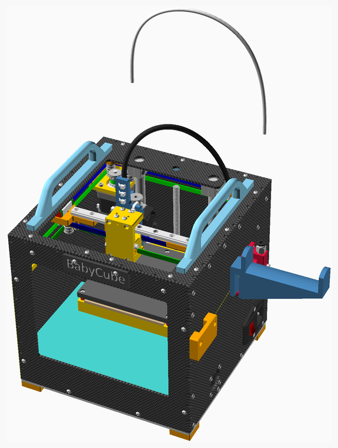

1. Attach the Bowden tube to the extruder and the hotend.
2. Attach the **Spool_Holder** and spool.

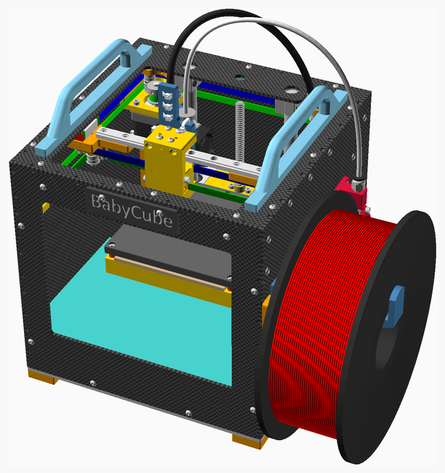

[Top](#TOP)
