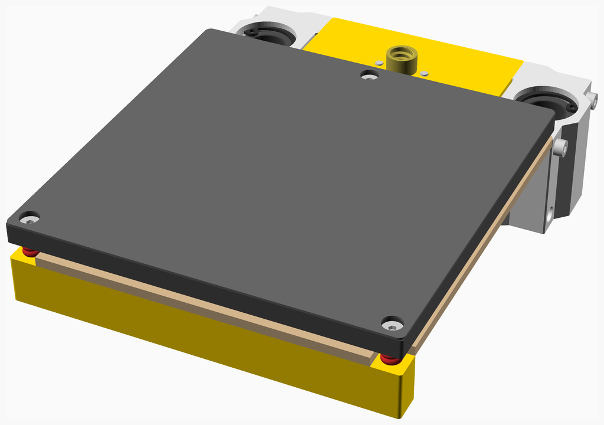
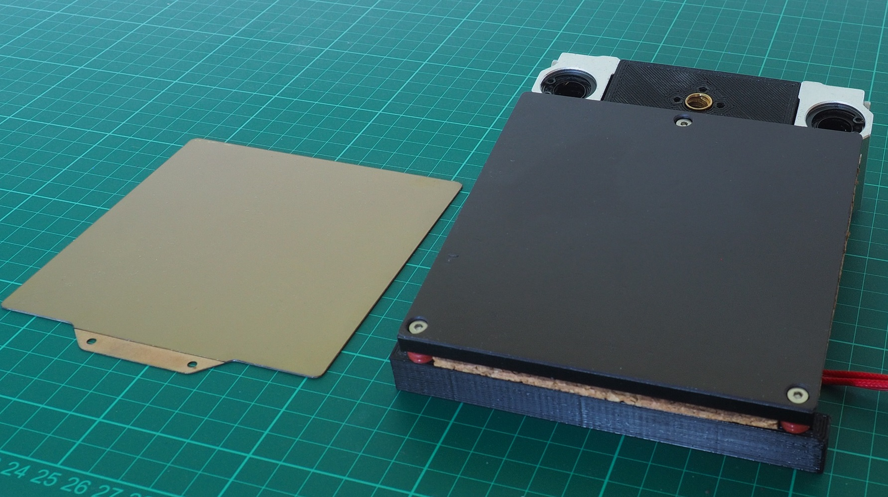
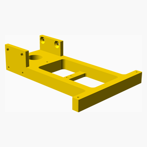
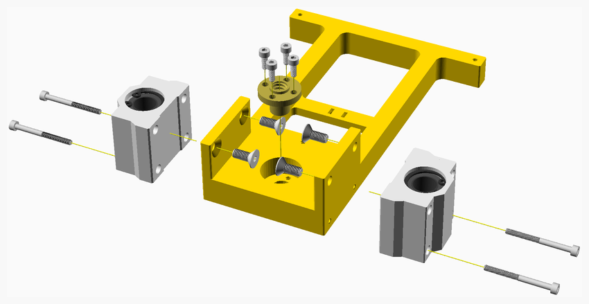
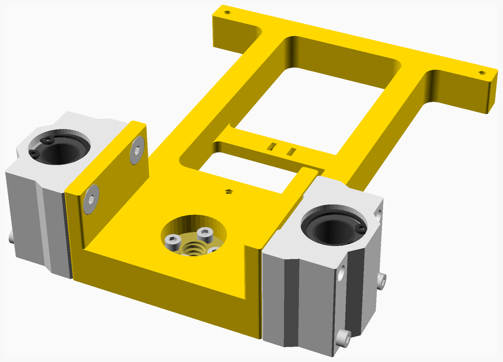
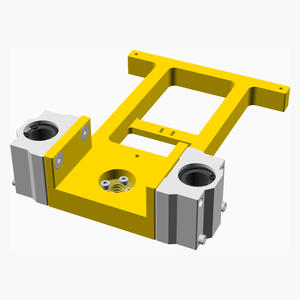
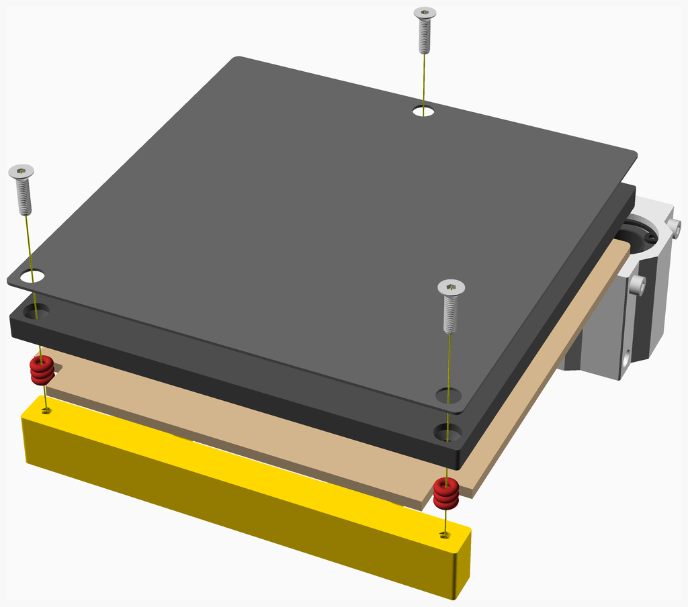

# Print Bed 3 Point Printed Assembly Instructions

This is a alternative print bed for the BabyCube. It uses the same 120 x 120 x 6 mm aluminium tooling plate that is used on the
[Voron0](https://vorondesign.com/voron0).

---

## Table of Contents

1. [Parts list](#Parts_list)
1. [Print_bed_3_point_printed_stage_1 assembly](#Print_bed_3_point_printed_stage_1_assembly)
1. [Print_bed_3_point_printed assembly](#Print_bed_3_point_printed_assembly)

[Top](#TOP)

---

## Parts list

| Print Bed 3 Point Printed Stage 1 | Print Bed 3 Point Printed | TOTALS |  |
|-----:|-----:|------:|:---|
|      |      |       | **Vitamins** |
|   .  |   1  |    1  |  Aluminium tooling plate 120mm x 120mm x 6mm |
|   4  |   .  |    4  |  Bolt M3 caphead x  8mm |
|   4  |   .  |    4  |  Bolt M3 caphead x 35mm |
|   .  |   3  |    3  |  Bolt M3 countersunk x 12mm |
|   4  |   .  |    4  |  Bolt M5 countersunk x 12mm |
|   .  |   1  |    1  |  Cork underlay 120mm x 120mm x 3mm |
|   .  |   1  |    1  |  Heating pad 100mm x 100mm |
|   1  |   .  |    1  |  Leadscrew nut 8 x 2 |
|   .  |   1  |    1  |  Magnetic base 120mm x 120mm |
|   .  |   9  |    9  |  O-ring nitrile 3mm x 2mm |
|   2  |   .  |    2  |  SCS12UU bearing block |
|   .  |   1  |    1  |  Ziptie 2.5mm x 100mm min length |
|  15  |  17  |   32  | Total vitamins count |
|      |      |       | **3D printed parts** |
|   1  |   .  |    1  | Printbed_Frame.stl |
|   1  |   .  |    1  | Total 3D printed parts count |

[Top](#TOP)

---

## Print_bed_3_point_printed_stage_1 assembly

### Vitamins

|Qty|Description|
|---:|:----------|
|4| Bolt M3 caphead x  8mm|
|4| Bolt M3 caphead x 35mm|
|4| Bolt M5 countersunk x 12mm|
|1| Leadscrew nut 8 x 2|
|2| SCS12UU bearing block|

### 3D Printed parts

| 1 x Printbed_Frame.stl |
|---|
|  

### Assembly instructions

1. Bolt the bearing blocks to the sides of the printed frame.
2. Insert the leadnut and bolt it to the frame.

[Top](#TOP)

---

## Print_bed_3_point_printed assembly

### Vitamins

|Qty|Description|
|---:|:----------|
|1| Aluminium tooling plate 120mm x 120mm x 6mm|
|3| Bolt M3 countersunk x 12mm|
|1| Cork underlay 120mm x 120mm x 3mm|
|1| Heating pad 100mm x 100mm|
|1| Magnetic base 120mm x 120mm|
|9| O-ring nitrile 3mm x 2mm|
|1| Ziptie 2.5mm x 100mm min length|

### Sub-assemblies

| 1 x Print_bed_3_point_printed_stage_1_assembly |
|---|
|  

### Assembly instructions

1. Prepare the the cork underlay by cutting it to size, making a cutout for the heated bed wiring, and drilling holes for the bolts.
2. Attach the magnetic base to the top side of the aluminium tooling plate.
3. Attach the heating pad to the bottom side of the tooling plate.
4. Place the cork underlay on the printed frame and place the tooling plate on top.
5. Secure the tooling plate to the frame, using the bolts and O-rings. Note that the O-rings allow bed leveling and help thermally insulate the heated bed from the frame.
6. Secure the heating pad wiring to the underside of the frame using a cable tie.

[Top](#TOP)
