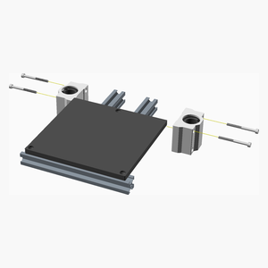
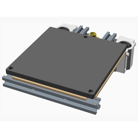

# Print Bed 3 Point Printed Assembly Instructions

This is a alternative print bed for the BabyCube. It uses the same 120 x 120 x 6 mm aluminium tooling plate that is used on the
[Voron0](https://vorondesign.com/voron0).

---

## Table of Contents

1. [Parts list](#Parts_list)
1. [Print_bed_3_point assembly](#Print_bed_3_point_assembly)

[Top](#TOP)

---

## Parts list

| Print Bed 3 Point | TOTALS |  |
|-----:|------:|:-------------|
|      |       | **Vitamins** |
|   1  |    1  |  Aluminium tooling plate 120mm x 120mm x 6mm |
|   4  |    4  |  Bolt M3 caphead x  8mm |
|   4  |    4  |  Bolt M3 caphead x 35mm |
|   2  |    2  |  Bolt M4 buttonhead x 12mm |
|   4  |    4  |  Bolt M5 countersunk x 12mm |
|   1  |    1  |  Cork underlay 120mm x 120mm x 3mm |
|   1  |    1  |  Extrusion E1515 x 130mm |
|   2  |    2  |  Extrusion E1515 x 150mm |
|   1  |    1  |  Heating pad 100mm x 100mm |
|   1  |    1  |  Leadscrew nut 8 x 2 |
|   1  |    1  |  Magnetic base 120mm x 120mm |
|   2  |    2  |  SCS12UU bearing block |
|   2  |    2  |  Washer M4 |
|  26  |   26  | Total vitamins count |

[Top](#TOP)

---

## Print_bed_3_point assembly

### Vitamins

| Qty | Description |
|----:|:------------|
|   1 | Aluminium tooling plate 120mm x 120mm x 6mm |
|   4 | Bolt M3 caphead x  8mm |
|   4 | Bolt M3 caphead x 35mm |
|   2 | Bolt M4 buttonhead x 12mm |
|   4 | Bolt M5 countersunk x 12mm |
|   1 | Cork underlay 120mm x 120mm x 3mm |
|   1 | Extrusion E1515 x 130mm |
|   2 | Extrusion E1515 x 150mm |
|   1 | Heating pad 100mm x 100mm |
|   1 | Leadscrew nut 8 x 2 |
|   1 | Magnetic base 120mm x 120mm |
|   2 | SCS12UU bearing block |
|   2 | Washer M4 |

### Assembly instructions

[Top](#TOP)
