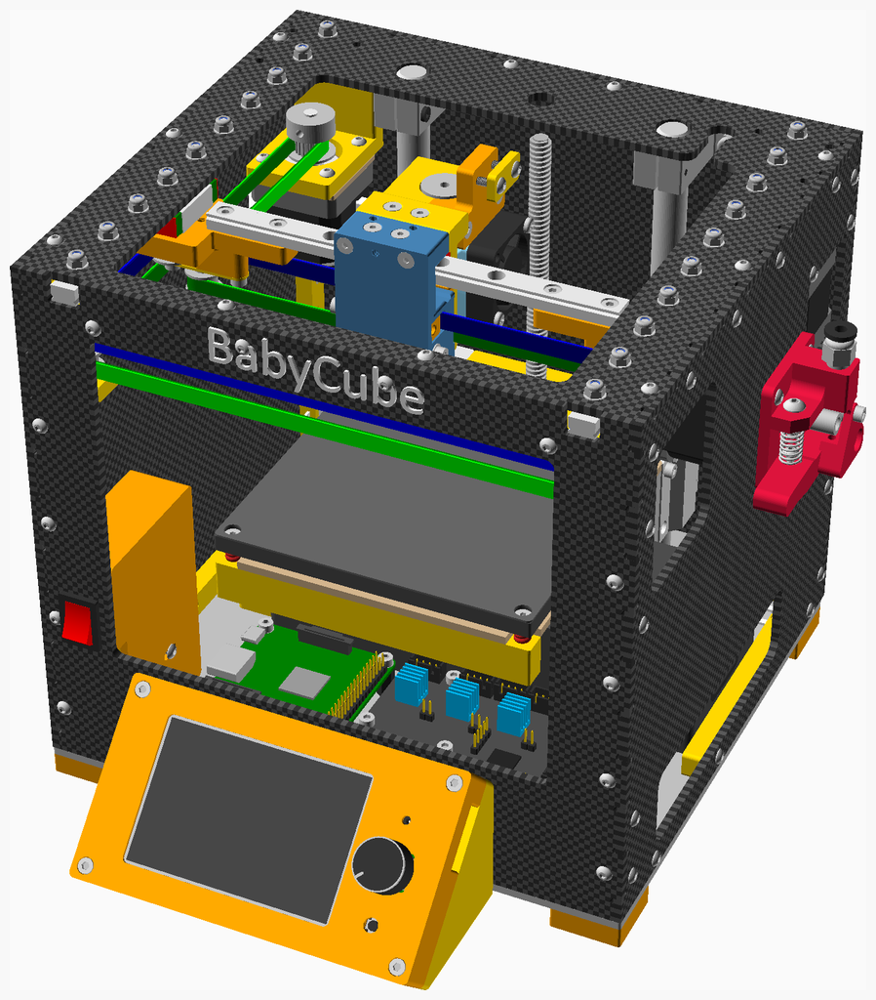
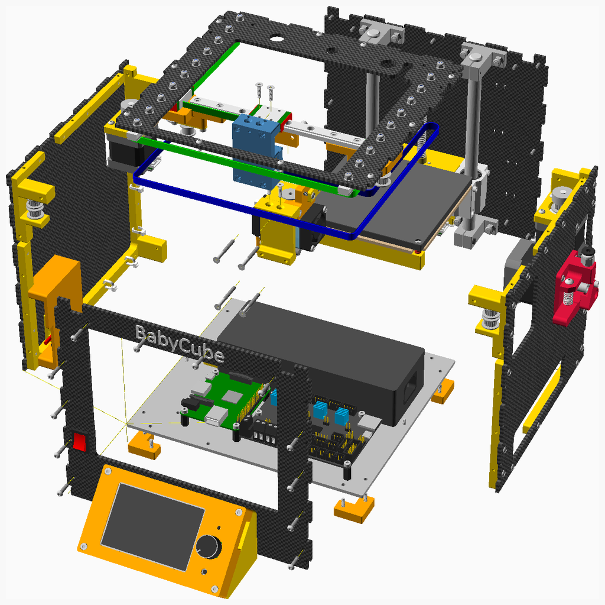

# BabyCube Carbon Fiber

The carbon fiber version of the BabyCube is very much a work in progress. Here's an illustration demonstrating proof of concept:

The exploded version:

## License

BabyCube is licensed under the [Creative Commons Attribution-NonCommercial-ShareAlike 4.0 International Licence](https://creativecommons.org/licenses/by-nc-sa/4.0/)
(CC BY-NC-SA 4.0) 

